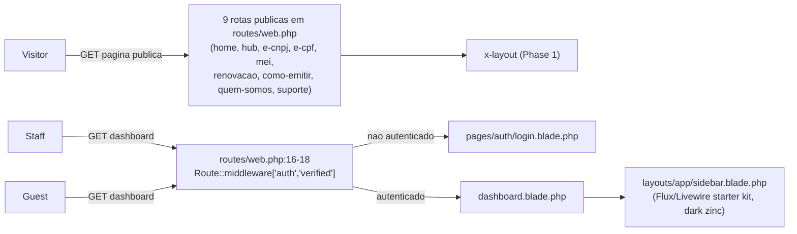
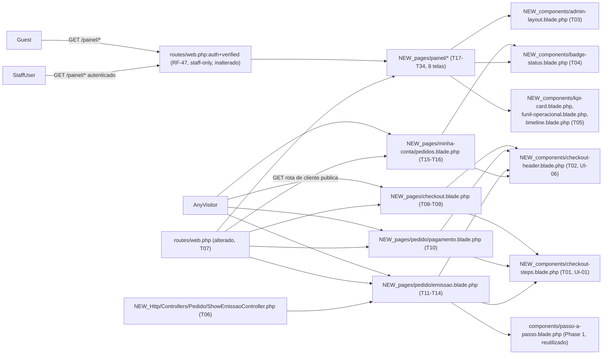

# Implementation Plan

## Request Summary
- Objective: entregar as 13 telas Blade restantes do mockup (checkout, aguardando pagamento/Pix, dados de
  emissão PF/PJ, minha conta, 8 telas do painel administrativo) como slice **100% estática/mock**, reaproveitando
  o design system da Phase 1 (`x-layout`, `x-passo-a-passo`, `x-comparison-table` etc.) e criando os componentes
  novos exigidos pelas UI Requirements (`x-checkout-header`, `x-checkout-steps`, `x-admin-layout`) mais os
  componentes de apoio sugeridos (`x-badge-status`, `x-kpi-card`, `x-funil-operacional`, `x-timeline`).
- Scope:
  - **In**: 4 rotas públicas de loja (`/checkout/`, `/pedido/{id}/pagamento/`, `/pedido/{id}/emissao/` PF+PJ,
    `/minha-conta/pedidos/`), 8 rotas do painel atrás do grupo `auth`+`verified` já existente, os componentes
    novos, conteúdo mock hardcoded bloco a bloco.
  - **Out**: migration, model, seeder, controller com lógica de negócio real, autenticação/model de `customers`,
    autenticação de papéis do painel, gateway de pagamento/GFSIS reais, e-mail, chamada assíncrona, submissão de
    formulário funcional, polling real, `/painel/configuracoes/`, item de navegação "Cupons" separado.
- Tier: complete
- Architecture references: `AGENTS.md` (raiz do repo — Laravel Boost guidelines), `.ai/rules/views.md`
  (convenções de `resources/views/**` — nomenclatura obrigatória e paleta/tipografia/`rounded-lg`), `.ai/rules/index.md`.
  Init chain: `.spec/init/project-phases.md` (Phases 1–10, convenção de granularidade — 1 Phase por página/grupo
  de páginas, task por bloco com Design ref + Acceptance criteria, layout reutilizado sem duplicação de HTML —
  qualquer bloco repetido em ≥ 2 telas vira componente compartilhado, mesmo padrão usado para `x-checkout-steps`
  nesta própria feature).

## AS IS — Componentes impactados

O único uso hoje do grupo `auth`/`verified` é a rota `dashboard`, que renderiza o layout Flux do starter kit
(`layouts/app/sidebar.blade.php`), visualmente distinto da marca Digital Lock. `routes/web.php` não tem nenhuma
rota de checkout, pedido, minha conta ou painel. Os únicos componentes Blade compartilhados existentes ficam em
`resources/views/components/*` (Phase 1): `layout`, `breadcrumb`, `eyebrow`, `card-produto`, `comparison-table`,
`elegibilidade-videoconferencia`, `passo-a-passo`, `credenciamento`, `faq-accordion`, `purchase-panel`.

## TO BE — Componentes propostos

As 4 rotas de loja novas são públicas nesta fatia (T07 registra sem middleware) e, por UI-06, **não** reaproveitam
o `x-layout` completo nem `x-breadcrumb` — usam o novo `x-checkout-header` (T02: logo + link de contexto) nas 4
telas, complementado por `x-checkout-steps` (T01) apenas nas 3 telas de compra (checkout, pagamento, emissão —
**não** em minha-conta, que não faz parte do funil de 3 passos, conforme SPEC v1.3) e por `x-badge-status` (T04,
usado em Minha Conta). As 8 rotas do painel entram no mesmo grupo `auth`/`verified` já existente (T07, RF-47
inalterado) e usam exclusivamente o novo `x-admin-layout` (T03, UI-04), apoiado por
`x-kpi-card`/`x-funil-operacional`/`x-timeline` (T05) e `x-badge-status` (T04).

## Tasks

### T01 — Componente `x-checkout-steps`
- **Files**: `resources/views/components/checkout-steps.blade.php`
- **Change**: Indicador de 3 passos ("1. Carrinho", "2. Dados e pagamento", "3. Dados de emissão") como componente
  único. Prop `:passo-ativo` (1|2|3) destaca visualmente o passo atual (fundo `--color-highlight`, texto
  `--color-ink` peso 600, conforme mockup `#checkout`/`#pix`/`#emissao-pf` linha `display:flex;border-bottom...`);
  passos anteriores ao ativo marcados como concluídos ("ok" — cor `--color-muted-light`/check visual); passos
  futuros em `--color-muted-light`. Nenhum texto hardcoded fora do componente.
- **Covers**: UI-01 (criação do componente; reuso comprovado em T08, T10, T11)
- **Tests**: `tests/Feature/Components/CheckoutStepsTest.php` — renderiza com `:passo-ativo="2"` e `:passo-ativo="3"`,
  asserta os 3 rótulos presentes e que o passo correspondente recebe a marcação de ativo/concluído.
- **Risk**: Low — componente novo isolado, sem dependência de dado externo.
- **Dependencies**: none

### T02 — Componente `x-checkout-header`
- **Files**: `resources/views/components/checkout-header.blade.php`
- **Change**: Cabeçalho reduzido específico de fluxo (logo "digital**lock**" — círculo com borda 2.5px
  `--color-brand` + wordmark — mais, à direita, um texto de contexto via prop `:contexto` ("Compra segura" nas 3
  telas de compra, "Minha conta" na tela de pedidos) e o link fixo "Ajuda" em `--color-brand` peso 600),
  reproduzindo o header simplificado do mockup (`#checkout`/`#pix`/`#emissao-pf`/`#emissao-pj`/`#conta`, bloco
  `padding:16px 28px;background:#fff;border-bottom:1px solid #e7e3de`). **Sem** nav horizontal de 5 itens, **sem**
  botão "Comprar", **sem** rodapé, **sem** `x-breadcrumb` (UI-06). Extraído como componente compartilhado desde o
  início — reaproveitado nas 4 telas de loja (T08, T10, T11, T15) em vez de repetido inline 4 vezes, seguindo a
  mesma convenção anti-duplicação já usada para `x-checkout-steps` na Phase 1 (todo bloco repetido em ≥ 2 telas
  vira componente).
- **Covers**: UI-06 (criação do componente; reuso comprovado em T08, T10, T11, T15)
- **Tests**: `tests/Feature/Components/CheckoutHeaderTest.php` — renderiza com `:contexto="'Compra segura'"` e
  `:contexto="'Minha conta'"`, asserta logo + texto de contexto correspondente + link "Ajuda"; asserta ausência
  de nav horizontal de 5 itens, botão "Comprar", rodapé e marcação de `x-breadcrumb`.
- **Risk**: Low — componente novo isolado; blast radius limitado às 4 telas de loja (menor que `x-admin-layout`,
  que afeta 8 telas).
- **Dependencies**: none

### T03 — Componente `x-admin-layout`
- **Files**: `resources/views/components/admin-layout.blade.php`
- **Change**: Layout comum do painel: sidebar fundo `--color-ink`, wordmark "digital**lock**", os 7 itens de
  navegação em escopo (Visão geral, Vendas, Fila de recuperação, Produtos, Formas de pagamento, Clientes,
  Relatórios — **sem** "Cupons" nem "Configurações", conforme Scope/Out), rodapé com nome/papel do usuário
  autenticado (`{{ auth()->user()->name }}` + rótulo estático "admin", já que não há papéis reais nesta fase),
  barra superior com `<x-slot:titulo>` e seletor de período estático ("Últimos 30 dias ▾", sem lógica). Prop
  `:item-ativo` define qual item de nav recebe o destaque (`background: rgba(228,0,68,.14)`, borda esquerda 3px
  `--color-brand`, conforme mockup `#visao`). Slot de conteúdo principal.
- **Covers**: UI-02, UI-04 (criação do componente; reuso comprovado nas 8 telas T17-T34; UI-04 garantido por
  nenhuma tela do painel referenciar `x-layouts::app.sidebar` nem `x-layout`)
- **Tests**: `tests/Feature/Components/AdminLayoutTest.php` — renderiza com cada um dos 7 valores de
  `:item-ativo`, asserta que exatamente 1 item recebe a classe/estilo de destaque por vez; asserta ausência de
  qualquer string característica do layout Flux (`x-layouts::app.sidebar`) ou do header/rodapé de `x-layout`.
- **Risk**: Medium — blast radius alto (as 8 telas do painel herdam qualquer defeito); mitigado por teste
  dedicado antes de qualquer tela consumir o componente (T03 roda em Phase 1, antes de T17-T34).
- **Dependencies**: none

### T04 — Componente `x-badge-status`
- **Files**: `resources/views/components/badge-status.blade.php`
- **Change**: Badge único com prop `:variante` (`emitido`/`agendado`/`aguardando`/`erro`/`neutro`), cada variante
  com combinação fixa de cor de fundo/texto dentro da paleta de tokens (ex.: `emitido` → fundo `#e4f0e8`/texto
  `#1e5c34` já usado no mockup `#conta`; `agendado` → fundo `--color-highlight`/texto `#B8003A`; `aguardando` →
  fundo `#fbf0d8`/texto `#7a5606`; mapear `erro`/`neutro` com as mesmas famílias de cor do mockup nos blocos
  `#vendas`/`#venda`/`#clientes`). Aceita o rótulo via slot.
- **Covers**: UI-03 (criação do componente; reuso comprovado nas 4 telas que exibem status — Minha Conta T15,
  Painel Vendas T19, Detalhe da Venda T21, Painel Clientes T30-31)
- **Tests**: `tests/Feature/Components/BadgeStatusTest.php` — renderiza cada uma das 5 variantes, asserta a
  combinação de cor de fundo/texto esperada e que nenhuma cor fora da paleta de tokens é usada (regex de cores
  hex fora da lista permitida).
- **Risk**: Low — componente isolado; reuso em 4 telas testado em cada task consumidora.
- **Dependencies**: none

### T05 — Componentes de apoio ao painel: `x-kpi-card`, `x-funil-operacional`, `x-timeline`
- **Files**: `resources/views/components/kpi-card.blade.php`, `resources/views/components/funil-operacional.blade.php`,
  `resources/views/components/timeline.blade.php`
- **Change**: `x-kpi-card` (props rótulo, valor, texto de apoio opcional) evita recriar a marcação de cartão de
  KPI em Visão Geral (RF-16), Fila de Recuperação (RF-29) e Relatórios (RF-45). `x-funil-operacional` (prop com
  coleção de estágios: nome, quantidade, percentual opcional) evita reescrever o funil de 5 estágios em RF-17.
  `x-timeline` (prop com coleção de eventos: data/hora, descrição, origem) evita reescrever a linha do tempo de
  RF-28. Nenhum destes três é RIGID por nome (FLEXIBLE), mas a estrutura visual (cartão/funil/timeline) é RIGID
  via RF-16/17/28/29/45 — a decisão de reuso evita duplicação de marcação entre as 3 telas do painel que
  compartilham o padrão de KPI.
- **Covers**: nenhum RF isoladamente satisfeito aqui — componentes de apoio consumidos em T17 (RF-16, RF-17),
  T23 (RF-28), T24 (RF-29), T33 (RF-45).
- **Tests**: `tests/Feature/Components/PainelSupportComponentsTest.php` — 1 método por componente, cada um
  renderizando com dados de exemplo e verificando saída (rótulo+valor no kpi-card; 5 estágios em ordem no
  funil; eventos em ordem cronológica na timeline).
- **Risk**: Low — componentes de apresentação pura, sem lógica condicional complexa.
- **Dependencies**: none

### T06 — Controller de emissão (`Pedido\ShowEmissaoController`)
- **Files**: `app/Http/Controllers/Pedido/ShowEmissaoController.php`
- **Change**: Single Action Controller (`__invoke(Request $request, int|string $id)`), conforme convenção já
  registrada em `project-description.md` (citada na SPEC como FLEXIBLE). Resolve a variação PF/PJ **apenas** a
  partir de uma variável mock — lê `?tipo=pj` da query string (default PF quando ausente) e retorna
  `view('pages.pedido.emissao', ['id' => $id, 'tipoTitular' => $tipo, ...mock arrays inline...])`. **Não** faz
  nenhuma consulta a banco, não instancia Eloquent Model, não injeta Repository — apenas resolve qual bloco
  central mostrar (RF-10/RF-11/RF-12 vs RF-07/RF-08), respeitando RNF-04 (proibição de lógica de negócio).
- **Covers**: CT-03 (rota pública, controller mínimo); habilita RF-06 a RF-13 (view a ser construída em T11-T14)
- **Tests**: cobertura funcional incluída nos testes de T11-T14 (`EmissaoTest.php`); nenhum teste próprio de
  unidade além da verificação estrutural "controller não importa nenhuma classe de `App\Models`" feita em T36.
- **Risk**: Medium — único ponto do slice com lógica condicional em PHP (fora de Blade); risco de "vazamento" de
  lógica de negócio real. Mitigação: revisão de código focada em RNF-04 antes de fechar a task; rollback:
  reverter para `Route::view()` simples com variável de query lida diretamente na Blade (`request('tipo')`), se
  o controller for considerado desnecessário.
- **Dependencies**: none

### T07 — Registrar as 13 rotas em `routes/web.php`
- **Files**: `routes/web.php`
- **Change**: Adicionar as 4 rotas públicas de loja fora de qualquer middleware (`checkout/`, `pedido/{id}/pagamento/`
  via `Route::view()`, `pedido/{id}/emissao/` via `Route::get(..., ShowEmissaoController::class)`,
  `minha-conta/pedidos/`); adicionar as 8 rotas do painel **dentro** do grupo `Route::middleware(['auth',
  'verified'])` já existente (`routes/web.php:16-18`, o mesmo que hoje só contém `dashboard`), todas via
  `Route::view()` com os nomes de view sugeridos no CT-01..CT-12 (`pages.checkout`, `pages.pedido.pagamento`,
  `pages.pedido.emissao`, `pages.minha-conta.pedidos`, `pages.painel.visao-geral`, `pages.painel.vendas.index`,
  `pages.painel.vendas.show`, `pages.painel.recuperacao`, `pages.painel.produtos`,
  `pages.painel.formas-pagamento`, `pages.painel.clientes`, `pages.painel.relatorios`). Nomear todas as rotas
  (`->name(...)`) seguindo o padrão `dot.case` já usado (`certificado-digital.e-cnpj`).
  - **Nota de arquitetura**: as rotas usam prefixo de caminho `/painel/*` no mesmo domínio, **não** o
    subdomínio `painel.ardigitallock.com` mostrado nos dois arquivos de design — decisão já registrada na SPEC
    (sumário confirmado prevalece sobre os dois arquivos de design neste ponto específico).
- **Covers**: CT-01 a CT-12, RF-47 (estrutura do guard — grupo correto para cada rota)
- **Tests**: cobertura funcional feita pelos testes de página de cada task consumidora (T08-T34) mais o guard
  transversal em T35; nenhum teste próprio além de `vendor/bin/sail artisan route:list` manual para conferência
  visual dos 13 nomes/paths antes de prosseguir.
- **Risk**: Medium — arquivo único compartilhado por todas as 22 rotas do site (9 existentes + 13 novas); um
  erro de sintaxe quebra o site inteiro. Mitigação: task atômica e sequencial (nenhuma outra task edita este
  arquivo), seguida de `route:list` e da suíte de testes das 9 páginas existentes antes de prosseguir. Rollback:
  reverter o commit único de T07.
- **Dependencies**: T06

### T08 — Checkout: rota, esqueleto, `x-checkout-header`, `x-checkout-steps`, blocos "Seus dados" e "Como você prefere pagar"
- **Files**: `resources/views/pages/checkout.blade.php`
- **Change**: `<x-checkout-header contexto="Compra segura" />`, `<x-checkout-steps :passo-ativo="2" />`, bloco
  "Seus dados" com os 6 campos + checkbox de opt-in (RF-01, valores de exemplo fixos, tipo de pessoa "Pessoa
  jurídica" pré-selecionado no exemplo do mockup), bloco "Como você prefere pagar" com as 3 opções e Pix
  destacado visualmente (RF-02).
- **Covers**: RF-01, RF-02, UI-01 (reuso), UI-06 (reuso)
- **Tests**: `tests/Feature/Pages/CheckoutTest.php` — `test_route_renders_the_checkout_view` (200,
  `assertViewIs('pages.checkout')`), `test_block_seus_dados_renders_six_fields_and_opt_in`, `test_block_forma_pagamento_renders_three_options_pix_selected`.
- **Risk**: Low — página nova isolada.
- **Dependencies**: T01, T02, T07

### T09 — Checkout: bloco "Seu pedido" (resumo lateral)
- **Files**: `resources/views/pages/checkout.blade.php`
- **Change**: Resumo lateral fixo com item comprado, campo de cupom + botão "Aplicar" (sem ação), subtotal,
  desconto de cupom, desconto do Pix, total e botão "Finalizar compra" **sem** atributo `action`/`method`
  funcional (RNF-02).
- **Covers**: RF-03
- **Tests**: `tests/Feature/Pages/CheckoutTest.php::test_block_resumo_renders_summary_and_finalizar_button_without_real_submission`
  — asserta presença de subtotal/desconto cupom/desconto Pix/total e ausência de `method="POST"` real associado
  ao botão "Finalizar compra".
- **Risk**: Low
- **Dependencies**: T08

### T10 — Pagamento Pix: rota, esqueleto, `x-checkout-header`, `x-checkout-steps`, blocos "Escaneie para pagar" e "Variação boleto"
- **Files**: `resources/views/pages/pedido/pagamento.blade.php`
- **Change**: `<x-checkout-header contexto="Compra segura" />` + `<x-checkout-steps :passo-ativo="2" />`. Bloco
  "Escaneie para pagar": placeholder de QR Code, "Pedido #{{ $id }} · R$ [VALOR]", copia-e-cola truncado + botão
  "Copiar código" (sem handler JS que faça requisição), texto estático "Expira em 29:47", mensagem de espera
  "Aguardando confirmação. Esta tela avança sozinha assim que o pagamento cair." (RF-04). Bloco "Variação
  boleto" com o texto literal do mockup sobre troca de QR pela linha digitável (RF-05). **Nenhum**
  `setInterval`/`setTimeout`/`fetch` real (RNF-01, RNF-03).
- **Covers**: RF-04, RF-05, UI-01 (reuso), UI-06 (reuso), RNF-03
- **Tests**: `tests/Feature/Pages/Pedido/PagamentoTest.php` — asserta os 5 elementos do bloco Pix, o texto da
  variação boleto, e que o HTML não contém `setInterval(`, `setTimeout(`, `fetch(` nem `XMLHttpRequest`.
- **Risk**: Low
- **Dependencies**: T01, T02, T07

### T11 — Emissão: rota (controller), esqueleto, `x-checkout-header`, `x-checkout-steps`, blocos "Confirmação" e "O que acontece agora"
- **Files**: `resources/views/pages/pedido/emissao.blade.php`
- **Change**: `<x-checkout-header contexto="Compra segura" />` + `<x-checkout-steps :passo-ativo="3" />`. Bloco
  "Confirmação": ícone de check, "Pagamento confirmado", "Pedido #{{ $id }} · R$ [VALOR] no Pix" (RF-06) —
  **idêntico** entre PF/PJ (RF-13). Bloco "O que acontece agora": `<x-passo-a-passo>` reaproveitado com título
  "O que acontece agora" e os 4 passos ("Recebe o e-mail", "Agenda", "Valida ao vivo", "Baixa e instala")
  passados via prop/dado — **sem** HTML de 4 cartões numerados reescrito manualmente (RF-09). O bloco central
  do formulário (Titular+Endereço ou Empresa+Responsável+Endereço) é incluído condicionalmente via
  `@if($tipoTitular === 'pj') @include(...) @else @include(...) @endif` apontando para os parciais criados em
  T12/T13.
- **Covers**: RF-06, RF-09, RF-13 (blocos 1 e 3), UI-01 (reuso), UI-06 (reuso)
- **Tests**: `tests/Feature/Pages/Pedido/EmissaoTest.php::test_block_confirmacao_renders_success_icon_order_and_value`,
  `::test_block_o_que_acontece_agora_reuses_passo_a_passo_component` (assert marcação idêntica à instância usada
  no checkout — mesma classe/estrutura de `x-passo-a-passo`, apenas título/copy diferentes).
- **Risk**: Medium — único ponto que integra o controller (T06) com dado condicional; erro na leitura de
  `?tipo=pj` quebra RF-10/RF-13. Mitigação: teste explícito dos dois cenários de query string.
- **Dependencies**: T01, T02, T06, T07

### T12 — Emissão PF: seções "Titular" e "Endereço"
- **Files**: `resources/views/pages/pedido/partials/emissao-pf.blade.php`
- **Change**: Seção "Titular" com os 5 campos (nome completo, CPF, data de nascimento, e-mail, telefone com DDD)
  — RF-07. Seção "Endereço" com os 7 campos independentes (CEP, logradouro, número, complemento, bairro,
  município, UF), cada um como elemento de formulário distinto — RF-08. Nenhum `<form method="POST">` funcional
  (RNF-02); botão "Concluir e enviar para emissão" sem `action` real.
- **Covers**: RF-07, RF-08
- **Tests**: `tests/Feature/Pages/Pedido/EmissaoTest.php::test_pf_variation_renders_titular_and_endereco_sections`
  (GET `/pedido/1042/emissao/` sem query string) — asserta os 5+7 campos e ausência da seção "Empresa".
- **Risk**: Low
- **Dependencies**: T11

### T13 — Emissão PJ: seções "Empresa", "Responsável" e "Endereço da empresa"
- **Files**: `resources/views/pages/pedido/partials/emissao-pj.blade.php`
- **Change**: Seção "Empresa" com os 4 campos (razão social, CNPJ, e-mail da empresa, telefone com DDD) no lugar
  de "Titular" — RF-10. Seção "Responsável pelo uso do certificado" com os 5 campos + texto explicativo sobre
  validação por videoconferência — RF-11. Seção "Endereço da empresa" com os mesmos 7 campos independentes de
  RF-08, rotulados como endereço da empresa — RF-12.
- **Covers**: RF-10, RF-11, RF-12
- **Tests**: `tests/Feature/Pages/Pedido/EmissaoTest.php::test_pj_variation_renders_empresa_responsavel_and_endereco_da_empresa_sections`
  (GET `/pedido/1042/emissao/?tipo=pj`) — asserta os 3 blocos e ausência da seção "Titular".
- **Risk**: Low
- **Dependencies**: T11

### T14 — Emissão: teste de paridade PF×PJ (RF-13)
- **Files**: `tests/Feature/Pages/Pedido/EmissaoTest.php`
- **Change**: Nenhuma mudança de view — task de teste dedicada. Requisita a mesma rota sem query string e com
  `?tipo=pj`, extrai o HTML dos blocos "Confirmação" e "O que acontece agora" (por âncora/seletor de bloco) e
  assere que o texto/estrutura é idêntico entre as duas respostas.
- **Covers**: RF-13 (verificação completa — blocos 1 e 3 idênticos)
- **Tests**: `tests/Feature/Pages/Pedido/EmissaoTest.php::test_blocks_confirmacao_and_o_que_acontece_agora_are_identical_between_pf_and_pj`
- **Risk**: Low — apenas teste; depende de T12 e T13 já implementados para comparar.
- **Dependencies**: T12, T13

### T15 — Minha conta: rota, esqueleto, `x-checkout-header`, 3 cartões de pedido por estado
- **Files**: `resources/views/pages/minha-conta/pedidos.blade.php`
- **Change**: `<x-checkout-header contexto="Minha conta" />` — sem `x-checkout-steps` (esta tela não faz parte
  do funil de 3 passos, conforme SPEC v1.3). 3 cartões de pedido de exemplo usando `<x-badge-status>`: "Emitido"
  (titular, validade até, pago em, botões "Ver nota fiscal"/"Baixar certificado"/"Renovar"), "Agendado" (titular,
  data/hora da videoconferência, pago em, botões "Ver o que levar"/"Reagendar"), "Faltam seus dados" (pago em,
  situação, botão "Preencher agora"). Nenhum botão dispara ação real (RNF-02).
- **Covers**: RF-14, UI-03 (reuso), UI-06 (reuso)
- **Tests**: `tests/Feature/Pages/MinhaConta/PedidosTest.php::test_route_renders_the_pedidos_view`,
  `::test_renders_three_order_cards_one_per_state_with_state_specific_fields_and_buttons`.
- **Risk**: Low
- **Dependencies**: T02, T04, T07

### T16 — Minha conta: tabela "Estados possíveis"
- **Files**: `resources/views/pages/minha-conta/pedidos.blade.php`
- **Change**: Tabela com as 5 linhas exatas do mockup (Faltam seus dados, Em processamento, Agendado, Emitido,
  Vencendo) e coluna "Origem" com o campo do banco (`status_emissao`, `pedido_item_gfsis...` — nomes de campo
  usados apenas como texto mock, sem consulta real, conforme instrução da SPEC sobre `database-schema.md`).
- **Covers**: RF-15
- **Tests**: `tests/Feature/Pages/MinhaConta/PedidosTest.php::test_renders_estados_possiveis_table_with_five_rows`.
- **Risk**: Low
- **Dependencies**: T15

### T17 — Painel visão geral: rota, `x-admin-layout`, blocos "Indicadores" e "Funil operacional"
- **Files**: `resources/views/pages/painel/visao-geral.blade.php`
- **Change**: `<x-admin-layout item-ativo="visao-geral" titulo="Visão geral">`. Bloco "Indicadores": 5×
  `<x-kpi-card>` (Faturamento, Ticket médio, Taxa de conversão, Aguardando dados, Falha de integração) com
  valor mock e texto de apoio quando aplicável (ex.: "312 pedidos") — RF-16. Bloco "Funil operacional":
  `<x-funil-operacional>` com os 5 estágios (Pedidos criados, Pagos, Dados completos, Enviados ao GFSIS,
  Emitidos), percentual de conversão entre estágios consecutivos, nota "A maior queda revela o gargalo." —
  RF-17.
- **Covers**: RF-16, RF-17, UI-02 (reuso)
- **Tests**: `tests/Feature/Pages/Painel/VisaoGeralTest.php::test_route_requires_authentication`,
  `::test_block_indicadores_renders_five_kpi_cards`, `::test_block_funil_renders_five_stages_with_conversion`.
- **Risk**: Low
- **Dependencies**: T03, T05, T07

### T18 — Painel visão geral: blocos "Exige ação" e "Vendas por dia"
- **Files**: `resources/views/pages/painel/visao-geral.blade.php`
- **Change**: Tabela "Exige ação" com as 5 filas exatas (Pagos sem dados de emissão, Falha de envio ao GFSIS,
  Conversões não enviadas, Reembolsos pendentes, Certificados vencendo em 30 dias), quantidade, "mais antigo" e
  botão "Abrir" sem ação real — RF-18. Placeholder de gráfico de barras "Vendas por dia" com texto indicativo,
  sem biblioteca de gráfico real — RF-19.
- **Covers**: RF-18, RF-19
- **Tests**: `tests/Feature/Pages/Painel/VisaoGeralTest.php::test_block_exige_acao_renders_five_queues`,
  `::test_block_vendas_por_dia_renders_chart_placeholder`.
- **Risk**: Low
- **Dependencies**: T17

### T19 — Painel vendas: rota, `x-admin-layout`, blocos "Filtros" e tabela de pedidos
- **Files**: `resources/views/pages/painel/vendas/index.blade.php`
- **Change**: `<x-admin-layout item-ativo="vendas" titulo="Vendas">`. Bloco "Filtros" com os 7 controles (Período,
  Status do pagamento, Status da emissão, Forma de pagamento, Produto, Origem, busca), todos visuais — RF-20.
  Tabela de pedidos com as 7 colunas (Pedido, Cliente, Produto, Valor, Pagamento, Emissão, Data — Pagamento e
  Emissão sempre em colunas separadas), ≥ 6 linhas de exemplo usando `<x-badge-status>` nas colunas de status,
  paginação mock "Mostrando 1 a 25 de 312" — RF-21.
- **Covers**: RF-20, RF-21, UI-02 (reuso), UI-03 (reuso)
- **Tests**: `tests/Feature/Pages/Painel/VendasIndexTest.php::test_route_requires_authentication`,
  `::test_block_filtros_renders_seven_controls`, `::test_table_renders_seven_columns_pagamento_and_emissao_separated_with_mock_pagination`.
- **Risk**: Low
- **Dependencies**: T03, T04, T07

### T20 — Painel vendas: bloco "Ações em lote"
- **Files**: `resources/views/pages/painel/vendas/index.blade.php`
- **Change**: 3 botões ("Exportar CSV", "Reenviar ao GFSIS", "Disparar recuperação"), nenhum com `action`
  funcional (RNF-02).
- **Covers**: RF-22
- **Tests**: `tests/Feature/Pages/Painel/VendasIndexTest.php::test_block_acoes_em_lote_renders_three_buttons_without_real_action`.
- **Risk**: Low
- **Dependencies**: T19

### T21 — Detalhe da venda: rota, `x-admin-layout`, blocos "Cabeçalho" e "Itens"
- **Files**: `resources/views/pages/painel/vendas/show.blade.php`
- **Change**: `<x-admin-layout item-ativo="vendas" titulo="Pedido #{{ $id }}">`. Bloco "Cabeçalho": número do
  pedido, data/hora de criação, nome do cliente, 2× `<x-badge-status>` lado a lado (pagamento e emissão) —
  RF-23. Tabela "Itens" com as 5 colunas (SKU, Produto, Titular, Preço tabela, Preço praticado), ≥ 1 linha —
  RF-24.
- **Covers**: RF-23, RF-24, UI-02 (reuso), UI-03 (reuso)
- **Tests**: `tests/Feature/Pages/Painel/VendasShowTest.php::test_route_requires_authentication`,
  `::test_block_cabecalho_renders_order_number_date_client_and_two_status_badges`,
  `::test_table_itens_renders_five_columns`.
- **Risk**: Low
- **Dependencies**: T03, T04, T07

### T22 — Detalhe da venda: blocos "Financeiro" e "Emissão e GFSIS"
- **Files**: `resources/views/pages/painel/vendas/show.blade.php`
- **Change**: Cartão "Valores" (subtotal, desconto cupom, desconto Pix, total, taxa do gateway, líquido
  previsto) + cartão "Pagamento" (método, status, ID no gateway, TXID, end-to-end, pago em, previsão de repasse)
  — RF-25. Cartão "Dados do titular" (razão social ou nome, CPF/CNPJ, responsável quando PJ, e-mail, endereço,
  município/UF) + cartão "Integração" (`gfsis_order_id`, código GFSIS, status GFSIS, agendamento, validade até,
  sincronizado em, tentativas) + botão "Reenviar ao GFSIS" sem ação real — RF-26.
- **Covers**: RF-25, RF-26
- **Tests**: `tests/Feature/Pages/Painel/VendasShowTest.php::test_block_financeiro_renders_valores_and_pagamento_cards`,
  `::test_block_emissao_gfsis_renders_titular_and_integracao_cards_and_resend_button`.
- **Risk**: Low
- **Dependencies**: T21

### T23 — Detalhe da venda: blocos "Origem da venda" e "Linha do tempo"
- **Files**: `resources/views/pages/painel/vendas/show.blade.php`
- **Change**: Tabela "Origem da venda" com as 7 linhas (campanha, origem e meio, gclid, página de entrada,
  dispositivo, sessões até a compra, status de conversão enviada) — RF-27. `<x-timeline>` com ≥ 6 eventos
  cronológicos (pedido criado, pagamento autorizado, dados de emissão preenchidos, enviado ao GFSIS,
  videoconferência realizada, certificado emitido), cada um com data/hora e origem — RF-28.
- **Covers**: RF-27, RF-28
- **Tests**: `tests/Feature/Pages/Painel/VendasShowTest.php::test_table_origem_da_venda_renders_seven_rows`,
  `::test_block_linha_do_tempo_renders_six_events_in_chronological_order_with_origin`.
- **Risk**: Low
- **Dependencies**: T21, T05

### T24 — Painel recuperação: rota, `x-admin-layout`, blocos "Indicadores" e "Fila ordenada por tempo"
- **Files**: `resources/views/pages/painel/recuperacao.blade.php`
- **Change**: `<x-admin-layout item-ativo="recuperacao" titulo="Fila de recuperação">`. Bloco "Indicadores": 4×
  `<x-kpi-card>` (Pagos sem dados, Recuperados em 7 dias, Mais antigo, Falha de envio) — RF-29. Tabela "Fila
  ordenada por tempo" com colunas Pedido, Cliente, Valor, Dias, Contatos, Ação ("Ligar"/"Reenviar link"), ≥ 4
  linhas ordenadas por "Dias" decrescente — RF-30.
- **Covers**: RF-29, RF-30, UI-02 (reuso)
- **Tests**: `tests/Feature/Pages/Painel/RecuperacaoTest.php::test_route_requires_authentication`,
  `::test_block_indicadores_renders_four_kpi_cards`,
  `::test_table_fila_renders_rows_ordered_by_dias_descending`.
- **Risk**: Low
- **Dependencies**: T03, T05, T07

### T25 — Painel recuperação: blocos "Régua automática" e "Falhas de integração"
- **Files**: `resources/views/pages/painel/recuperacao.blade.php`
- **Change**: Tabela "Régua automática" com as 5 linhas exatas (Imediato/E-mail, 2 horas/WhatsApp, 24
  horas/E-mail, 3 dias/WhatsApp, 5 dias/Painel), cada uma com momento, canal e mensagem — RF-31. Tabela "Falhas
  de integração" com colunas Pedido, Erro, Tentativas e Ação ("Corrigir e reenviar"), ≥ 2 linhas — RF-32.
- **Covers**: RF-31, RF-32
- **Tests**: `tests/Feature/Pages/Painel/RecuperacaoTest.php::test_table_regua_automatica_renders_five_rows`,
  `::test_table_falhas_de_integracao_renders_at_least_two_rows`.
- **Risk**: Low
- **Dependencies**: T24

### T26 — Painel produtos: rota, `x-admin-layout`, blocos "Lista" e "Edição · dados do produto"
- **Files**: `resources/views/pages/painel/produtos.blade.php`
- **Change**: `<x-admin-layout item-ativo="produtos" titulo="Produtos">`. Tabela "Lista" com colunas Produto,
  Tipo, Slug, Variantes, "A partir de", Ativo, ≥ 3 linhas, botão "Novo produto" sem ação real — RF-33. Bloco
  "Edição · dados do produto" com os 6 campos (nome, slug, tipo de titular, descrição curta, ordem, ativo)
  pré-preenchidos — RF-34.
- **Covers**: RF-33, RF-34, UI-02 (reuso)
- **Tests**: `tests/Feature/Pages/Painel/ProdutosTest.php::test_route_requires_authentication`,
  `::test_table_lista_renders_three_products_and_new_product_button`,
  `::test_block_edicao_produto_renders_six_prefilled_fields`.
- **Risk**: Low
- **Dependencies**: T03, T07

### T27 — Painel produtos: blocos "Variantes do produto" e "Edição de variante"
- **Files**: `resources/views/pages/painel/produtos.blade.php`
- **Change**: Tabela "Variantes do produto" com as 8 colunas (SKU, Tipo, Validade, Preço, Promocional, Vigência,
  Padrão, Ativo), ≥ 3 linhas, botão "Nova variante" sem ação real — RF-35. Bloco "Edição de variante" com os 8
  campos (SKU, tipo de certificado, validade em meses, preço, preço promocional, vigência da promoção, variante
  padrão, ativo) pré-preenchidos — RF-36.
- **Covers**: RF-35, RF-36
- **Tests**: `tests/Feature/Pages/Painel/ProdutosTest.php::test_table_variantes_renders_three_variants_with_eight_columns_and_new_variant_button`,
  `::test_block_edicao_variante_renders_eight_prefilled_fields`.
- **Risk**: Low
- **Dependencies**: T26

### T28 — Painel formas de pagamento: rota, `x-admin-layout`, tabelas "Formas de pagamento" e "Cupons"
- **Files**: `resources/views/pages/painel/formas-pagamento.blade.php`
- **Change**: `<x-admin-layout item-ativo="formas-pagamento" titulo="Formas de pagamento">`. Tabela "Formas de
  pagamento" com exatamente 3 linhas (pix, cartão, boleto), colunas Código, Nome exibido, Desconto, Máx.
  parcelas, Ordem, Ativo — RF-37. Tabela "Cupons" com colunas Código, Tipo, Valor, Usos, Limite, Vigência,
  Restrição, Ativo, ≥ 3 linhas, botão "Novo cupom" sem ação real — RF-38. (O conteúdo de cupons vive **dentro**
  desta tela, conforme Scope/Out — não há item de navegação "Cupons" separado.)
- **Covers**: RF-37, RF-38, UI-02 (reuso)
- **Tests**: `tests/Feature/Pages/Painel/FormasPagamentoTest.php::test_route_requires_authentication`,
  `::test_table_formas_pagamento_renders_exactly_three_rows`,
  `::test_table_cupons_renders_at_least_three_rows_and_new_coupon_button`.
- **Risk**: Low
- **Dependencies**: T03, T07

### T29 — Painel formas de pagamento: bloco "Edição de cupom"
- **Files**: `resources/views/pages/painel/formas-pagamento.blade.php`
- **Change**: Bloco com os 9 campos (código, tipo, valor, limite de usos, limite por cliente, restrito à
  variante, válido de, válido até, ativo) pré-preenchidos com valores de exemplo — RF-39.
- **Covers**: RF-39
- **Tests**: `tests/Feature/Pages/Painel/FormasPagamentoTest.php::test_block_edicao_cupom_renders_nine_prefilled_fields`.
- **Risk**: Low
- **Dependencies**: T28

### T30 — Painel clientes: rota, `x-admin-layout`, blocos "Filtros e lista" e "Ficha do cliente · dados"
- **Files**: `resources/views/pages/painel/clientes.blade.php`
- **Change**: `<x-admin-layout item-ativo="clientes" titulo="Clientes">`. Bloco "Filtros e lista" com os 4
  filtros (Tipo de pessoa, UF, Período de cadastro, Com certificado vencendo) + busca, tabela com colunas Nome
  ou razão social, Documento, Tipo, E-mail, Pedidos, Última compra, ≥ 3 linhas, paginação mock — RF-40. Bloco
  "Ficha do cliente · dados" com razão social/nome, tipo de pessoa, documento, e-mail, telefone e os 7 campos de
  endereço independentes — RF-41.
- **Covers**: RF-40, RF-41, UI-02 (reuso)
- **Tests**: `tests/Feature/Pages/Painel/ClientesTest.php::test_route_requires_authentication`,
  `::test_block_filtros_e_lista_renders_four_filters_search_and_three_customer_rows`,
  `::test_block_ficha_renders_identification_fields_and_seven_independent_address_fields`.
- **Risk**: Low
- **Dependencies**: T03, T07

### T31 — Painel clientes: blocos "Histórico de pedidos" e "Titulares vinculados"
- **Files**: `resources/views/pages/painel/clientes.blade.php`
- **Change**: Tabela "Histórico de pedidos" com colunas Pedido, Produto, Valor, Pagamento, Emissão, Validade
  até, ≥ 2 linhas, usando `<x-badge-status>` nas colunas de status — RF-42. Tabela "Titulares vinculados" com
  colunas Titular, Documento, Tipo, Responsável, Certificado até, ≥ 2 linhas — RF-43.
- **Covers**: RF-42, RF-43, UI-03 (reuso)
- **Tests**: `tests/Feature/Pages/Painel/ClientesTest.php::test_table_historico_de_pedidos_renders_at_least_two_rows`,
  `::test_table_titulares_vinculados_renders_at_least_two_rows`.
- **Risk**: Low
- **Dependencies**: T30, T04

### T32 — Painel relatórios: rota, `x-admin-layout`, bloco "Seleção"
- **Files**: `resources/views/pages/painel/relatorios.blade.php`
- **Change**: `<x-admin-layout item-ativo="relatorios" titulo="Relatórios">`. 9 cartões de relatório (Vendas por
  período, Vendas por produto, Funil operacional, Pagos sem dados, Base de renovação, Atribuição, Conciliação
  do gateway, Estornos, Cupons), cada um com nome e descrição curta; "Vendas por período" com destaque visual de
  selecionado por padrão.
- **Covers**: RF-44, UI-02 (reuso)
- **Tests**: `tests/Feature/Pages/Painel/RelatoriosTest.php::test_route_requires_authentication`,
  `::test_block_selecao_renders_nine_report_cards_with_vendas_por_periodo_selected_by_default`.
- **Risk**: Low
- **Dependencies**: T03, T07

### T33 — Painel relatórios: exemplo "Vendas por período"
- **Files**: `resources/views/pages/painel/relatorios.blade.php`
- **Change**: Filtros (Período, Produto, Forma de pagamento, Origem, busca), 4× `<x-kpi-card>` (Faturamento,
  Pedidos, Ticket médio, Descontos), placeholder de gráfico de linha, tabela diária (Dia, Pedidos, Faturamento,
  Ticket médio, Desconto) com ≥ 3 linhas, botões "Exportar CSV"/"Exportar PDF" sem exportação real — RF-45.
- **Covers**: RF-45
- **Tests**: `tests/Feature/Pages/Painel/RelatoriosTest.php::test_example_vendas_por_periodo_renders_filters_four_kpis_chart_placeholder_daily_table_and_export_buttons`.
- **Risk**: Low
- **Dependencies**: T32, T05

### T34 — Painel relatórios: exemplo "Base de renovação"
- **Files**: `resources/views/pages/painel/relatorios.blade.php`
- **Change**: Tabela com colunas Titular, Documento, Produto, Vence em, Dias e Contato (botão "WhatsApp"), ≥ 3
  linhas.
- **Covers**: RF-46
- **Tests**: `tests/Feature/Pages/Painel/RelatoriosTest.php::test_example_base_de_renovacao_renders_at_least_three_rows`.
- **Risk**: Low
- **Dependencies**: T32

### T35 — Teste transversal do guard de autenticação (RF-47)
- **Files**: `tests/Feature/RouteGuardTest.php`
- **Change**: Nenhuma mudança de aplicação — task de teste dedicada, validando o comportamento que já emerge do
  agrupamento de rotas feito em T07. Requisição sem sessão autenticada às 8 rotas do painel deve retornar 302
  (redirect para login), nunca 200. Requisição sem sessão às 4 rotas de loja deve retornar 200, nunca 302.
- **Covers**: RF-47
- **Tests**: `tests/Feature/RouteGuardTest.php::test_guest_is_redirected_from_all_eight_painel_routes`,
  `::test_guest_gets_200_from_all_four_public_customer_routes`.
- **Risk**: Medium — teste de segurança (guard de acesso ao painel); falha aqui indica rota mal agrupada em T07.
  Mitigação: roda por último, depois de todas as 13 telas existirem, cobrindo o grafo de rotas completo de uma
  vez. Rollback: mover a rota mal agrupada para o grupo correto em `routes/web.php`.
- **Dependencies**: T10, T14, T16, T18, T20, T23, T25, T27, T29, T31, T34

### T36 — Regressão transversal de NFRs (RNF-01, RNF-02, RNF-04, RNF-05, RNF-06)
- **Files**: `tests/Feature/StaticSliceRegressionTest.php`
- **Change**: Nenhuma mudança de aplicação — task de teste dedicada, varrendo a resposta HTTP das 13 rotas
  (autenticando como usuário de teste para as 8 do painel). Assere: (RNF-01) ausência de `fetch(`,
  `XMLHttpRequest`, `wire:`, `$wire` no HTML; (RNF-02) todo `<form` sem `method="post"` real e todo botão de
  ação sem `href`/`action` apontando a uma rota de escrita registrada; (RNF-05) nenhuma cor hex fora da lista de
  tokens permitida (`--color-brand #E40044`, `--color-ink #14110f`, `--color-muted #6b6660`, `--color-muted-light
  #9c968e`, `--color-surface-alt #f7f5f2`, `--color-border #e7e3de`, `--color-border-light #d8d3cc`,
  `--color-highlight #fdecf1`, `--color-cta-secondary #DB3861`, mais as cores de badge de RF-14/T04 já
  documentadas); (RNF-06) toda ocorrência de `rounded-lg` em botão/CTA, tipografia correta via `--font-heading`/`--font-sans`
  herdada de `x-checkout-header`/`x-admin-layout`/CSS global (nenhuma fonte inline divergente). RNF-04 (nenhuma
  migration/model/controller com lógica de negócio) é verificado por revisão de código, não por assertion HTTP —
  checklist manual: `git diff --stat` desta feature não deve conter nenhum arquivo em `database/migrations/`,
  `app/Models/`, e o único controller novo (`ShowEmissaoController`, T06) não importa nenhuma classe
  `App\Models\*`.
- **Covers**: RNF-01, RNF-02, RNF-05, RNF-06 (automatizado via scan de resposta HTTP); RNF-04 (checklist manual
  documentado no corpo do teste como comentário de revisão)
- **Tests**: `tests/Feature/StaticSliceRegressionTest.php` (ver acima)
- **Risk**: Medium — teste "guarda-chuva" cobrindo as 13 telas de uma vez; falha aqui pode ser ruidosa (múltiplas
  causas possíveis). Mitigação: mensagens de asserção específicas por página/regra (uma assertion por rota×regra,
  não uma assertion agregada), facilitando localizar a causa raiz.
- **Dependencies**: T10, T14, T16, T18, T20, T23, T25, T27, T29, T31, T34

## Execution Phases

| Phase | Tasks | Parallel-safe? |
|-------|-------|-----------------|
| 1 — Fundação (componentes + rotas) | T01, T02, T03, T04, T05, T06, T07 | Partial — T01-T06 tocam arquivos independentes (parallel-safe entre si); T07 edita `routes/web.php` e roda depois de T06 (sequencial, único editor do arquivo) |
| 2 — Checkout & Emissão (loja, público) | T08, T09, T10, T11, T12, T13, T14 | Partial — T08/T10/T11 tocam arquivos distintos (parallel-safe entre si); T09 é sequencial após T08 (mesmo arquivo); T12/T13 são parallel-safe entre si (arquivos distintos) mas sequenciais após T11; T14 é sequencial após T12+T13 |
| 3 — Minha Conta (loja, público) | T15, T16 | No — mesmo arquivo (`minha-conta/pedidos.blade.php`), T16 sequencial após T15 |
| 4 — Painel · Visão Geral, Vendas, Detalhe da Venda, Recuperação | T17, T18, T19, T20, T21, T22, T23, T24, T25 | Partial — T17/T19/T21/T24 tocam arquivos distintos (parallel-safe entre si); T18 após T17, T20 após T19, T22/T23 após T21, T25 após T24 (cada par sequencial por arquivo compartilhado) |
| 5 — Painel · Produtos, Formas de Pagamento, Clientes, Relatórios | T26, T27, T28, T29, T30, T31, T32, T33, T34 | Partial — T26/T28/T30/T32 tocam arquivos distintos (parallel-safe entre si); T27 após T26, T29 após T28, T31 após T30, T33/T34 após T32 (cada grupo sequencial por arquivo compartilhado) |
| 6 — Verificação Transversal | T35, T36 | Yes — arquivos de teste distintos, ambos apenas leem o comportamento já implementado nas Phases 1-5 |

## Risks

| Risk | Blast radius | Mitigation | Rollback |
|------|--------------|------------|----------|
| Defeito em `x-admin-layout` (T03) | Alto — as 8 telas do painel (T17-T34) herdam qualquer erro de marcação/nav | `AdminLayoutTest` dedicado roda antes de qualquer tela consumidora (Phase 1 antes de Phase 4/5); revisão visual manual em pelo menos 1 tela antes de replicar padrão nas demais | Reverter `admin-layout.blade.php` isoladamente; telas do painel não têm HTML duplicado a desfazer |
| Defeito em `x-checkout-header` (T02) | Médio — as 4 telas de loja (T08, T10, T11, T15) herdam qualquer erro de marcação/link de contexto | `CheckoutHeaderTest` dedicado roda antes de qualquer tela consumidora (Phase 1 antes de Phase 2/3); teste cobre os 2 valores de `:contexto` usados | Reverter `checkout-header.blade.php` isoladamente; nenhuma tela tem HTML duplicado a desfazer |
| `routes/web.php` (T07) mal editado | Alto — arquivo único compartilhado pelas 22 rotas do site (9 existentes + 13 novas) | Task atômica e sequencial; `vendor/bin/sail artisan route:list` + suíte completa das 9 páginas existentes antes de prosseguir para Phase 2 | Reverter o commit único de T07; nenhuma outra task depende do conteúdo do arquivo além da existência das rotas |
| Guard de autenticação mal aplicado (RF-47) | Alto — risco de segurança (painel administrativo exposto sem login) | `RouteGuardTest` (T35) roda por último cobrindo as 8+4 rotas de uma vez; revisão de que as 8 rotas do painel ficam **dentro** do grupo `Route::middleware(['auth','verified'])` em T07 | Mover a rota mal agrupada para o bloco correto em `routes/web.php` |
| `ShowEmissaoController` (T06) introduzir lógica de negócio real por engano | Médio — violaria RNF-04 e o corte "sem model/migration" desta fase | Revisão de código focada (checklist RNF-04 em T36), controller não importa `App\Models\*` | Reverter para `Route::view()` simples lendo `request('tipo')` diretamente na Blade |
| Cor fora da paleta de tokens (RNF-05) introduzida em alguma das 13 telas, especialmente no sidebar escuro do painel | Médio — quebra a identidade visual e a regra `.ai/rules/views.md` | Scan automatizado de cores hex em `StaticSliceRegressionTest` (T36) cobrindo as 13 rotas | Corrigir a cor pontual na view afetada, sem impacto em outras telas |
| Nomenclatura obrigatória (Certificado Digital / e-CNPJ / e-CPF / AC Digital Múltipla) violada em texto copiado do mockup | Baixo-Médio — regra de `.ai/rules/views.md`, já causou revisão extra nas Phases 1-10 | Revisão de conteúdo contra a checklist antes de cada tela ser dada como concluída (mesma disciplina das Phases 1-10) | Corrigir o texto pontual na view afetada |

## Open Questions

Nenhuma questão aberta nesta versão do plano. A única pendência da versão anterior — header/rodapé das 4 telas
de loja — foi resolvida pelo desenvolvedor e formalizada na SPEC v1.3 como UI-06 (cabeçalho reduzido de fluxo,
sem `x-layout` completo nem `x-breadcrumb`); os tasks T08/T10/T11/T15 já implementam essa decisão via o novo
componente `x-checkout-header` (T02).

## Assumptions

- Dados mock ficam como arrays/coleções PHP inline em cada view (`@php` block ou variáveis passadas pelo
  controller em T06), **não** numa classe de suporte centralizada (`app/Support/Mocks/...`) — evita criar uma
  base folder nova (`app/Support/`) sem aprovação prévia, conforme `AGENTS.md` ("stick to existing directory
  structure; don't create new base folders without approval"). A duplicação de pedidos de exemplo entre Visão
  Geral (T17-T18), Vendas (T19-T20) e Detalhe da Venda (T21-T23) é aceita como custo desta escolha.
  [FLEXIBLE — SPEC deixa a decisão para o momento de implementação; ambas as opções são conformes.]
- `/pedido/{id}/pagamento/` e `/painel/vendas/{id}/` usam `Route::view()` puro (o `{id}` é injetado
  automaticamente na view como variável, recurso disponível desde Laravel 9 — confirmado `laravel/framework
  ^13.17` em `composer.json`); apenas `/pedido/{id}/emissao/` precisa do Single Action Controller (T06), pela
  necessidade de ler `?tipo=pj` da query string, que `Route::view()` não expõe à view. [Verificado via
  `composer.json`.]
- Testes de página seguem a estrutura de subpastas espelhando as views (`tests/Feature/Pages/Pedido/*`,
  `tests/Feature/Pages/MinhaConta/*`, `tests/Feature/Pages/Painel/*`), estendendo o padrão flat já usado em
  `tests/Feature/Pages/*.php` (Phases 1-10) — extensão de baixo risco, motivada pela própria estrutura de pastas
  de view sugerida na SPEC (`pedido/`, `minha-conta/`, `painel/`). [UNVERIFIED — nenhuma convenção explícita
  proíbe ou exige subpastas em `tests/Feature/Pages/`; escolha de consistência com a árvore de views.]
- O cabeçalho reduzido de fluxo (UI-06) foi extraído para um componente compartilhado `x-checkout-header` (T02),
  em vez de repetido inline 4 vezes em T08/T10/T11/T15 — decisão explícita, não por omissão: o header aparece em
  4 telas distintas com apenas 1 variação de texto (`:contexto`), exatamente o padrão que a Phase 1 já tratou
  como "vira componente" para `x-checkout-steps`; manter inline arriscaria divergência de marcação entre as 4
  telas ao longo de futuras edições, o que uma inspeção automatizada única (`CheckoutHeaderTest`, T02) evita.
- O item de navegação do painel usa o rótulo curto "Formas de pagamento" (não "Formas de pagamento e cupons"),
  já que a SPEC lista os 7 itens de UI-02 sem menção a cupons no nome do item — o conteúdo de cupons (RF-38,
  RF-39) vive dentro da tela `/painel/formas-pagamento/`, conforme Scope/Out e AC confirmado #11.

## Contracts emitted

Nenhum contrato de API foi emitido (`openapi.yaml`/`service.proto`/`asyncapi.yaml`) — confirmado intencionalmente,
apesar do tier `complete` e das 12 entradas `CT-XX` na SPEC. Os 12 `CT-XX` são contratos de **rota/tela**
(`GET <path>` → `view <nome>`, sem parâmetro de request body, sem schema de resposta JSON) para páginas Blade
100% estáticas — não há endpoint HTTP consumido por um cliente programático, nem payload de entrada/saída a
tipar. A tradução mecânica desses 12 contratos para a implementação está inteiramente coberta pela **T07**
(registro de rotas) e pelas tasks de tela correspondentes (T08-T34); nenhum gap foi identificado que justificasse
tratá-los como contratos RIGID de API.
