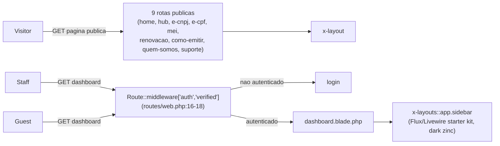
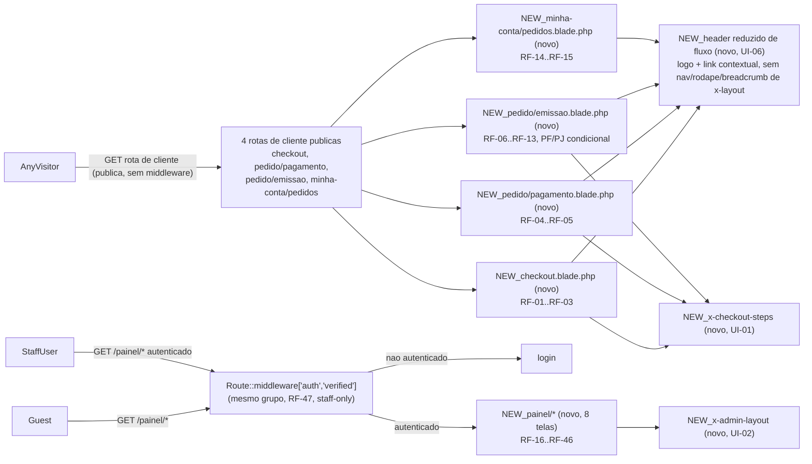

# SPEC: telas-mockup-checkout-conta-painel

## Metadata
- Source: developer description via /plan
- Service: ecommerce (Laravel monolith, único repositório)
- Tier: complete
- Version: 1.3
- Architecture references: `AGENTS.md` (raiz do repo — Laravel Boost guidelines), `.ai/rules/views.md` (convenções de `resources/views/**`), `.ai/rules/index.md` (mapa de regras)

## Context

As Phases 1–10 (já implementadas) entregaram o frontend estático das 9 páginas comerciais e de apoio (`Home`,
`Hub`, `e-CNPJ`, `e-CPF`, `MEI`, `Renovação`, `Como Emitir`, `Quem Somos`, `Suporte`), reaproveitando o design
system definido na Phase 1 (`x-layout`, `x-breadcrumb`, `x-card-produto`, `x-comparison-table`,
`x-faq-accordion`, `x-passo-a-passo`, `x-credenciamento`, `x-elegibilidade-videoconferencia`,
`x-purchase-panel`). Esta feature entrega as **13 telas restantes do mockup** (`.spec/init/design/Digital Lock
Mockups.dc.html`, seções `#checkout`, `#pix`, `#emissao-pf`, `#emissao-pj`, `#conta`, `#visao`, `#vendas`,
`#venda`, `#fila`, `#produtos`, `#pagamento`, `#clientes`, `#relatorios`) como páginas Blade **100% estáticas**,
com o mesmo corte já usado nas Phases 1–10: **sem migration, model, controller com lógica de negócio,
autenticação de papéis, chamada assíncrona, submissão real de formulário ou polling real**. Todo dado exibido
(valores, status, nomes de cliente, números de pedido) é mock/hardcoded no HTML/Blade. Uma feature futura
adicionará o banco de dados, os models e a lógica de negócio real por trás destas mesmas telas — o schema já
desenhado em `.spec/init/database-schema.md` (WIP/uncommitted) é usado aqui **apenas como fonte de nomes de
campo para o conteúdo mock** (ex.: `status_id`/`fulfillment_status_id` como dois ciclos independentes,
`product_variants.sku`, `order_item_gfsis.gfsis_order_id`), nunca para persistência real.

**Duas fontes de design, papéis diferentes (conforme instruído):** `Digital Lock Mockups.dc.html` (alta
fidelidade, WIP/uncommitted) é a fonte de **identidade visual** (paleta `--color-brand #E40044`, `--color-ink
#14110f`, tipografia Plus Jakarta Sans/IBM Plex Sans, `rounded-lg`, já convencionada na Phase 1); o
`Digital_Lock_Wireframes_Checkout_e_Painel_v1.0` é a fonte de **estrutura funcional/comportamental** (lista de
campos por formulário, rotas, origem de cada dado no banco). Onde os dois arquivos se sobrepõem em conteúdo, não
há conflito de campos — apenas de estilo visual (o wireframe usa paleta azul-marinho `#1f3556` genérica, que
**não** é usada; o dc.html prevalece, mesma decisão já registrada em `project-phases.md` para as Phases 1–10).
Um conflito de fato existe na URL do painel: ambos os arquivos de design mostram o painel num subdomínio
(`painel.ardigitallock.com`), enquanto o sumário confirmado — fonte de verdade desta SPEC — define rotas com
prefixo de caminho (`/painel/*`) no mesmo domínio da loja; as rotas `/painel/*` prevalecem.

**Correção pós-revisão (v1.1): rotas de cliente são públicas nesta fatia.** Após revisão do split
`users`/`customers` documentado em `database-schema.md` ("as duas nunca se misturam" — `users` é a equipe do
painel administrativo; `customers` são os compradores da loja, sem model/migration ainda nesta fase), o
desenvolvedor decidiu que as 4 rotas voltadas ao cliente (`/checkout/`, `/pedido/{id}/pagamento/`,
`/pedido/{id}/emissao/`, `/minha-conta/pedidos/`) **NÃO** ficam atrás do grupo `Route::middleware(['auth',
'verified'])` — são rotas **públicas** nesta fatia visual, acessíveis sem login. Autenticação real de cliente
(contra uma futura tabela `customers`) é responsabilidade de uma fase futura, fora de escopo aqui. O grupo
`Route::middleware(['auth', 'verified'])` já existente (verified at `routes/web.php:16-18`, hoje usado só pela
rota `dashboard`) continua exclusivo das 8 telas do painel administrativo (`/painel/*`) — que é e sempre foi
staff-only, isso nunca esteve em questão.

**Regra de arquitetura citada:** `.ai/rules/views.md` fixa que nenhum componente pode usar cor fora da paleta
de tokens Tailwind (`--color-brand`, `--color-ink`, `--color-muted`, `--color-surface-alt`, `--color-border`,
etc.) — regra que esta feature herda integralmente para as 13 telas novas, inclusive o painel administrativo
(fundo do sidebar em `--color-ink`, não uma cor nova). `AGENTS.md` (Laravel Boost) fixa "stick to existing
directory structure" e "check sibling files for the correct structure" — por isso as novas views seguem a
mesma árvore `resources/views/pages/**` e o mesmo padrão de `Route::view()`/controller mínimo já usado nas 9
páginas das Phases 1–10 (nenhuma pasta base nova é criada sem aprovação).

## AS IS — Estado atual

Hoje o único uso do grupo `auth`/`verified` é a rota `dashboard`, que renderiza o layout Flux/Livewire do
starter kit (`x-layouts::app.sidebar`), visualmente distinto da marca Digital Lock. Nenhuma rota de checkout,
pedido, minha conta ou painel administrativo existe em `routes/web.php`.

## TO BE — Estado proposto

As 4 rotas de loja novas (`checkout`, `pedido/pagamento`, `pedido/emissao`, `minha-conta/pedidos`) são
**públicas nesta fatia**, sem middleware de autenticação — **não** reaproveitam o `x-layout` completo da Phase
1 (nav de 5 itens + botão "Comprar" + rodapé); usam, em vez disso, o cabeçalho reduzido específico de fluxo do
mockup (logo "digitallock" + um único link de contexto — "Compra segura"/"Ajuda" nas 3 telas de compra,
"Minha conta"/"Ajuda" na tela de pedidos —, sem nav horizontal, sem `x-breadcrumb`, sem rodapé, novo requisito
UI-06). As telas `/checkout/`, `/pedido/{id}/pagamento/` e `/pedido/{id}/emissao/` somam a esse cabeçalho o
indicador de 3 passos `x-checkout-steps` (UI-01); `/minha-conta/pedidos/` usa apenas o cabeçalho reduzido, sem
indicador de passos (não faz parte do funil de 3 passos). As 8 rotas do painel entram no mesmo grupo
`auth`/`verified` já existente (RF-47, staff-only, inalterado) e usam o novo `x-admin-layout` (UI-02), distinto
do layout Flux do starter kit.

## Scope
- **In**: as 13 telas Blade estáticas listadas nos Acceptance Criteria confirmados (`/checkout/`,
  `/pedido/{id}/pagamento/`, `/pedido/{id}/emissao/` nas variações PF e PJ, `/minha-conta/pedidos/`, `/painel/`,
  `/painel/vendas/`, `/painel/vendas/{id}/`, `/painel/recuperacao/`, `/painel/produtos/`,
  `/painel/formas-pagamento/`, `/painel/clientes/`, `/painel/relatorios/`); os 8 registros de rota do painel
  atrás do grupo `auth`/`verified` existente (staff-only); os 4 registros de rota de loja (`/checkout/`,
  `/pedido/{id}/pagamento/`, `/pedido/{id}/emissao/`, `/minha-conta/pedidos/`) como rotas **públicas**, sem
  middleware de autenticação nesta fatia; os componentes novos `x-admin-layout` e `x-checkout-steps`; conteúdo
  mock hardcoded reproduzindo os blocos do mockup bloco a bloco.
- **Out**: migration, model, seeder; controller com lógica de negócio real; autenticação/model de `customers`;
  autenticação de papéis (`roles`) do painel (só checagem de login, decisão explícita do sumário confirmado);
  gateway de pagamento (Safe2Pay) e integração GFSIS reais; envio de e-mail; qualquer chamada assíncrona,
  submissão de formulário funcional ou polling real; `/painel/configuracoes/` e um item de navegação "Cupons"
  separado (visíveis no mockup, mas sem tela própria nesta fase — o conteúdo de cupons vive dentro de
  `/painel/formas-pagamento/`, conforme o próprio AC confirmado #11); páginas legais e demais rotas fora das 13
  listadas.

## RIGID (Non-Negotiable)

### Functional Requirements

#### Checkout (`/checkout/`) — Traces: US-2.3, US-2.4

- RF-01 [Event-Driven]: WHEN qualquer visitante (autenticado ou não) acessa `/checkout/`, o sistema SHALL renderizar o bloco
  "Seus dados" com os 6 campos do mockup (tipo de pessoa, CPF ou CNPJ conforme o tipo, nome completo ou razão
  social, e-mail, telefone com DDD, CEP) mais o checkbox de opt-in de comunicação.
  - AC: a página exibe rótulo "Seus dados" e os 6 campos/checkbox listados, com valores de exemplo fixos no
    HTML (sem chamada assíncrona).
- RF-02 [Event-Driven]: WHEN qualquer visitante (autenticado ou não) acessa `/checkout/`, o sistema SHALL renderizar o bloco
  "Como você prefere pagar" com as 3 opções (Pix, Cartão de crédito, Boleto), Pix pré-selecionado visualmente e
  o texto de desconto/parcelamento de cada opção.
  - AC: as 3 opções aparecem com os textos "Confirmação imediata · 5% de desconto" (Pix), "Até 12x · Sem
    desconto" (Cartão), "Compensa em 1 a 3 dias úteis · Sem desconto" (Boleto); Pix tem destaque visual de
    selecionado.
- RF-03 [Event-Driven]: WHEN qualquer visitante (autenticado ou não) acessa `/checkout/`, o sistema SHALL renderizar o bloco
  "Seu pedido" (resumo lateral) com item comprado, campo de cupom, subtotal, desconto de cupom, desconto do
  Pix e total, mais o botão "Finalizar compra".
  - AC: o resumo exibe subtotal, desconto cupom, desconto Pix e total como valores de exemplo fixos e o botão
    "Finalizar compra" não dispara nenhuma requisição HTTP real (sem `action` funcional).

#### Aguardando pagamento · Pix (`/pedido/{id}/pagamento/`) — Traces: US-2.4 (conteúdo)

- RF-04 [Event-Driven]: WHEN qualquer visitante (autenticado ou não) acessa `/pedido/{id}/pagamento/`, o sistema SHALL
  renderizar o bloco "Escaneie para pagar" com placeholder de QR Code, número do pedido, valor, código
  copia-e-cola (truncado) com botão "Copiar código", um texto estático de expiração (ex.: "Expira em 29:47") e
  a mensagem "Aguardando confirmação. Esta tela avança sozinha assim que o pagamento cair."
  - AC: os 5 elementos (QR placeholder, pedido+valor, copia-e-cola, expiração, mensagem de espera) estão
    presentes no HTML; nenhum script faz polling real a um endpoint de status.
- RF-05 [Event-Driven]: WHEN qualquer visitante (autenticado ou não) acessa `/pedido/{id}/pagamento/`, o sistema SHALL
  renderizar o bloco "Variação boleto" com o texto estático descrevendo a troca do QR Code pela linha
  digitável, o botão de download e a ressalva de compensação em 1 a 3 dias úteis.
  - AC: o texto da variação boleto aparece literalmente como no mockup, na mesma tela (não é uma rota
    separada nem um estado alternado por JS).

#### Confirmação e dados de emissão · pessoa física (`/pedido/{id}/emissao/`) — Traces: US-2.5, US-3.2 (conteúdo), US-3.3 (conteúdo)

- RF-06 [Event-Driven]: WHEN qualquer visitante (autenticado ou não) acessa `/pedido/{id}/emissao/` para um pedido cujo produto
  tem titular pessoa física (mock), o sistema SHALL renderizar o bloco de confirmação com ícone de sucesso,
  "Pagamento confirmado", número do pedido e valor pago.
  - AC: o bloco de confirmação exibe o ícone de check, "Pagamento confirmado" e "Pedido #[N] · R$ [VALOR] no
    Pix" como valores de exemplo fixos.
- RF-07 [Event-Driven]: WHEN a variação pessoa física é renderizada, o sistema SHALL exibir a seção "Titular"
  do formulário de emissão com os campos nome completo, CPF, data de nascimento, e-mail e telefone com DDD.
  - AC: os 5 campos da seção "Titular" estão presentes, sem submissão real (nenhum `method="POST"` funcional).
- RF-08 [Event-Driven]: WHEN a variação pessoa física é renderizada, o sistema SHALL exibir a seção "Endereço"
  do formulário de emissão com os campos CEP, logradouro, número, complemento, bairro, município e UF, cada um
  como campo independente (nunca um único campo de texto livre para endereço).
  - AC: os 7 campos de endereço existem como elementos de formulário distintos; nenhum campo único concatena
    mais de um componente de endereço.
- RF-09 [Event-Driven]: WHEN a tela de emissão é renderizada (PF ou PJ), o sistema SHALL exibir o bloco "O que
  acontece agora" com 4 cartões numerados: "Recebe o e-mail", "Agenda", "Valida ao vivo", "Baixa e instala",
  reaproveitando o componente `x-passo-a-passo` (Phase 1, US-8.1) — título e os 4 passos SHALL ser fornecidos
  ao componente por propriedades/dados (não hardcoded no componente), já que a diferença para o uso do
  checkout é apenas de copy (título e texto dos 4 passos), nunca de estrutura visual. Nenhum bloco/componente
  bespoke SHALL ser criado para esta tela.
  - AC: os 4 cartões aparecem na ordem e com os textos do mockup, renderizados pela mesma instância do
    componente `x-passo-a-passo` usada no checkout (mesma marcação/estrutura), recebendo título e os 4 passos
    como props/dados específicos desta tela; nenhum HTML de "4 passos numerados" é reescrito manualmente fora
    do componente.

#### Dados de emissão · pessoa jurídica (mesma rota `/pedido/{id}/emissao/`) — Traces: US-2.5 (conteúdo)

- RF-10 [Conditional]: IF o pedido acessado em `/pedido/{id}/emissao/` é de um produto com titular pessoa
  jurídica (mock), THEN o sistema SHALL exibir a seção "Empresa" com os campos razão social, CNPJ, e-mail da
  empresa e telefone com DDD, no lugar da seção "Titular" da variação PF.
  - AC: a seção "Empresa" com os 4 campos aparece apenas quando o mock representa um pedido PJ; a seção
    "Titular" (RF-07) não aparece nesse caso.
- RF-11 [Conditional]: IF a variação pessoa jurídica é renderizada, THEN o sistema SHALL exibir a seção
  "Responsável pelo uso do certificado" com os campos nome completo, CPF, data de nascimento, e-mail e
  telefone com DDD, e o texto explicando que é essa pessoa quem faz a validação por videoconferência.
  - AC: a seção "Responsável" com os 5 campos e o texto explicativo aparece na variação PJ.
- RF-12 [Conditional]: IF a variação pessoa jurídica é renderizada, THEN o sistema SHALL exibir a seção
  "Endereço da empresa" com os mesmos 7 campos independentes de RF-08, referentes ao endereço da empresa.
  - AC: os 7 campos de endereço aparecem rotulados como endereço da empresa na variação PJ.
- RF-13 [State-Driven]: WHILE a rota `/pedido/{id}/emissao/` está sendo renderizada, o sistema SHALL manter os
  blocos "Confirmação" (RF-06) e "O que acontece agora" (RF-09) idênticos entre as variações PF e PJ — apenas
  o bloco central do formulário (RF-07+RF-08 ou RF-10+RF-11+RF-12) muda conforme o tipo de titular do produto.
  - AC: comparação de snapshot dos blocos 1 e 3 entre a variação PF e a variação PJ não mostra nenhuma
    diferença de texto ou estrutura.

#### Minha conta · meus pedidos (`/minha-conta/pedidos/`) — Traces: US-3.4, US-4.2 (conteúdo, botão "Renovar")

- RF-14 [Event-Driven]: WHEN qualquer visitante (autenticado ou não) acessa `/minha-conta/pedidos/`, o sistema SHALL renderizar
  ao menos 3 cartões de pedido de exemplo, cada um em um dos estados "Emitido", "Agendado" e "Faltam seus
  dados", com os campos e ações próprios de cada estado do mockup (Emitido: titular, validade até, pago em,
  botões "Ver nota fiscal"/"Baixar certificado"/"Renovar"; Agendado: titular, data/hora da videoconferência,
  pago em, botões "Ver o que levar"/"Reagendar"; Faltam seus dados: pago em, situação, botão "Preencher
  agora").
  - AC: os 3 cartões de exemplo, cada um com o conjunto de campos e botões do seu estado, estão presentes no
    HTML; nenhum botão dispara ação real.
- RF-15 [Event-Driven]: WHEN qualquer visitante (autenticado ou não) acessa `/minha-conta/pedidos/`, o sistema SHALL renderizar
  a tabela "Estados possíveis" com as 5 linhas do mockup (Faltam seus dados, Em processamento, Agendado,
  Emitido, Vencendo) e a coluna "Origem" descrevendo o campo do banco que determina cada estado.
  - AC: a tabela tem exatamente 5 linhas com os textos de situação e origem do mockup.

#### Painel · visão geral (`/painel/`) — Traces: nenhuma US existente cobre telas administrativas (gap registrado no backlog de user stories)

- RF-16 [Event-Driven]: WHEN um usuário autenticado acessa `/painel/`, o sistema SHALL renderizar o bloco
  "Indicadores" com 5 cartões de KPI (Faturamento, Ticket médio, Taxa de conversão, Aguardando dados, Falha de
  integração), cada um com valor mock e, quando aplicável, texto de apoio (ex.: "312 pedidos").
  - AC: os 5 cartões de KPI aparecem com rótulo e valor mock.
- RF-17 [Event-Driven]: WHEN um usuário autenticado acessa `/painel/`, o sistema SHALL renderizar o bloco
  "Funil operacional" com os 5 estágios (Pedidos criados, Pagos, Dados completos, Enviados ao GFSIS, Emitidos)
  e o percentual de conversão entre estágios consecutivos, mais a nota "A maior queda revela o gargalo."
  - AC: os 5 estágios aparecem na ordem, cada um com quantidade mock e percentual (exceto o primeiro).
- RF-18 [Event-Driven]: WHEN um usuário autenticado acessa `/painel/`, o sistema SHALL renderizar o bloco
  "Exige ação" com uma tabela de 5 filas (Pagos sem dados de emissão, Falha de envio ao GFSIS, Conversões não
  enviadas, Reembolsos pendentes, Certificados vencendo em 30 dias), cada linha com quantidade, "mais antigo" e
  botão "Abrir".
  - AC: a tabela tem exatamente 5 linhas com os textos de fila do mockup.
- RF-19 [Event-Driven]: WHEN um usuário autenticado acessa `/painel/`, o sistema SHALL renderizar o bloco
  "Vendas por dia" como um placeholder de gráfico de barras (sem biblioteca de gráfico real conectada a dado
  vivo).
  - AC: o placeholder de gráfico está presente com o texto indicativo do tipo de gráfico.

#### Painel · gestão de vendas (`/painel/vendas/`)

- RF-20 [Event-Driven]: WHEN um usuário autenticado acessa `/painel/vendas/`, o sistema SHALL renderizar o
  bloco "Filtros" com os 7 controles do mockup (Período, Status do pagamento, Status da emissão, Forma de
  pagamento, Produto, Origem, busca por nome/documento/número do pedido), todos visuais e sem lógica de
  filtragem real.
  - AC: os 7 controles de filtro aparecem, nenhum deles altera a listagem via requisição real.
- RF-21 [Event-Driven]: WHEN um usuário autenticado acessa `/painel/vendas/`, o sistema SHALL renderizar a
  tabela de pedidos com as colunas Pedido, Cliente, Produto, Valor, Pagamento, Emissão e Data — as colunas
  Pagamento e Emissão SHALL sempre aparecer separadas, nunca combinadas em uma única coluna de status — mais
  paginação mock ("Mostrando 1 a 25 de 312").
  - AC: pelo menos 6 linhas de exemplo com as 7 colunas presentes, Pagamento e Emissão em colunas distintas;
    controle de paginação mock visível.
- RF-22 [Event-Driven]: WHEN um usuário autenticado acessa `/painel/vendas/`, o sistema SHALL renderizar o
  bloco "Ações em lote" com os botões "Exportar CSV", "Reenviar ao GFSIS" e "Disparar recuperação", nenhum
  disparando ação real.
  - AC: os 3 botões estão presentes, sem `action` funcional associado.

#### Painel · detalhe da venda (`/painel/vendas/{id}/`)

- RF-23 [Event-Driven]: WHEN um usuário autenticado acessa `/painel/vendas/{id}/`, o sistema SHALL renderizar
  o bloco "Cabeçalho" com número do pedido, data/hora de criação, nome do cliente e os dois badges de status
  (pagamento e emissão) lado a lado.
  - AC: o cabeçalho mostra número do pedido, data de criação, cliente e 2 badges de status distintos.
- RF-24 [Event-Driven]: WHEN um usuário autenticado acessa `/painel/vendas/{id}/`, o sistema SHALL renderizar
  a tabela "Itens" com as colunas SKU, Produto, Titular, Preço tabela e Preço praticado.
  - AC: ao menos 1 linha de item de exemplo com as 5 colunas presentes.
- RF-25 [Event-Driven]: WHEN um usuário autenticado acessa `/painel/vendas/{id}/`, o sistema SHALL renderizar
  o bloco "Financeiro" com 2 cartões: "Valores" (subtotal, desconto cupom, desconto Pix, total, taxa do
  gateway, líquido previsto) e "Pagamento" (método, status, ID no gateway, TXID, end-to-end, pago em, previsão
  de repasse).
  - AC: os 2 cartões com as linhas de campo/valor listadas estão presentes.
- RF-26 [Event-Driven]: WHEN um usuário autenticado acessa `/painel/vendas/{id}/`, o sistema SHALL renderizar
  o bloco "Emissão e GFSIS" com 2 cartões: "Dados do titular" (razão social ou nome, CPF/CNPJ, responsável
  quando PJ, e-mail, endereço, município/UF) e "Integração" (`gfsis_order_id`, código GFSIS, status GFSIS,
  agendamento, validade até, sincronizado em, tentativas), mais o botão "Reenviar ao GFSIS".
  - AC: os 2 cartões e o botão "Reenviar ao GFSIS" estão presentes, sem ação real associada ao botão.
- RF-27 [Event-Driven]: WHEN um usuário autenticado acessa `/painel/vendas/{id}/`, o sistema SHALL renderizar
  a tabela "Origem da venda" com campanha, origem e meio, gclid, página de entrada, dispositivo, sessões até a
  compra e status de conversão enviada.
  - AC: a tabela com as 7 linhas de campo/valor do mockup está presente.
- RF-28 [Event-Driven]: WHEN um usuário autenticado acessa `/painel/vendas/{id}/`, o sistema SHALL renderizar
  o bloco "Linha do tempo" com ao menos 6 eventos cronológicos (pedido criado, pagamento autorizado, dados de
  emissão preenchidos, enviado ao GFSIS, videoconferência realizada, certificado emitido), cada evento com
  data/hora e origem (sistema, webhook, cliente, fila).
  - AC: pelo menos 6 eventos aparecem em ordem cronológica ascendente, cada um com data/hora e origem.

#### Painel · fila de recuperação (`/painel/recuperacao/`)

- RF-29 [Event-Driven]: WHEN um usuário autenticado acessa `/painel/recuperacao/`, o sistema SHALL renderizar
  o bloco "Indicadores" com 4 cartões de KPI (Pagos sem dados, Recuperados em 7 dias, Mais antigo, Falha de
  envio).
  - AC: os 4 cartões de KPI aparecem com rótulo e valor mock.
- RF-30 [Event-Driven]: WHEN um usuário autenticado acessa `/painel/recuperacao/`, o sistema SHALL renderizar
  a tabela "Fila ordenada por tempo" com as colunas Pedido, Cliente, Valor, Dias, Contatos e Ação (botão
  "Ligar" ou "Reenviar link" conforme a linha), ordenada por dias em espera de forma decrescente.
  - AC: ao menos 4 linhas de exemplo, ordenadas do maior para o menor valor de "Dias".
- RF-31 [Event-Driven]: WHEN um usuário autenticado acessa `/painel/recuperacao/`, o sistema SHALL renderizar
  a tabela "Régua automática" com as 5 linhas do mockup (Imediato/E-mail, 2 horas/WhatsApp, 24 horas/E-mail, 3
  dias/WhatsApp, 5 dias/Painel), cada uma com momento, canal e mensagem.
  - AC: a tabela tem exatamente 5 linhas com os 3 campos preenchidos.
- RF-32 [Event-Driven]: WHEN um usuário autenticado acessa `/painel/recuperacao/`, o sistema SHALL renderizar
  a tabela "Falhas de integração" com as colunas Pedido, Erro, Tentativas e Ação ("Corrigir e reenviar").
  - AC: ao menos 2 linhas de exemplo com as 4 colunas presentes.

#### Painel · produtos (`/painel/produtos/`)

- RF-33 [Event-Driven]: WHEN um usuário autenticado acessa `/painel/produtos/`, o sistema SHALL renderizar a
  tabela "Lista" de produtos com as colunas Produto, Tipo, Slug, Variantes, "A partir de" e Ativo, mais o
  botão "Novo produto".
  - AC: ao menos 3 linhas de produto de exemplo com as 6 colunas presentes; botão "Novo produto" visível, sem
    ação real.
- RF-34 [Event-Driven]: WHEN um usuário autenticado acessa `/painel/produtos/`, o sistema SHALL renderizar o
  bloco "Edição · dados do produto" com os campos nome, slug, tipo de titular, descrição curta, ordem e ativo.
  - AC: os 6 campos de edição de produto estão presentes, pré-preenchidos com valores de exemplo.
- RF-35 [Event-Driven]: WHEN um usuário autenticado acessa `/painel/produtos/`, o sistema SHALL renderizar a
  tabela "Variantes do produto" com as colunas SKU, Tipo, Validade, Preço, Promocional, Vigência, Padrão e
  Ativo, mais o botão "Nova variante".
  - AC: ao menos 3 linhas de variante de exemplo com as 8 colunas presentes.
- RF-36 [Event-Driven]: WHEN um usuário autenticado acessa `/painel/produtos/`, o sistema SHALL renderizar o
  bloco "Edição de variante" com os campos SKU, tipo de certificado, validade em meses, preço, preço
  promocional, vigência da promoção, variante padrão e ativo.
  - AC: os 8 campos de edição de variante estão presentes, pré-preenchidos com valores de exemplo.

#### Painel · formas de pagamento e cupons (`/painel/formas-pagamento/`)

- RF-37 [Event-Driven]: WHEN um usuário autenticado acessa `/painel/formas-pagamento/`, o sistema SHALL
  renderizar a tabela "Formas de pagamento" com as colunas Código, Nome exibido, Desconto, Máx. parcelas,
  Ordem e Ativo, cobrindo pix, cartão e boleto.
  - AC: exatamente 3 linhas (pix, cartão, boleto) com as 6 colunas presentes.
- RF-38 [Event-Driven]: WHEN um usuário autenticado acessa `/painel/formas-pagamento/`, o sistema SHALL
  renderizar a tabela "Cupons" com as colunas Código, Tipo, Valor, Usos, Limite, Vigência, Restrição e Ativo,
  mais o botão "Novo cupom".
  - AC: ao menos 3 linhas de cupom de exemplo com as 8 colunas presentes.
- RF-39 [Event-Driven]: WHEN um usuário autenticado acessa `/painel/formas-pagamento/`, o sistema SHALL
  renderizar o bloco "Edição de cupom" com os campos código, tipo, valor, limite de usos, limite por cliente,
  restrito à variante, válido de, válido até e ativo.
  - AC: os 9 campos de edição de cupom estão presentes, pré-preenchidos com valores de exemplo.

#### Painel · clientes (`/painel/clientes/`)

- RF-40 [Event-Driven]: WHEN um usuário autenticado acessa `/painel/clientes/`, o sistema SHALL renderizar o
  bloco "Filtros e lista" com os 4 filtros do mockup (Tipo de pessoa, UF, Período de cadastro, Com certificado
  vencendo) mais busca, e a tabela com colunas Nome ou razão social, Documento, Tipo, E-mail, Pedidos e Última
  compra, com paginação mock.
  - AC: os 4 filtros + busca e ao menos 3 linhas de cliente de exemplo com as 6 colunas estão presentes.
- RF-41 [Event-Driven]: WHEN um usuário autenticado acessa `/painel/clientes/`, o sistema SHALL renderizar o
  bloco "Ficha do cliente · dados" com razão social/nome, tipo de pessoa, documento, e-mail, telefone e os 7
  campos de endereço independentes (CEP, logradouro, número, complemento, bairro, município, UF).
  - AC: os 5 campos de identificação e os 7 campos de endereço estão presentes, cada componente de endereço
    em campo próprio.
- RF-42 [Event-Driven]: WHEN um usuário autenticado acessa `/painel/clientes/`, o sistema SHALL renderizar a
  tabela "Histórico de pedidos" do cliente com as colunas Pedido, Produto, Valor, Pagamento, Emissão e
  Validade até.
  - AC: ao menos 2 linhas de pedido de exemplo com as 6 colunas presentes.
- RF-43 [Event-Driven]: WHEN um usuário autenticado acessa `/painel/clientes/`, o sistema SHALL renderizar a
  tabela "Titulares vinculados" com as colunas Titular, Documento, Tipo, Responsável e Certificado até.
  - AC: ao menos 2 linhas de titular de exemplo com as 5 colunas presentes.

#### Painel · relatórios (`/painel/relatorios/`)

- RF-44 [Event-Driven]: WHEN um usuário autenticado acessa `/painel/relatorios/`, o sistema SHALL renderizar o
  bloco "Seleção" com 9 cartões de relatório (Vendas por período, Vendas por produto, Funil operacional, Pagos
  sem dados, Base de renovação, Atribuição, Conciliação do gateway, Estornos, Cupons), cada um com nome e
  descrição curta, e "Vendas por período" com destaque visual de selecionado por padrão.
  - AC: os 9 cartões aparecem com nome e descrição; exatamente 1 cartão tem o destaque de selecionado.
- RF-45 [Event-Driven]: WHEN um usuário autenticado acessa `/painel/relatorios/`, o sistema SHALL renderizar o
  exemplo "Vendas por período" com filtros (Período, Produto, Forma de pagamento, Origem, busca), 4 cartões de
  KPI (Faturamento, Pedidos, Ticket médio, Descontos), um placeholder de gráfico de linha, uma tabela diária
  (Dia, Pedidos, Faturamento, Ticket médio, Desconto) e os botões "Exportar CSV"/"Exportar PDF".
  - AC: os filtros, os 4 KPIs, o placeholder de gráfico, ao menos 3 linhas da tabela diária e os 2 botões de
    exportação estão presentes, sem exportação real.
- RF-46 [Event-Driven]: WHEN um usuário autenticado acessa `/painel/relatorios/`, o sistema SHALL renderizar o
  exemplo "Base de renovação" com a tabela Titular, Documento, Produto, Vence em, Dias e Contato (botão
  "WhatsApp").
  - AC: ao menos 3 linhas de exemplo com as 6 colunas presentes.

#### Transversal — Traces: nenhuma US aplicável (guard cobre apenas as telas de staff do painel)

- RF-47 [Event-Driven]: WHEN um usuário não autenticado (guest) solicita qualquer uma das 8 rotas do painel
  administrativo (`/painel/`, `/painel/vendas/`, `/painel/vendas/{id}/`, `/painel/recuperacao/`,
  `/painel/produtos/`, `/painel/formas-pagamento/`, `/painel/clientes/`, `/painel/relatorios/`), o sistema
  SHALL redirecionar para a rota de login, usando o mesmo grupo `Route::middleware(['auth', 'verified'])` já
  existente (verified at `routes/web.php:16-18`). As 4 rotas de loja (`/checkout/`, `/pedido/{id}/pagamento/`,
  `/pedido/{id}/emissao/`, `/minha-conta/pedidos/`) SHALL NOT redirecionar guests — são públicas nesta fatia
  (correção pós-revisão, v1.1).
  - AC: uma requisição de teste sem sessão autenticada a qualquer uma das 8 rotas do painel retorna
    redirecionamento (302) para login, nunca 200; a mesma requisição sem sessão a qualquer uma das 4 rotas de
    loja retorna 200, nunca 302.

### UI Requirements

- UI-01 [State-Driven]: WHILE uma das telas `/checkout/`, `/pedido/{id}/pagamento/` ou
  `/pedido/{id}/emissao/` está sendo exibida, o sistema SHALL renderizar o indicador de 3 passos ("1.
  Carrinho", "2. Dados e pagamento", "3. Dados de emissão") como um único componente Blade reutilizado
  (`x-checkout-steps`), com o passo correspondente à tela atual destacado e os passos concluídos marcados como
  "ok".
  - AC: nas 3 telas o mesmo componente aparece; o passo ativo muda conforme a tela (checkout e pix destacam o
    passo 2, emissão destaca o passo 3); nenhuma tela reescreve o HTML do indicador manualmente.
- UI-02 [State-Driven]: WHILE qualquer uma das 8 telas do painel administrativo está sendo exibida, o sistema
  SHALL renderizar um layout comum (`x-admin-layout`, novo) com sidebar de fundo `--color-ink`, wordmark
  "digitallock", os 7 itens de navegação em escopo (Visão geral, Vendas, Fila de recuperação, Produtos, Formas
  de pagamento, Clientes, Relatórios) e um rodapé com nome/papel do usuário autenticado, mais uma barra
  superior com título da tela e seletor de período estático.
  - AC: as 8 telas do painel usam o mesmo componente de layout; o item de navegação correspondente à tela
    atual está com destaque visual distinto dos demais; nenhuma tela do painel duplica o HTML do sidebar.
- UI-03 [State-Driven]: WHILE uma tela exibe status de pagamento ou de emissão (minha conta, vendas, detalhe
  da venda, clientes), o sistema SHALL usar um componente de badge único com variantes visuais distintas por
  categoria de status (sucesso/emitido, agendado, atenção/aguardando, erro/falha ou estornado, neutro/pendente
  ou cancelado).
  - AC: o mesmo componente de badge é usado nas 4 telas citadas; cada categoria de status tem uma combinação
    de cor de fundo/texto consistente em todas as ocorrências.
- UI-04 [Unwanted]: IF uma tela do painel administrativo é renderizada, THEN o sistema SHALL NOT reutilizar o
  layout `x-layouts::app.sidebar` do starter kit (Flux, dark zinc) nem o `x-layout` da loja — o painel usa
  exclusivamente `x-admin-layout` (UI-02).
  - AC: inspeção do HTML das 8 telas do painel não encontra nenhuma marcação característica do layout Flux do
    starter kit nem do header/rodapé de `x-layout`.
- UI-05 [Unwanted]: IF qualquer uma das 13 telas é renderizada em largura de viewport mobile, THEN o sistema
  SHALL NOT apresentar rolagem horizontal, seguindo o mesmo padrão de responsividade "desktop-first com
  adaptação mobile" já estabelecido em US-8.4 para as Phases 1–10.
  - AC: nas 13 telas, em pelo menos uma largura de viewport mobile de referência, não há elemento que force
    `overflow-x` na página.
- UI-06 [Unwanted]: IF uma das 4 telas de loja (`/checkout/`, `/pedido/{id}/pagamento/`,
  `/pedido/{id}/emissao/`, `/minha-conta/pedidos/`) é renderizada, THEN o sistema SHALL NOT reutilizar o
  `x-layout` completo (Phase 1, nav horizontal de 5 itens, botão CTA "Comprar" e rodapé) nem `x-breadcrumb` —
  o sistema SHALL exibir, em vez disso, o cabeçalho reduzido específico do mockup (logo "digitallock" + um
  único link de contexto: "Compra segura"/"Ajuda" nas 3 telas de compra, "Minha conta"/"Ajuda" na tela de
  pedidos), coerente com o fato de nenhuma das 13 telas usar `x-breadcrumb` (conforme mockup revisado).
  - AC: inspeção do HTML das 4 telas de loja não encontra a nav horizontal de 5 itens, o botão "Comprar" nem o
    rodapé característicos de `x-layout`, nem marcação de `x-breadcrumb`; o cabeçalho reduzido (logo + 1 link
    de contexto) está presente nas 4 telas, com o texto do link correspondente a cada tela.

### Contracts

- CT-01: `GET /checkout/` → view `pages.checkout` (sugerido) · **rota pública, sem middleware de
  autenticação** · sem parâmetros.
- CT-02: `GET /pedido/{id}/pagamento/` → view `pages.pedido.pagamento` (sugerido) · **rota pública, sem
  middleware de autenticação** · `{id}` é um identificador mock de pedido, usado apenas para exibição (ex.:
  "Pedido #{id}"), sem consulta a banco de dados.
- CT-03: `GET /pedido/{id}/emissao/` → view `pages.pedido.emissao` (sugerido) · **rota pública, sem middleware
  de autenticação** · `{id}` mock; a variação PF/PJ é decidida por uma variável mock (não por lookup real de
  `holder_type_id`).
- CT-04: `GET /minha-conta/pedidos/` → view `pages.minha-conta.pedidos` (sugerido) · **rota pública, sem
  middleware de autenticação** · sem parâmetros.
- CT-05: `GET /painel/` → view `pages.painel.visao-geral` (sugerido) · atrás de `auth`+`verified`.
- CT-06: `GET /painel/vendas/` → view `pages.painel.vendas.index` (sugerido) · atrás de `auth`+`verified`.
- CT-07: `GET /painel/vendas/{id}/` → view `pages.painel.vendas.show` (sugerido) · atrás de `auth`+`verified` ·
  `{id}` é um identificador mock de pedido, exibição apenas.
- CT-08: `GET /painel/recuperacao/` → view `pages.painel.recuperacao` (sugerido) · atrás de `auth`+`verified`.
- CT-09: `GET /painel/produtos/` → view `pages.painel.produtos` (sugerido) · atrás de `auth`+`verified`.
- CT-10: `GET /painel/formas-pagamento/` → view `pages.painel.formas-pagamento` (sugerido) · atrás de
  `auth`+`verified`.
- CT-11: `GET /painel/clientes/` → view `pages.painel.clientes` (sugerido) · atrás de `auth`+`verified`.
- CT-12: `GET /painel/relatorios/` → view `pages.painel.relatorios` (sugerido) · atrás de `auth`+`verified`.

### Non-Functional Requirements

- RNF-01 [Unwanted]: IF qualquer uma das 13 telas é implementada, THEN o sistema SHALL NOT emitir chamada
  assíncrona (`fetch`, `XMLHttpRequest`, Livewire request, Alpine `$wire`) para buscar ou enviar dado de
  negócio — toda a renderização é server-side, no carregamento inicial da página.
- RNF-02 [Unwanted]: IF qualquer uma das 13 telas contém um elemento `<form>` ou botão de ação (ex.: "Finalizar
  compra", "Concluir e enviar para emissão", "Novo produto", "Reenviar ao GFSIS"), THEN o sistema SHALL NOT
  vincular esse elemento a uma rota funcional de submissão (sem `POST`/`PUT`/`PATCH` real processado no
  back-end nesta fase).
- RNF-03 [Unwanted]: IF a tela `/pedido/{id}/pagamento/` é renderizada, THEN o sistema SHALL NOT executar
  nenhum mecanismo de polling real (`setInterval`/`setTimeout` chamando um endpoint de status) — o texto de
  contagem regressiva e a mensagem de espera são estáticos.
- RNF-04 [Unwanted]: IF esta feature é implementada, THEN o sistema SHALL NOT criar migration, model ou
  controller com lógica de negócio (consulta a banco, cálculo de preço real, integração com gateway/GFSIS) —
  todo dado exibido nas 13 telas é hardcoded/mock no Blade.
- RNF-05 [Unwanted]: IF qualquer uma das 13 telas é implementada, THEN o sistema SHALL NOT usar cor fora da
  paleta de tokens já definida em `resources/css/app.css` (Phase 1) — em particular, nenhum azul e nenhuma cor
  nova introduzida só para o painel administrativo (`--color-ink` cobre o fundo escuro do sidebar).
- RNF-06 [Event-Driven]: WHEN qualquer uma das 13 telas é carregada, o sistema SHALL aplicar a tipografia já
  convencionada (Plus Jakarta Sans para títulos/botões/labels, IBM Plex Sans para corpo) e `rounded-lg` (8px)
  em todo botão/CTA, sem exceção.

## FLEXIBLE (Implementation Suggestions)

- Rotas com `{id}` (`/pedido/{id}/pagamento/`, `/pedido/{id}/emissao/`, `/painel/vendas/{id}/`) podem ser
  registradas com `Route::view()` recebendo o parâmetro como variável de view, ou com um controller mínimo
  (`__invoke`, Single Action Controller, convenção já registrada em `project-description.md`) quando a lógica
  condicional PF/PJ de `/pedido/{id}/emissao/` tornar `Route::view()` insuficiente.
- Estrutura de pastas sugerida em `resources/views/pages/`: `checkout.blade.php`, `pedido/pagamento.blade.php`,
  `pedido/emissao.blade.php`, `minha-conta/pedidos.blade.php`, `painel/visao-geral.blade.php`,
  `painel/vendas/index.blade.php`, `painel/vendas/show.blade.php`, `painel/recuperacao.blade.php`,
  `painel/produtos.blade.php`, `painel/formas-pagamento.blade.php`, `painel/clientes.blade.php`,
  `painel/relatorios.blade.php`.
- Componentes novos sugeridos: `x-checkout-steps` (props: passo ativo), `x-admin-layout` (slot de conteúdo +
  prop de item de nav ativo), `x-badge-status` (prop de variante), `x-kpi-card`, `x-funil-operacional`,
  `x-timeline`. Reaproveitar `x-comparison-table` (Phase 1) onde a forma de tabela (colunas fixas + linhas)
  já se encaixa, em vez de recriar marcação de tabela em cada tela do painel.
- Dados mock podem viver como arrays/coleções PHP inline em cada view, ou centralizados numa classe de suporte
  (ex.: `app/Support/Mocks/PainelMockData.php`) para reduzir duplicação entre `visao-geral`, `vendas` e
  `vendas/show`, que compartilham os mesmos pedidos de exemplo (`#1042`, `#1041`, `#1040`...).
  Ambas as opções descarregam a mesma lógica; escolher no momento de implementação, sem model/migration.
  real.
- Máscara de CPF/CNPJ/CEP nos campos de formulário pode usar Alpine.js puro no cliente, sem validação real de
  back-end, para fidelidade visual ao mockup.
- Página `/pedido/{id}/emissao/` pode aceitar um query string ou variável mock (`?tipo=pj`) para alternar entre
  as variações PF/PJ durante o desenvolvimento/QA visual, já que não há model de produto real ainda.

## Acceptance Criteria Summary

| ID | Criterion | Testable? |
|----|-----------|-----------|
| RF-01 | Checkout exibe bloco "Seus dados" com 6 campos + opt-in | Yes |
| RF-02 | Checkout exibe bloco de forma de pagamento com 3 opções, Pix pré-selecionado | Yes |
| RF-03 | Checkout exibe resumo do pedido + botão "Finalizar compra" sem submissão real | Yes |
| RF-04 | Pix exibe QR, copia-e-cola, expiração e mensagem de espera, sem polling real | Yes |
| RF-05 | Pix exibe bloco de variação boleto com o texto do mockup | Yes |
| RF-06 | Emissão PF exibe confirmação de pagamento (ícone + pedido + valor) | Yes |
| RF-07 | Emissão PF exibe seção "Titular" com 5 campos | Yes |
| RF-08 | Emissão PF exibe seção "Endereço" com 7 campos independentes | Yes |
| RF-09 | Emissão exibe bloco "O que acontece agora" com 4 cartões via `x-passo-a-passo` (título/passos por props) | Yes |
| RF-10 | Emissão PJ exibe seção "Empresa" com 4 campos no lugar de "Titular" | Yes |
| RF-11 | Emissão PJ exibe seção "Responsável" com 5 campos + texto explicativo | Yes |
| RF-12 | Emissão PJ exibe seção "Endereço da empresa" com 7 campos | Yes |
| RF-13 | Blocos 1 e 3 idênticos entre variações PF e PJ | Yes |
| RF-14 | Minha conta exibe 3 cartões de pedido, um por estado (Emitido/Agendado/Faltam dados) | Yes |
| RF-15 | Minha conta exibe tabela de 5 estados possíveis | Yes |
| RF-16 | Painel visão geral exibe 5 KPIs | Yes |
| RF-17 | Painel visão geral exibe funil de 5 estágios com conversão | Yes |
| RF-18 | Painel visão geral exibe tabela "Exige ação" com 5 filas | Yes |
| RF-19 | Painel visão geral exibe placeholder de gráfico "Vendas por dia" | Yes |
| RF-20 | Painel vendas exibe 7 filtros visuais | Yes |
| RF-21 | Painel vendas exibe tabela com Pagamento e Emissão em colunas separadas + paginação mock | Yes |
| RF-22 | Painel vendas exibe 3 botões de ação em lote sem ação real | Yes |
| RF-23 | Detalhe da venda exibe cabeçalho com 2 badges de status | Yes |
| RF-24 | Detalhe da venda exibe tabela de itens (5 colunas) | Yes |
| RF-25 | Detalhe da venda exibe cartões "Valores" e "Pagamento" | Yes |
| RF-26 | Detalhe da venda exibe cartões "Dados do titular" e "Integração" + botão reenviar | Yes |
| RF-27 | Detalhe da venda exibe tabela "Origem da venda" | Yes |
| RF-28 | Detalhe da venda exibe linha do tempo com ≥ 6 eventos cronológicos | Yes |
| RF-29 | Fila de recuperação exibe 4 KPIs | Yes |
| RF-30 | Fila de recuperação exibe tabela ordenada por dias decrescente | Yes |
| RF-31 | Fila de recuperação exibe tabela "Régua automática" com 5 linhas | Yes |
| RF-32 | Fila de recuperação exibe tabela "Falhas de integração" | Yes |
| RF-33 | Produtos exibe lista de produtos + botão "Novo produto" | Yes |
| RF-34 | Produtos exibe bloco de edição de produto com 6 campos | Yes |
| RF-35 | Produtos exibe tabela de variantes + botão "Nova variante" | Yes |
| RF-36 | Produtos exibe bloco de edição de variante com 8 campos | Yes |
| RF-37 | Formas de pagamento exibe tabela com 3 formas | Yes |
| RF-38 | Formas de pagamento exibe tabela de cupons + botão "Novo cupom" | Yes |
| RF-39 | Formas de pagamento exibe bloco de edição de cupom com 9 campos | Yes |
| RF-40 | Clientes exibe filtros + lista com 6 colunas | Yes |
| RF-41 | Clientes exibe ficha do cliente com identificação + 7 campos de endereço | Yes |
| RF-42 | Clientes exibe histórico de pedidos (6 colunas) | Yes |
| RF-43 | Clientes exibe titulares vinculados (5 colunas) | Yes |
| RF-44 | Relatórios exibe seleção de 9 relatórios, 1 selecionado por padrão | Yes |
| RF-45 | Relatórios exibe exemplo "Vendas por período" completo | Yes |
| RF-46 | Relatórios exibe exemplo "Base de renovação" | Yes |
| RF-47 | Guest é redirecionado (302) nas 8 rotas do painel; retorna 200 (público) nas 4 rotas de loja | Yes |
| UI-01 | `x-checkout-steps` reutilizado nas 3 telas de loja, passo ativo correto | Yes |
| UI-02 | `x-admin-layout` reutilizado nas 8 telas do painel, item ativo destacado | Yes |
| UI-03 | Badge de status único e consistente nas 4 telas que exibem status | Yes |
| UI-04 | Painel não reutiliza layout Flux do starter kit nem `x-layout` da loja | Yes |
| UI-05 | Nenhuma das 13 telas tem rolagem horizontal em viewport mobile | Yes |
| UI-06 | As 4 telas de loja usam cabeçalho reduzido (logo + 1 link), não `x-layout` completo nem `x-breadcrumb` | Yes |
| RNF-01 | Nenhuma chamada assíncrona nas 13 telas | Yes |
| RNF-02 | Nenhum formulário/botão com submissão funcional | Yes |
| RNF-03 | Nenhum polling real na tela de pagamento Pix | Yes |
| RNF-04 | Nenhuma migration/model/controller com lógica de negócio criada | Yes |
| RNF-05 | Nenhuma cor fora da paleta de tokens do Phase 1 | Yes |
| RNF-06 | Tipografia e `rounded-lg` aplicados em todas as 13 telas | Yes |
