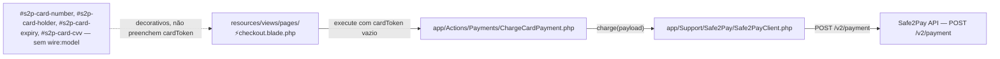

# Implementation Plan

## Request Summary
- Objective: fechar a lacuna de tokenização de cartão do checkout — (1) uma rota backend
  dedicada (`POST /checkout/tokenizar-cartao`) que chama `POST /v2/token` da Safe2Pay (Cofre de
  Chaves) com a credencial `X-API-KEY` já configurada, devolvendo só `token`/`brand`/`last4` em
  sucesso e nunca logando/persistindo o payload bruto de cartão; e (2) validação client-side
  (máscara, bandeira por BIN, validade, CVV, Luhn) que controla o estado de "Finalizar compra" e
  dispara essa rota via `fetch` antes de `finalizarCompra()`, preenchendo `cardToken` via
  `$wire.set()` — mesmo padrão já usado para `visitorId`.
- Scope: in — rota/controller/FormRequest/exceção de tokenização, método novo em
  `Safe2PayClient`, módulo JS de máscara/Luhn/BIN/validade/CVV, wiring desse módulo no botão
  "Finalizar compra" do checkout, meta tag CSRF no layout. out — 3DS/MPI, tokenização direta
  navegador→Safe2Pay, qualquer alteração de comportamento em `ChargeCardPayment`/`CardBrand`/
  `TransactionStatus`/`PaymentPayloadBuilder`, sandbox real para `/v2/token`.
- Tier: standard
- Architecture references: AGENTS.md (guidelines genéricas do Laravel Boost — constructor
  property promotion, return types explícitos, "Keep state server-side... validate in actions"
  em Livewire); `.ai/rules/routes.md` (controller invocável precisa existir antes do registro da
  rota — T05 antes de T06 nesta ordem exata); `.ai/rules/tests.md` (sem impacto direto — nenhuma
  task usa `HolderTypeFactory` isoladamente). Não há árvore `docs/agents/` nem documento de
  arquitetura específico do domínio Checkout/Safe2Pay além disso.

## AS IS — Componentes impactados

Reprodução verificada do AS IS descrito na SPEC: os 4 inputs de cartão existem no HTML mas sem
`wire:model`; `cardToken` (propriedade Livewire já existente) chega sempre vazio a
`ChargeCardPayment::execute()`, que já espera um `Token` do Cofre de Chaves e nunca dados brutos.

## TO BE — Componentes propostos

```mermaid
flowchart LR
  Layout["resources/views/components/checkout-layout.blade.php (alterado, T04)"]
  CardJS["resources/js/card-tokenization.js (novo, T07)"]
  AppJS["resources/js/app.js (alterado, T07)"]
  Checkout["resources/views/pages/⚡checkout.blade.php (alterado, T08)"]
  Route["routes/web.php: POST /checkout/tokenizar-cartao (novo, T06)"]
  Controller["app/Http/Controllers/Checkout/TokenizeCardController.php (novo, T05)"]
  FormRequest["app/Http/Requests/TokenizeCardRequest.php (novo, T03)"]
  Exception["app/Exceptions/Payments/Safe2PayTokenizationFailedException.php (novo, T01)"]
  Client["app/Support/Safe2Pay/Safe2PayClient.php (alterado, T02)"]
  Safe2PayAPI["Safe2Pay API — POST /v2/token"]
  ChargeCardPayment["app/Actions/Payments/ChargeCardPayment.php (inalterado, RF-05)"]

  Layout -.->|"meta csrf-token"| CardJS
  AppJS -->|"registra Alpine.data cardCheckout"| CardJS
  Checkout -->|"x-data cardCheckout()"| CardJS
  CardJS -->|"fetch POST"| Route
  Route --> Controller
  Controller -->|"valida payload"| FormRequest
  Controller -->|"tokenize(payload)"| Client
  Client -->|"POST /v2/token"| Safe2PayAPI
  Controller -.->|"HasError:true"| Exception
  CardJS -->|"wire.set cardToken + wire.finalizarCompra()"| Checkout
  Checkout -->|"execute com cardToken real"| ChargeCardPayment
```

`CardJS`/`AppJS` (T07) e o wiring em `Checkout` (T08) realizam UI-01 a UI-06 e disparam RF-01;
`Route`→`Controller`→`FormRequest`/`Client`/`Exception` (T01, T02, T03, T05, T06) realizam
RF-01 a RF-04, CT-01, CT-02, RNF-01; `Layout` (T04) habilita o header CSRF do `fetch`;
`ChargeCardPayment` permanece inalterado — só passa a receber um `cardToken` não vazio (RF-05).

## Tasks

### T01 — Criar `Safe2PayTokenizationFailedException`
- **Files**: `app/Exceptions/Payments/Safe2PayTokenizationFailedException.php` (novo)
- **Change**: Nova `RuntimeException` no mesmo molde de `Safe2PayChargeFailedException`
  (construtor property promotion + `readonly array $rawResponse`, getter `rawResponse(): array`),
  mas com docblock e mensagem interna específicas de `/v2/token` (não reaproveitar
  `Safe2PayChargeFailedException` — seu docblock/mensagem hoje referenciam explicitamente
  `POST /v2/payment`; ver Assumptions). Implementa um método `render(): \Illuminate\Http\JsonResponse`
  (convenção nativa do Laravel: o exception handler chama `render()` quando presente) que retorna
  `response()->json(['message' => 'Não foi possível tokenizar o cartão. Tente novamente.'], 422)` —
  isso satisfaz CT-02 sem exigir `try/catch` explícito no controller para este caminho.
- **Covers**: RF-02, CT-02
- **Tests**: Sem teste unitário dedicado (mesmo padrão de `Safe2PayChargeFailedException`, que
  também não tem arquivo de teste próprio) — comportamento exercitado indiretamente pelos testes
  de T06.
- **Risk**: Low — classe nova, sem efeito colateral, não importada por nenhum código existente.
- **Dependencies**: none

### T02 — `Safe2PayClient::tokenize()`
- **Files**: `app/Support/Safe2Pay/Safe2PayClient.php`
- **Change**: Novo método público `tokenize(array $payload): Response` seguindo o mesmo padrão de
  `charge()`/`query()`/`refundPix()`/`refundCard()`: `return $this->client()->post('/v2/token',
  $payload);`. Sem `IsSandbox` no payload (RF-01 só lista `Holder`/`CardNumber`/
  `ExpirationDate`/`SecurityCode` no corpo de `/v2/token` — diferente de `charge()`, que sempre
  injeta `IsSandbox`). Reaproveita `client()`/`apiKey()`/`isSandbox()` privados já existentes, sem
  alterá-los (RNF-01: credencial já lida exclusivamente via `config('services.safe2pay.*')`).
- **Covers**: RF-01, RNF-01
- **Tests**: `tests/Unit/Support/Safe2Pay/Safe2PayClientTest.php` — novos casos
  `test_tokenize_posts_to_v2_token_with_sandbox_api_key_from_config` (URL
  `https://payment.safe2pay.com.br/v2/token`, método POST, header `X-API-KEY: sandbox-key`,
  payload repassado sem alteração) e `test_tokenize_uses_production_api_key_when_configured`
  (mesmo padrão dos dois testes de `charge()` já existentes no arquivo, linhas 22-45); assert
  explícito de que o payload enviado NÃO contém a chave `IsSandbox`.
- **Risk**: Low — método aditivo, não altera `charge()`/`query()`/`refundPix()`/`refundCard()`
  nem os métodos privados compartilhados.
- **Dependencies**: none

### T03 — Criar `TokenizeCardRequest`
- **Files**: `app/Http/Requests/TokenizeCardRequest.php` (novo)
- **Change**: `FormRequest` no mesmo molde de `StoreIssuanceDataRequest`: `authorize(): bool`
  retorna `true` (rota pública, sem gate de posse — mesma acessibilidade de `checkout`, CT-01);
  `rules()` retorna `holder` (`required|string|max:180`), `cardNumber`
  (`required|string|regex:/^[0-9]{12,19}$/`), `expirationDate`
  (`required|string|regex:/^(0[1-9]|1[0-2])\/[0-9]{2}$/` — formato MM/AA), `securityCode`
  (`required|string|regex:/^[0-9]{3,4}$/`) — casa exatamente com o request body de CT-01/openapi.yaml.
- **Covers**: RF-01 (suporte), CT-01
- **Tests**: `tests/Unit/Http/Requests/TokenizeCardRequestTest.php` (novo) — mesmo padrão de
  `tests/Unit/Http/Requests/StoreIssuanceDataRequestTest.php` (rota `_test/` registrada em
  `setUp()` com `Route::middleware('web')->post(...)`): casos
  `test_missing_holder_card_number_expiration_date_or_security_code_fails_validation` (loop pelos
  4 campos, `assertSessionHasErrors(<campo>)`), `test_a_valid_payload_passes_validation`,
  `test_an_expiration_date_not_in_mm_slash_yy_format_fails_validation` (ex.: `13/2026`),
  `test_a_security_code_with_letters_or_wrong_length_fails_validation`.
- **Risk**: Low — classe nova de validação, sem side effect.
- **Dependencies**: none

### T04 — Meta tag CSRF em `checkout-layout.blade.php`
- **Files**: `resources/views/components/checkout-layout.blade.php`
- **Change**: Adicionar `<meta name="csrf-token" content="{{ csrf_token() }}">` ao `<head>`
  (hoje ausente) — necessário para o `fetch` de T08 enviar `X-CSRF-TOKEN`, já que
  `/checkout/tokenizar-cartao` fica dentro do grupo `web` com CSRF ativo por padrão (verified at
  `bootstrap/app.php:22` — só `webhooks/safe2pay`/`webhooks/gfsis` estão isentos).
- **Covers**: UI-05 (suporte — pré-requisito do `fetch`)
- **Tests**: Nenhum teste dedicado — verificado junto de T08, que adiciona um `assertSee('name="csrf-token"')` em `tests/Feature/Pages/CheckoutTest.php` ao renderizar `pages::checkout`.
- **Risk**: Low — mudança aditiva de uma linha no `<head>`, não afeta nenhum layout/página
  existente além de expor o token (comportamento padrão do Laravel, sem dado sensível).
- **Dependencies**: none

### T05 — Criar `TokenizeCardController`
- **Files**: `app/Http/Controllers/Checkout/TokenizeCardController.php` (novo)
- **Change**: Controller single-action (`__invoke`, mesmo padrão de `StoreEmissaoController`/
  `Safe2PayWebhookController`), assinatura `__invoke(TokenizeCardRequest $request,
  Safe2PayClient $client): JsonResponse`. Monta `$payload = ['Holder' =>
  $request->validated('holder'), 'CardNumber' => $request->validated('cardNumber'),
  'ExpirationDate' => $request->validated('expirationDate'), 'SecurityCode' =>
  $request->validated('securityCode')]`; chama `$response = $client->tokenize($payload);`;
  envolve `$response->throw()` em `try/catch (\Illuminate\Http\Client\RequestException)` — no
  `catch`, lança `Safe2PayTokenizationFailedException(['error' => $e->getMessage()])` (RF-02,
  caminho "chamada HTTP falha" de CT-02, tratado com a mesma exceção/`render()` de T01 para manter
  um único formato de erro). Após `throw()` bem-sucedido, `if ($response->json('HasError') ===
  true) { throw new Safe2PayTokenizationFailedException((array) $response->json()); }` (RF-02).
  Em sucesso: `$brandCode = (int) $response->json('ResponseDetail.Brand'); $cardNumber = (string)
  $response->json('ResponseDetail.CardNumber');` e retorna `response()->json(['token' =>
  (string) $response->json('ResponseDetail.Token'), 'brand' =>
  CardBrand::tryFrom($brandCode)?->label() ?? (string) $brandCode, 'last4' =>
  substr($cardNumber, -4)])` — mesmo padrão de derivação de `card_brand`/`card_last_digits` já
  usado em `ChargeCardPayment::execute()` (verified at
  `app/Actions/Payments/ChargeCardPayment.php:76-78`) — nenhuma chave além de
  `token`/`brand`/`last4` no corpo de sucesso (RF-01). Nenhuma chamada `Log::*` em nenhum ponto
  deste método, nem em qualquer helper que este controller chame (RF-03) — o corpo bruto da
  requisição/resposta só é carregado dentro da exceção (T01), nunca logado/persistido.
- **Covers**: RF-01, RF-02, RF-03, RF-04
- **Tests**: Sem teste dedicado neste ponto — a rota ainda não existe (regra de
  `.ai/rules/routes.md`: controller precisa existir antes do registro da rota); exercitado pelos
  testes de T06, que registra a rota e só então consegue fazer requisições HTTP reais contra este
  controller.
- **Risk**: Medium — primeiro endpoint JSON público desta aplicação que recebe dados sensíveis de
  cartão (mesmo que nunca persistidos); mitigado por RF-03 (proibição de log/persistência,
  verificável por revisão de código) e pela resposta de sucesso conter só as 3 chaves permitidas.
- **Dependencies**: T01, T02, T03

### T06 — Registrar rota `POST /checkout/tokenizar-cartao` e testes do controller
- **Files**: `routes/web.php`, `tests/Feature/Http/Checkout/TokenizeCardControllerTest.php` (novo)
- **Change**: `Route::post('checkout/tokenizar-cartao', TokenizeCardController::class)
  ->name('checkout.tokenizar-cartao');`, fora de qualquer grupo `middleware('auth...')` (mesma
  acessibilidade pública de `Route::livewire('checkout/', ...)`, verified at
  `routes/web.php:24`) — import de `App\Http\Controllers\Checkout\TokenizeCardController` no topo
  do arquivo. Registrado **depois** de T05 (regra de `.ai/rules/routes.md`: `method_exists($action,
  '__invoke')` é validado no boot da rota; se a classe não existir, o boot inteiro da aplicação
  falha).
- **Covers**: CT-01, CT-02, RF-01, RF-02, RF-03, RF-04, RNF-01 (via testes)
- **Tests**: `tests/Feature/Http/Checkout/TokenizeCardControllerTest.php` (novo, mesmo padrão de
  `tests/Feature/Http/Webhooks/Safe2PayWebhookControllerTest.php` — `$this->postJson(...)`) —
  1. `test_a_successful_tokenization_returns_exactly_token_brand_and_last4` — `Http::fake` com
     `HasError: false` e `ResponseDetail.Token/Brand/CardNumber` preenchidos; `assertOk()`,
     `assertExactJson(['token' => ..., 'brand' => 'Visa', 'last4' => '5100'])` (RF-01, RF-04).
  2. `test_hasError_true_blocks_any_token_in_the_response` — `Http::fake` HTTP 200 com
     `HasError: true`; `assertStatus(422)`, `assertJsonStructure(['message'])`,
     `assertJsonMissing(['token'])` (RF-02, CT-02).
  3. `test_when_the_safe2pay_http_call_fails_the_response_has_no_token` — `Http::fake` retornando
     500; `assertStatus(422)`, `assertJsonMissing(['token'])` (CT-02).
  4. `test_a_missing_required_field_fails_validation` — loop pelos 4 campos do body, cada um
     ausente; `assertStatus(422)`, `assertJsonMissing(['token'])` (CT-01).
  5. `test_credentials_are_read_from_config_not_hardcoded` — sobrescreve
     `services.safe2pay.api_key_sandbox`/`api_key_production`/`is_sandbox`; `Http::assertSent`
     confere `X-API-KEY` batendo com o valor de `config()`, nunca um literal fixo no teste
     (RNF-01).
  6. `test_the_raw_card_payload_and_response_are_never_logged` — `Log::spy()`; após uma chamada
     bem-sucedida e uma com `HasError:true`, `Log::shouldNotHaveReceived('error')` (ou equivalente
     assert de que nenhuma chamada a `Log::*` ocorreu) — confirma RF-03 também no caminho de erro.
- **Risk**: Medium — primeira rota JSON pública desta aplicação fora do padrão de webhooks;
  mitigado por não ter middleware `auth` (mesmo padrão documentado de `checkout`) e pelos 6 casos
  de teste cobrindo sucesso, ambos os caminhos de erro (CT-02) e a não-persistência/log (RF-03).
- **Dependencies**: T05

### T07 — Módulo JS de máscara/Luhn/bandeira/validade/CVV (`card-tokenization.js`)
- **Files**: `resources/js/card-tokenization.js` (novo), `resources/js/app.js` (hoje vazio,
  verified)
- **Change**: Funções puras exportadas em `card-tokenization.js` — `luhnIsValid(digits: string):
  boolean`; `detectBrand(digits: string): string|null` (BIN por prefixo cobrindo as 8 bandeiras de
  `CardBrand`: Visa `4`; Mastercard `51-55`/`2221-2720`; American Express `34`/`37`; Elo (ranges
  publicamente conhecidos, ex.: `4011`, `4312`, `4389`, `504175`, `509`, `627780`, `636297`,
  `636368`, `650`-`651`; lista exata é detalhe de implementação, não RIGID — ver Assumptions);
  Aura `50`; JCB `3528-3589`; Diners Club `300-305`/`36`/`38`; Discover `6011`/`644-649`/`65`);
  `formatCardNumber(digits: string): string` (grupos de 4, UI-04); `isValidExpiry(mmYY: string):
  boolean` (mês 01-12 e ano/mês não anterior ao mês corrente, UI-02); `isValidCvv(cvv: string,
  brand: string|null): boolean` (3 dígitos, ou 4 quando `brand === 'amex'`, UI-03). Também exporta
  `cardCheckout(): object` — factory de componente Alpine com estado (`cardNumberRaw`, `holder`,
  `expiry`, `cvv`, `brand`, `submitting` para a trava de "no máximo 1 chamada por clique",
  RNF-02) e métodos `onCardNumberInput(event)` (mantém só dígitos, corta em 19, aplica
  `formatCardNumber` no valor exibido), `cardIsValid()` (computed: `luhnIsValid` + `detectBrand`
  não-nulo + `isValidExpiry` + `isValidCvv`, UI-01 a UI-03) e `submit(paymentMethodSlug)`: se
  `paymentMethodSlug !== 'cartao'`, chama `this.$wire.finalizarCompra()` direto (fluxo pix/boleto
  inalterado); se `cartao` e `!this.cardIsValid()` ou `this.submitting`, não faz nada (botão já
  desabilitado via `:disabled`, guarda redundante evita corrida); senão marca
  `this.submitting = true`, faz **um único** `fetch('/checkout/tokenizar-cartao', {method:
  'POST', headers: {'Content-Type': 'application/json', 'X-CSRF-TOKEN':
  document.querySelector('meta[name="csrf-token"]').content}, body: JSON.stringify({holder:
  this.holder, cardNumber: this.cardNumberRaw, expirationDate: this.expiry, securityCode:
  this.cvv})})`; em sucesso (`res.ok`), lê `{token}` e chama `this.$wire.set('cardToken', token)`
  seguido de `this.$wire.finalizarCompra()` (RF-01, UI-05); em falha, define uma mensagem de erro
  local (state `tokenizeError`) e NÃO chama `finalizarCompra()`; em `finally`, `this.submitting =
  false`. Em `app.js`, registra o componente via
  `document.addEventListener('alpine:init', () => Alpine.data('cardCheckout', cardCheckout));`
  após `import { cardCheckout } from './card-tokenization';` — `Alpine` já está disponível
  globalmente (bundle do Livewire 4, verified pelo uso de `x-data` já existente em
  `resources/views/components/purchase-panel.blade.php` e outros, sem import explícito hoje).
- **Covers**: UI-01, UI-02, UI-03, UI-04, UI-05 (suporte), RNF-02
- **Tests**: Sem test runner JS no projeto (verified — `package.json` sem `devDependency` de
  teste); cobertura é por revisão de código e teste manual (mesmo status "Parcial" já registrado
  no Acceptance Criteria Summary da SPEC para UI-01 a UI-04 e RNF-02). Funções exportadas como
  puras deixa o módulo pronto para testes automatizados futuros sem exigir dependência nova agora
  (FLEXIBLE da SPEC).
- **Risk**: Medium — lógica de validação client-side sem cobertura automatizada; mitigado por
  funções puras isoladas (facilita revisão linha a linha) e pelo botão permanecer desabilitado
  por padrão até `cardIsValid()` retornar `true` (fail-closed, nunca fail-open).
- **Dependencies**: T06 (usa o path `/checkout/tokenizar-cartao` registrado nesta task)

### T08 — Conectar `cardCheckout()` ao botão "Finalizar compra" em `⚡checkout.blade.php`
- **Files**: `resources/views/pages/⚡checkout.blade.php`
- **Change**: Envolver o bloco "Como você prefere pagar" (ou o `<main>` inteiro) com
  `x-data="cardCheckout()"`. No input `#s2p-card-number`, adicionar `x-on:input="onCardNumberInput"`
  e `x-bind:value` vindo do estado formatado (UI-04) — sem `wire:model` (UI-06, sem regressão).
  Nos inputs `#s2p-card-holder`/`#s2p-card-expiry`/`#s2p-card-cvv`, `x-model` do Alpine (nunca
  `wire:model`, UI-06) ligando a `holder`/`expiry`/`cvv`. No botão "Finalizar compra"
  (linha 634), trocar `wire:click="finalizarCompra"` por `x-on:click="submit('{{
  $paymentMethodSlug }}')"` e `:disabled="{{ $paymentMethodSlug === 'cartao' ? 'true' : 'false'
  }} && !cardIsValid()"` (Blade injeta a condição de forma‐de‐pagamento no lado servidor;
  `cardIsValid()` cobre UI-01 a UI-03 no lado cliente) — preserva o comportamento atual para
  pix/boleto (sempre habilitado, chamando `finalizarCompra()` direto via `submit()`). Exibir
  `tokenizeError` (quando presente) num bloco `x-show` próximo ao botão, sem reaproveitar o
  `@error('geral')` do Livewire (é estado puramente client-side, RNF-02 não exige integração com
  o error bag do servidor).
- **Covers**: UI-01, UI-02, UI-03, UI-04, UI-05, UI-06, RF-01 (disparo), RF-05 (guarda de
  regressão — `ChargeCardPayment` não é tocado por esta task)
- **Tests**: `tests/Feature/Pages/CheckoutTest.php` —
  1. Novo caso `test_checkout_layout_exposes_a_csrf_token_meta_tag` — `assertSee('name="csrf-token"', false)` (suporte de T04).
  2. Novo caso `test_no_public_property_or_wire_model_exists_for_raw_card_fields` (UI-06) — via
     `ReflectionClass` sobre a instância do componente Livewire resolvida por
     `Livewire::test('pages::checkout', ...)->instance()`, `assertEmpty` na interseção dos nomes
     das propriedades públicas com `['cardNumber', 'cardHolder', 'cardExpiry', 'cardCvv',
     'securityCode', 'expirationDate']` (variações de nome que violariam UI-06); e no HTML
     renderizado, para cada um dos 4 ids `#s2p-card-number`/`#s2p-card-holder`/
     `#s2p-card-expiry`/`#s2p-card-cvv`, `assertMatchesRegularExpression` confirmando que o
     trecho do `<input>` correspondente não contém a substring `wire:model`.
  3. Reexecutar `test_switching_payment_method_after_a_pending_charge_creates_a_new_payment_without_cancelling_the_previous_one`
     (linhas 183-213, já usa `->set('cardToken', ...)->set('visitorId', ...)->call('finalizarCompra')`)
     para confirmar que o caminho servidor de UI-05/RF-05 continua passando sem alteração —
     cobre o efeito de `cardToken` chegando não-vazio a `ChargeCardPayment`, já que testes
     Livewire não executam `fetch`/Alpine (fluxo client-side é revisão de código/manual, mesmo
     status "Parcial" da SPEC).
  4. Reexecutar toda a suíte `tests/Feature/Actions/Payments/ChargeCardPaymentTest.php` sem
     nenhuma alteração de asserção (RF-05).
- **Risk**: High — altera o wiring de clique do botão "Finalizar compra" para as 3 formas de
  pagamento simultaneamente (não só cartão); mitigado por: `submit()` preservar
  `this.$wire.finalizarCompra()` como caminho único de disparo do backend (pix/boleto chamam
  direto, cartão chama só após tokenização bem-sucedida) e pelos testes de regressão do item 3/4
  acima cobrirem os 3 fluxos felizes já existentes.
- **Dependencies**: T04, T07

## Execution Phases
| Phase | Tasks | Parallel-safe? |
|-------|-------|----------------|
| 1 | T01, T02, T03, T04 | Yes — arquivos distintos, sem dependências entre si |
| 2 | T05, T06 | No — T06 depende de T05 (regra de `.ai/rules/routes.md`: o controller invocável precisa existir antes do registro da rota, senão o boot da aplicação quebra) |
| 3 | T07 | Sim (tarefa única) — depende de T06 (Fase 2, já concluída) pelo path da rota |
| 4 | T08 | Sim (tarefa única) — depende de T04 (Fase 1) e T07 (Fase 3), ambas já concluídas |

## Contracts emitted

Diferente do CT-01 da feature irmã `safe2pay-erro-e-endereco-cliente` (endpoint de terceiro,
consumido via `Safe2PayClient`), o CT-01/CT-02 desta SPEC descrevem uma rota **nova, interna,
exposta por esta própria aplicação** (`POST /checkout/tokenizar-cartao`) — a primeira rota JSON
pública desta aplicação fora do padrão de webhooks (que também não têm contrato formal). Como o
tier é `standard`, a seção `### Contracts` da SPEC está populada com request/response concretos
(sem tipos genéricos) e uma busca no repositório não encontrou nenhum `openapi.yaml`/`*.proto`/
`asyncapi.yaml` pré-existente nem `docs/agents/api_contracts.md`, o custo de formalizar é baixo
(um único endpoint, ~40 linhas) e o benefício é real: fixa o contrato entre o módulo JS novo (T07)
e o controller novo (T05/T06) de forma versionada, e estabelece o primeiro precedente de contrato
formal desta aplicação para rotas JSON futuras. Por isso, ao contrário da feature irmã, este PLAN
emite o contrato.

| Artifact | Path | RFs covered | Compatibility |
|---|---|---|---|
| OpenAPI 3.1 — `POST /checkout/tokenizar-cartao` | `.spec/features/tokenizacao-cartao-safe2pay/openapi.yaml` | RF-01, RF-02, RF-04, CT-01, CT-02 | Novo — nenhum `openapi.yaml` pré-existente no repositório para conflitar; primeiro contrato REST formalizado nesta aplicação |

## Risks
| Risk | Blast radius | Mitigation | Rollback |
|------|-------------|------------|----------|
| Validação client-side (Luhn/BIN/validade/CVV) sem test runner JS — bug de lógica só é pego em revisão manual | Cliente pode ficar travado com "Finalizar compra" sempre desabilitado (fail-closed) ou, pior, habilitado com dados inválidos (fail-open) | Funções puras isoladas em `card-tokenization.js` (T07) facilitam revisão linha a linha; botão nasce desabilitado por padrão até `cardIsValid()` confirmar (fail-closed) | Reverter T07/T08 — checkout volta a ter os 4 campos sem `wire:model` e sem gating (mesmo bug atual, não uma regressão nova) |
| T08 troca o wiring de clique do botão "Finalizar compra" para as 3 formas de pagamento (não só cartão) | Checkout inteiro (pix/boleto/cartão) | `submit()` mantém `$wire.finalizarCompra()` como único ponto de disparo do backend; reexecução da suíte `CheckoutTest.php`/`ChargeCardPaymentTest.php` existente sem alteração de asserções (T08, item 3/4 dos testes) | Reverter apenas o diff de T08 (arquivo único), restaurando `wire:click="finalizarCompra"` |
| `/checkout/tokenizar-cartao` fica fora de `auth`, mesmo padrão de `checkout` — mas é um novo alvo de abuso (probing/flood) que consome o limite compartilhado de 60 req/min da Safe2Pay (RNF-02) | Cota compartilhada de `/v2/token` na Safe2Pay para toda a aplicação | RNF-02 já limita o frontend a 1 chamada por clique, sem retry em loop; throttle de infraestrutura (rate limiter Laravel) fica fora do escopo desta SPEC — ver Open Questions | Adicionar `throttle` middleware à rota é uma mudança isolada e aditiva em `routes/web.php`, sem impacto em T01-T08 |
| `ResponseDetail.Brand` de `/v2/token` pode não seguir a mesma codificação inteira de `/v2/payment` (não confirmado ao vivo, só por inferência de padrão de envelope) | Resposta de sucesso da rota de tokenização (`brand`) | T05 usa `CardBrand::tryFrom($brandCode)?->label() ?? (string) $brandCode` — fallback para o código bruto em vez de quebrar quando o código não é reconhecido | Ajuste isolado em T05 (uma linha), sem impacto em `ChargeCardPayment`/`CardBrand` (RF-05 preservado) |

## Open Questions
- A rota `/checkout/tokenizar-cartao` deveria ter um middleware `throttle` dedicado, dado que
  fica fora de `auth` e consome o limite compartilhado de 60 req/min de `/v2/token` na Safe2Pay
  (RNF-02)? A SPEC não define isso como RIGID — o PLAN assume que a mesma acessibilidade pública
  de `checkout` (sem rate limit dedicado hoje) é suficiente para esta versão, mas é uma decisão de
  infraestrutura que pode valer uma revisão futura (não bloqueia esta implementação).

## Assumptions
- Criar `Safe2PayTokenizationFailedException` como exceção irmã (T01), em vez de reaproveitar
  `Safe2PayChargeFailedException` — a SPEC permite ambas as opções (RF-02), mas o docblock e a
  mensagem interna da exceção existente hoje referenciam explicitamente `POST /v2/payment`
  (verified at `app/Exceptions/Payments/Safe2PayChargeFailedException.php:6-11`), então reaproveitá-la
  tornaria a mensagem/documentação enganosa para o novo call site.
- Alpine.js já está disponível globalmente via o bundle do Livewire 4 (verified pelo uso de
  `x-data` sem nenhum import JS explícito em `resources/views/components/purchase-panel.blade.php`
  e outras views) — T07/T08 não introduzem nenhuma dependência JS nova, só passam a usar
  `Alpine.data()` (registro nomeado) em vez de `x-data` inline, pelo tamanho da lógica de
  validação de cartão.
- `resources/js/app.js` está vazio hoje (verified) — T07 pode introduzir o padrão
  `document.addEventListener('alpine:init', ...)` sem conflitar com conteúdo pré-existente.
- `ResponseDetail.Brand` retornado por `/v2/token` segue a mesma codificação inteira usada por
  `ResponseDetail.CreditCard.Brand` em `/v2/payment` (ambos consumidos via `CardBrand::tryFrom()`)
  — [UNVERIFIED] contra uma resposta real da Safe2Pay especificamente para `/v2/token`; a própria
  SPEC já registra que o envelope de erro (e, por extensão, tipos de campo não citados
  explicitamente na documentação oficial) é inferido por padrão, não confirmado ao vivo.
- A tabela de prefixos BIN por bandeira em `card-tokenization.js` (T07), especialmente as faixas
  de Elo/Aura, é tratada como detalhe de implementação (FLEXIBLE da SPEC) — não foi verificada
  contra uma fonte autoritativa nesta passada de planejamento; cobre as 8 bandeiras de `CardBrand`
  o suficiente para não bloquear o gate de UI-01, mas pode exigir ajuste fino em revisão de
  código/QA manual.
- Nenhum `openapi.yaml`/`*.proto`/`asyncapi.yaml` nem `docs/agents/api_contracts.md` pré-existem
  no repositório (verified via busca) — o contrato emitido nesta feature (`openapi.yaml`) é o
  primeiro contrato REST formal desta aplicação, sem risco de conflito com convenção prévia.
- `AGENTS.md` não define regras de camadas específicas para os domínios
  Controllers/Requests/Support/JS além das guidelines genéricas do Laravel Boost já citadas na
  SPEC — o plano segue essas guidelines e as convenções observadas no código lido (controllers
  single-action `__invoke` em `app/Http/Controllers/{Domínio}/`, `FormRequest` em
  `app/Http/Requests/`, exceptions em `App\Exceptions\{Domínio}`) como fonte de verdade de fato.
