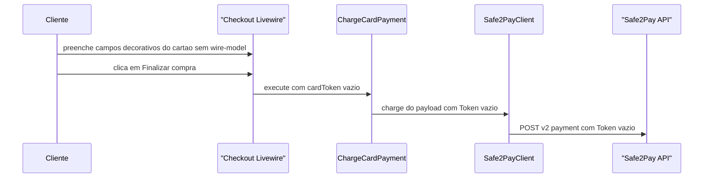
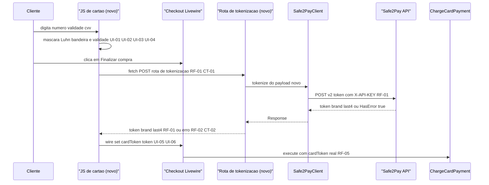

# SPEC: tokenizacao-cartao-safe2pay

## Metadata
- Source: developer description via /plan
- Service: ecommerce (Digital Lock E-commerce)
- Tier: standard
- Version: 1.1
- Architecture references: AGENTS.md (Laravel Boost guidelines genéricas — sem árvore `docs/agents/`), `.ai/rules/routes.md`, `.ai/rules/tests.md`

## Context

Hoje o checkout Livewire (`resources/views/pages/⚡checkout.blade.php`) tem 4 campos de cartão puramente
decorativos — `#s2p-card-number`, `#s2p-card-holder`, `#s2p-card-expiry`, `#s2p-card-cvv` — sem `wire:model` e
sem qualquer validação (verified at resources/views/pages/⚡checkout.blade.php:562-576). O componente já expõe uma
propriedade pública `cardToken` (verified at resources/views/pages/⚡checkout.blade.php:70) conectada via
`<input type="hidden" wire:model="cardToken">`, mas nada a preenche hoje: `finalizarCompra()` só valida que
`cardToken` não está vazio (verified at resources/views/pages/⚡checkout.blade.php:236-241) e a repassa a
`ChargeCardPayment::execute()` (verified at resources/views/pages/⚡checkout.blade.php:315), que já está pronta
para receber um `Token` do Cofre de Chaves e nunca `CardNumber`/`SecurityCode`/`ExpirationDate`
(verified at app/Actions/Payments/ChargeCardPayment.php:22-28,49-53). O padrão de "só o resultado final vira
propriedade Livewire" já existe para `visitorId`, preenchido via `$wire.set()` em um bloco `@script`
(verified at resources/views/pages/⚡checkout.blade.php:638-646) — esta feature reaplica o mesmo padrão para
`cardToken`.

Esta feature fecha essa lacuna com uma rota backend dedicada que chama `POST /v2/token` da Safe2Pay (Cofre de
Chaves) usando a mesma credencial `X-API-KEY` já configurada em `services.safe2pay.api_key_sandbox` /
`api_key_production` (verified at config/services.php:39-40) — mesmo padrão de leitura de credencial usado por
`Safe2PayClient` para `POST /v2/payment` (verified at app/Support/Safe2Pay/Safe2PayClient.php:42-53) — mais a
validação client-side (máscara, bandeira por BIN, validade, CVV, Luhn) que habilita "Finalizar compra".
`ChargeCardPayment`, `CardBrand` (verified at app/Support/Safe2Pay/CardBrand.php) e `TransactionStatus`
permanecem inalterados: passam a receber um `cardToken` real em vez de vazio.

Nenhuma referência local ao endpoint `POST /v2/token` foi encontrada no repositório (grep por `v2/token`,
`Cofre de Chaves`, `criar-token` em `docs/oficial-docs/**` e `.md` do projeto não retornou nada). O envelope
exato da resposta bruta da Safe2Pay para `/v2/token` foi confirmado contra a documentação oficial
(https://developers.safe2pay.com.br/reference/cobranca-cartao-credito-cofre-criar-token): em caso de sucesso,
`HasError` fica no nível raiz (`false`) e os dados do token ficam aninhados sob `ResponseDetail`
(`ResponseDetail.Token`, `ResponseDetail.CardNumber` mascarado, `ResponseDetail.Brand`, `ResponseDetail.Holder`,
`ResponseDetail.Expiration`, `ResponseDetail.CardType`) — mesmo padrão de envelope de `POST /v2/payment`. Não
há confirmação ao vivo específica do formato de erro (`HasError: true`) para este endpoint, mas segue-se o
mesmo padrão observado empiricamente em `/v2/payment` (`HasError`/`ErrorCode`/`Error` também no nível raiz).

Não existe test runner JS no projeto (`package.json` não declara nenhuma `devDependency` de teste — verified at
package.json) nem Dusk/Panther no lado PHP (grep em `composer.json` não retornou nada); a validação client-side
(máscara/Luhn/bandeira/validade) só é verificável hoje por revisão de código e teste manual, não por teste
automatizado de unidade JS.

## AS IS — Estado atual

Os campos de cartão não têm `wire:model`, máscara, Luhn ou detecção de bandeira, e `cardToken` chega sempre
vazio a `ChargeCardPayment`, então toda cobrança de cartão é recusada pela Safe2Pay por token ausente/inválido.

## TO BE — Estado proposto

`JS de cartão` e `Rota de tokenização` são novos (UI-01 a UI-06, RF-01 a RF-04, CT-01, CT-02);
`Safe2PayClient` ganha um método novo de tokenização mas seu papel de único ponto de saída HTTP não muda;
`ChargeCardPayment` só passa a receber um `cardToken` não vazio, sem alteração de comportamento (RF-05).

## Scope
- **In**: rota backend dedicada de tokenização (`POST /v2/token`), exceção dedicada para `HasError:true`,
  garantia de não-log/não-persistência do PAN/CVV/validade, validação client-side completa (máscara, bandeira
  por BIN, validade, CVV, Luhn) que controla o estado habilitado/desabilitado de "Finalizar compra", chamada
  `fetch` no submit e preenchimento de `cardToken` via `$wire.set()`.
- **Out**: 3DS/MPI (`Safe2Pay.Mpi`, `verify_3DS2.min.js` — decisão de negócio em aberto, `.spec/init/project-description.md` → Open Questions); qualquer caminho de tokenização "direto pra Safe2Pay" a partir do navegador (não confirmado com o suporte da Safe2Pay); qualquer alteração de comportamento em `ChargeCardPayment`, `CardBrand`, `TransactionStatus` ou `PaymentPayloadBuilder`; sandbox real para `/v2/token` (não existe — testes de integração usam `Http::fake()`).

## RIGID (Non-Negotiable)

### Functional Requirements

- RF-01 [Event-Driven]: WHEN a rota de tokenização recebe uma requisição POST com `Holder`, `CardNumber`, `ExpirationDate` e `SecurityCode`, o sistema DEVE chamar `POST https://payment.safe2pay.com.br/v2/token` (mesma `base_url`, verified at config/services.php:42) com o header `X-API-KEY` lido de `services.safe2pay.api_key_sandbox` (sandbox) ou `services.safe2pay.api_key_production` (produção) conforme `services.safe2pay.is_sandbox` (mesmo padrão de `Safe2PayClient`, verified at app/Support/Safe2Pay/Safe2PayClient.php:48-58) e, em caso de sucesso (`HasError: false` no nível raiz da resposta bruta), responder com um corpo JSON contendo exclusivamente as chaves `token`, `brand` e `last4`, lidas de `ResponseDetail.Token`, `ResponseDetail.Brand` e `ResponseDetail.CardNumber` (envelope confirmado contra a documentação oficial da Safe2Pay para `/v2/token`, mesmo padrão de `/v2/payment`).
  - AC: Para uma tokenização bem-sucedida, o corpo de resposta contém exatamente as chaves `token`, `brand`, `last4` e nenhuma outra (em especial nunca `CardNumber`, `SecurityCode`, `ExpirationDate` ou qualquer campo bruto do payload recebido).

- RF-02 [Conditional/Unwanted]: IF a resposta de `POST /v2/token` vier com HTTP 200 e `HasError: true` no nível raiz do corpo, THEN a rota DEVE lançar uma exceção dedicada — reaproveitando `App\Exceptions\Payments\Safe2PayChargeFailedException` (verified at app/Exceptions/Payments/Safe2PayChargeFailedException.php) ou uma exceção irmã em `app/Exceptions/Payments/` — e NÃO DEVE retornar nenhuma chave `token` na resposta.
  - AC: Dado um fake de `HasError: true` em `POST /v2/token`, a chamada à rota de tokenização não retorna 200 com `token` preenchido; a exceção dedicada é lançada e nenhuma chave `token` chega ao corpo de resposta ao cliente.

- RF-03 [Unwanted]: O corpo da requisição de tokenização (`Holder`, `CardNumber`, `ExpirationDate`, `SecurityCode`) e o corpo bruto da resposta da Safe2Pay a `/v2/token` NUNCA DEVEM ser passados como argumento a `Log::*` nem gravados em qualquer local persistente (banco, cache, sessão, arquivo).
  - AC: Revisão de código confirma ausência de chamadas `Log::*` referenciando o payload bruto de cartão na rota/action de tokenização; um teste com `Log::spy()` (ou equivalente) sobre um cenário de sucesso e de `HasError:true` confirma que nenhuma entrada de log contém `CardNumber`, `SecurityCode` ou `ExpirationDate` do payload submetido.

- RF-04 [Event-Driven]: WHEN a tokenização é bem-sucedida, o sistema DEVE derivar `brand` reaproveitando `App\Support\Safe2Pay\CardBrand::label()` (verified at app/Support/Safe2Pay/CardBrand.php:21-33) e `last4` a partir dos 4 últimos dígitos de `ResponseDetail.CardNumber` (retornado mascarado, ex.: `510510*****5100`) — mesmo padrão já usado em `ChargeCardPayment::execute()` para `card_brand`/`card_last_digits` (verified at app/Actions/Payments/ChargeCardPayment.php:76-78).
  - AC: Para um código de bandeira reconhecido pelo enum `CardBrand`, `brand` na resposta é o rótulo textual (ex.: `"Visa"`), não o código numérico; `last4` tem exatamente 4 caracteres numéricos.

- RF-05 [Unwanted]: Esta feature NÃO DEVE alterar o comportamento de `app/Actions/Payments/ChargeCardPayment.php`, `app/Support/Safe2Pay/CardBrand.php`, `app/Support/Safe2Pay/TransactionStatus.php` ou `app/Support/Safe2Pay/PaymentPayloadBuilder.php` — a única mudança observável é `cardToken` deixar de chegar vazio a `ChargeCardPayment::execute()`.
  - AC: `tests/Feature/Actions/Payments/ChargeCardPaymentTest.php` continua passando sem alteração das suas asserções; nenhum diff de implementação nesses 4 arquivos faz parte desta feature.

### UI Requirements

- UI-01 [State-Driven]: WHILE a forma de pagamento selecionada for `cartao` e o número do cartão falhar a validação de Luhn ou não corresponder a nenhum prefixo (BIN) das 8 bandeiras suportadas por `CardBrand` (verified at app/Support/Safe2Pay/CardBrand.php:12-19), o botão "Finalizar compra" DEVE permanecer desabilitado.
  - AC: Com um número de cartão que falha Luhn (ex.: dígito verificador trocado) ou não bate com nenhum prefixo de bandeira suportada, o botão "Finalizar compra" fica desabilitado mesmo com os demais campos preenchidos.

- UI-02 [State-Driven]: WHILE a validade MM/yyyy for inválida — mês fora de 01-12, ou ano/mês anterior ao mês corrente — o botão "Finalizar compra" DEVE permanecer desabilitado.
  - AC: Uma validade com mês `13` ou com ano anterior ao ano corrente mantém "Finalizar compra" desabilitado; uma validade igual ao mês/ano corrente é aceita.

- UI-03 [State-Driven]: WHILE o CVV não for numérico com 3 dígitos (ou 4 dígitos quando a bandeira detectada for American Express), o botão "Finalizar compra" DEVE permanecer desabilitado.
  - AC: Um CVV com letras, ou com 3 dígitos para uma bandeira Amex detectada, ou com 4 dígitos para uma bandeira não-Amex, mantém "Finalizar compra" desabilitado.

- UI-04 [Event-Driven]: WHEN o cliente digita no campo de número do cartão, o frontend DEVE formatar o valor exibido em grupos de 4 dígitos.
  - AC: Digitar `4111111111111111` resulta no campo exibindo `4111 1111 1111 1111`.

- UI-05 [Event-Driven]: WHEN todos os campos de cartão são válidos (UI-01 a UI-03) e o cliente clica em "Finalizar compra" com `cartao` selecionado, o frontend DEVE chamar a rota de tokenização via `fetch` antes de invocar `finalizarCompra()` do Livewire e, em caso de sucesso, preencher `cardToken` via `$wire.set('cardToken', token)` — mesmo padrão já usado para `visitorId` (verified at resources/views/pages/⚡checkout.blade.php:638-646).
  - AC: Em um submit com cartão válido, uma chamada `fetch` é feita à rota de tokenização antes de `finalizarCompra()` ser acionado no servidor, e `cardToken` (propriedade Livewire) reflete o `token` retornado antes dessa chamada.

- UI-06 [Unwanted]: Os campos brutos de cartão (número, nome impresso, validade, CVV) NUNCA DEVEM ser declarados como propriedade pública de nenhum componente Livewire — nem via `wire:model` nem por qualquer outro meio; os inputs `#s2p-card-number`, `#s2p-card-holder`, `#s2p-card-expiry`, `#s2p-card-cvv` continuam sem `wire:model` (verified at resources/views/pages/⚡checkout.blade.php:562-576).
  - AC: Inspeção por reflexão das propriedades públicas do componente `pages::checkout` não encontra nenhuma propriedade nomeada para número/nome impresso/validade/CVV de cartão; os 4 inputs `#s2p-card-*` não têm atributo `wire:model` no HTML renderizado.

### Contracts

- CT-01: `POST` rota interna nova de tokenização (nome final é sugestão em FLEXIBLE, ex.: `/checkout/tokenizar-cartao`), registrada em `routes/web.php` fora de qualquer middleware `auth` (mesma acessibilidade pública da rota `checkout`, verified at routes/web.php:24). Request: `{ "holder": string, "cardNumber": string, "expirationDate": string (MM/yyyy — ano com 4 dígitos, confirmado contra o sandbox real da Safe2Pay em POST /v2/payment; correção de uma suposição anterior de MM/AA), "securityCode": string }`. Response 200: `{ "token": string, "brand": string, "last4": string de 4 dígitos }`.
- CT-02: Resposta de erro da rota de tokenização quando a Safe2Pay recusa (`HasError: true`, RF-02) ou a chamada HTTP falha: status de erro (ex.: 422) com corpo `{ "message": string }` — nunca inclui a chave `token`.

### Non-Functional Requirements

- RNF-01: A rota de tokenização DEVE ler a credencial `X-API-KEY` exclusivamente via `config('services.safe2pay.api_key_sandbox')` / `config('services.safe2pay.api_key_production')` (verified at config/services.php:39-40) — nunca hardcoded no código-fonte.
- RNF-02: O frontend DEVE fazer no máximo 1 chamada a `POST /v2/token` por clique em "Finalizar compra" (sem retry automático em loop) — a Safe2Pay aplica um limite compartilhado de 60 requisições/minuto a este endpoint e não oferece ambiente de sandbox real para ele (decisão já fechada com o developer).

## FLEXIBLE (Implementation Suggestions)

- Nome de rota/controller sugerido: `POST /checkout/tokenizar-cartao` → `App\Http\Controllers\Checkout\TokenizeCardController` (single-action, `__invoke`, mesmo padrão de `StoreEmissaoController`/`Safe2PayWebhookController`). Lembrar da regra de `.ai/rules/routes.md`: o controller invocável precisa existir antes da rota ser registrada, senão o boot da aplicação quebra.
- `Safe2PayClient` pode ganhar um método `tokenize(array $payload): Response` que faz `POST /v2/token`, seguindo o mesmo padrão de `charge()`/`query()`/`refundPix()`/`refundCard()` (verified at app/Support/Safe2Pay/Safe2PayClient.php:19-40). Leitura da resposta bruta: `$response->json('HasError')` no nível raiz; em sucesso, `$response->json('ResponseDetail.Token')`, `$response->json('ResponseDetail.Brand')`, `$response->json('ResponseDetail.CardNumber')`.
- Validação client-side (máscara, Luhn, bandeira por BIN, validade, CVV) como funções JS puras e testáveis isoladamente, mesmo sem test runner JS hoje instalado — facilita adoção futura de testes automatizados sem exigir dependência nova agora.
- Prefixos de BIN por bandeira (Visa `4`, Mastercard `51-55`/`2221-2720`, Amex `34`/`37`, etc.) são de conhecimento público da indústria de pagamentos — não fazem parte do RIGID por serem detalhe de implementação, mas cobrem as 8 bandeiras de `CardBrand`.
- Adicionar `<meta name="csrf-token">` ao `<head>` de `checkout-layout.blade.php` (hoje ausente, verified at resources/views/components/checkout-layout.blade.php) para o `fetch` da rota de tokenização enviar `X-CSRF-TOKEN`, já que a rota fica dentro do grupo `web` (CSRF ativo por padrão, verified at bootstrap/app.php — só `webhooks/safe2pay` e `webhooks/gfsis` estão isentos).
- Exceção dedicada sugerida, se optar por não reaproveitar `Safe2PayChargeFailedException`: `App\Exceptions\Payments\Safe2PayTokenizationFailedException`.

## Acceptance Criteria Summary

| ID | Criterion | Testable? |
|----|-----------|-----------|
| RF-01 | Resposta de sucesso da rota de tokenização contém só `token`, `brand`, `last4` | Sim (Feature test com `Http::fake`) |
| RF-02 | `HasError:true` em `/v2/token` bloqueia qualquer `token` na resposta e lança exceção dedicada | Sim (Feature test com `Http::fake`) |
| RF-03 | Payload/response bruto do cartão nunca é logado nem persistido | Sim (`Log::spy`/revisão de código) |
| RF-04 | `brand` é rótulo textual via `CardBrand::label()`, `last4` tem 4 dígitos | Sim (Feature test com `Http::fake`) |
| RF-05 | `ChargeCardPayment`/`CardBrand`/`TransactionStatus`/`PaymentPayloadBuilder` sem alteração de comportamento | Sim (suíte existente permanece verde) |
| UI-01 | Luhn/bandeira inválida mantém botão desabilitado | Parcial (revisão de código/manual — sem test runner JS) |
| UI-02 | Validade MM/yyyy inválida mantém botão desabilitado | Parcial (revisão de código/manual — sem test runner JS) |
| UI-03 | CVV inválido (3/4 dígitos por bandeira) mantém botão desabilitado | Parcial (revisão de código/manual — sem test runner JS) |
| UI-04 | Número do cartão é mascarado em grupos de 4 | Parcial (revisão de código/manual — sem test runner JS) |
| UI-05 | `fetch` chama a rota de tokenização antes de `finalizarCompra()`; `cardToken` preenchido via `$wire.set()` | Sim (Feature test Livewire para o efeito em `cardToken`; fluxo `fetch` em si é manual) |
| UI-06 | Campos brutos de cartão nunca são propriedade pública Livewire | Sim (reflexão + assert de HTML sem `wire:model`) |
| CT-01 | Contrato de request/response da rota de tokenização | Sim (Feature test) |
| CT-02 | Contrato de resposta de erro da rota de tokenização | Sim (Feature test) |
| RNF-01 | Credencial lida só via `config()` | Sim (Feature test com `config()` sobrescrito) |
| RNF-02 | No máximo 1 chamada a `/v2/token` por clique em "Finalizar compra" | Parcial (revisão de código/manual — sem test runner JS) |

## Unresolved Markers

Nenhum marcador pendente. O envelope exato de `POST /v2/token` foi confirmado contra a documentação oficial da
Safe2Pay (https://developers.safe2pay.com.br/reference/cobranca-cartao-credito-cofre-criar-token): `HasError`
no nível raiz, dados do token aninhados sob `ResponseDetail` (`Token`, `CardNumber`, `Brand`, `Holder`,
`Expiration`, `CardType`). O formato de erro (`HasError: true`) segue por inferência o mesmo padrão de
`/v2/payment` (`HasError`/`ErrorCode`/`Error` no nível raiz) — sem confirmação ao vivo específica para
`/v2/token`, mas consistente com o envelope de sucesso já confirmado.
