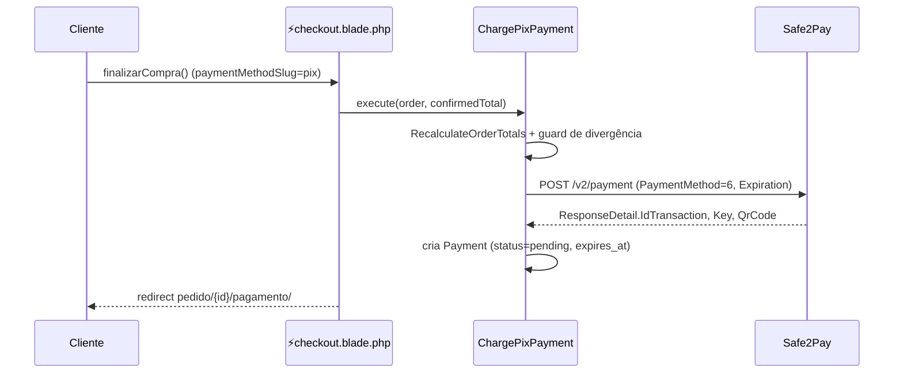
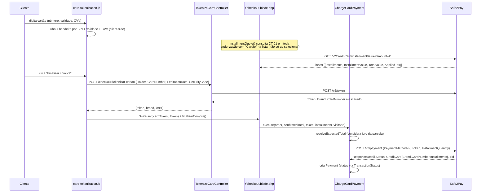
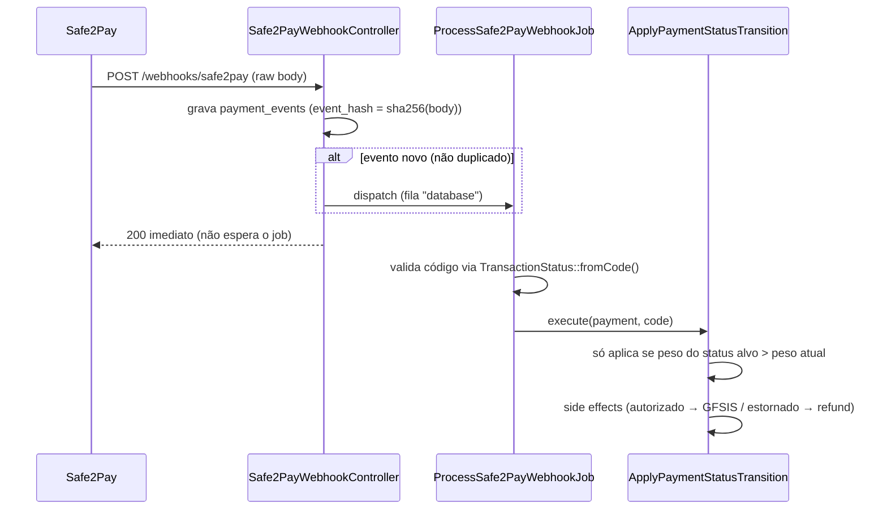

# Fluxos técnicos — Digital Lock E-commerce

> Documento de referência interna/handoff. Descreve o sistema **como ele está
> implementado hoje**, verificado contra o código-fonte (não contra o que foi
> planejado). Trechos marcados `[NÃO CONFIRMADO]` não puderam ser verificados
> com certeza — tratar como hipótese, não fato.
>
> As decisões técnicas citadas aqui vêm de `.spec/features/*/SPEC.md`
> (histórico de planejamento já resolvido) e de descobertas feitas durante
> implementação real nesta sessão. Não é um documento de API pública.

## Índice

1. [Visão geral](#1-visão-geral)
2. [Fluxo de pagamento por forma](#2-fluxo-de-pagamento-por-forma)
3. [Integração Safe2Pay](#3-integração-safe2pay)
4. [Integração GFSIS](#4-integração-gfsis)
5. [Autenticação do cliente](#5-autenticação-do-cliente)
6. [Painel administrativo — pagamento e vendas](#6-painel-administrativo--pagamento-e-vendas)
7. [Outros fluxos](#7-outros-fluxos)
8. [Decisões técnicas e o porquê](#8-decisões-técnicas-e-o-porquê)
9. [Decisões em aberto](#9-decisões-em-aberto)

---

## 1. Visão geral

Monólito Laravel + Livewire (single-file components no estilo Volt:
`Route::livewire('caminho/', 'pages::nome')` resolve pra
`resources/views/pages/⚡nome.blade.php`, ou sem o raio quando o componente
não precisa de reatividade Livewire — ex. `pages.home` é `Route::view()`
puro, HTML estático servido direto).

### Dois lados, dois guards de autenticação

| | Painel (admin) | Cliente-final |
|---|---|---|
| Guard | `web` (`config/auth.php`) | `customer` |
| Model | `App\Models\User` | `App\Models\Customer` |
| Auth backend | Laravel Fortify (`app/Providers/FortifyServiceProvider.php`) | Componentes Livewire manuais, **sem Fortify** — `resources/views/pages/auth/customer/*.blade.php` |
| Middleware | `auth`, `verified` (`routes/web.php:71`) | `auth:customer` (`routes/web.php:34`) |
| Rotas | `painel/*` | `minha-conta/*`, `cliente/*`, `carrinho/`, `checkout/` |

Fortify (`config/fortify.php` → `'guard' => 'web'`) só existe pro lado admin.
O login/registro/recuperação de senha do cliente foi construído à mão, sem
usar nenhum contrato do Fortify (`LoginResponse`/`RegisterResponse` não têm
binding customizado em lugar nenhum do projeto).

### Diretórios relevantes

```
app/Actions/Cart/          — adicionar/remover item, sincronizar carrinho no login
app/Actions/Checkout/      — montar pedido, recalcular totais, cupom, consulta de parcelamento
app/Actions/Payments/      — cobrar por forma de pagamento, aplicar transição de status
app/Actions/Refunds/       — abrir estorno (Pix/Cartão)
app/Actions/Gfsis/         — registrar pedido no GFSIS, gerar token de emissão, transição de status GFSIS
app/Actions/Fortify/       — CreateNewUser (admin), CreateNewCustomer (cliente), ResetUserPassword
app/Support/Safe2Pay/      — cliente HTTP único, payload builder, enums de status/bandeira/forma
app/Support/Gfsis/         — cliente HTTP único, payload builder, enum de erro
app/Http/Controllers/      — Checkout (tokenizar cartão), Pedido (emissão), Webhooks (Safe2Pay/GFSIS)
app/Jobs/                  — processamento assíncrono dos webhooks + registro GFSIS
app/Console/Commands/      — 3 comandos agendados (reconciliação de pagamento, reconciliação GFSIS, reforço de e-mail)
routes/web.php             — única fonte de rotas; não existe routes/api.php
```

---

## 2. Fluxo de pagamento por forma

Checkout: `resources/views/pages/⚡checkout.blade.php` (componente Livewire
único pras 3 formas). Cobrança: uma Action por forma em
`app/Actions/Payments/Charge{Pix,Boleto,Card}Payment.php`. Todas recalculam
o total via `RecalculateOrderTotals` e bloqueiam **antes de qualquer chamada
HTTP** se o total enviado pelo front (`$frontTotal`/`confirmedTotal`)
divergir do recalculado no servidor (`PaymentTotalMismatchException`) — trava
contra manipulação client-side do valor.

### Como a config de `payment_methods` afeta o checkout

`PaymentMethod` (`app/Models/PaymentMethod.php`) tem `slug`, `discount_percentage`,
`max_installments`, `is_active`, `position` — editáveis em
`painel/formas-pagamento/{id}/` (ver seção 6). `RecalculateOrderTotals::execute()`
(`app/Actions/Checkout/RecalculateOrderTotals.php:19-33`) aplica
`discount_percentage` sobre o subtotal (após cupom) pra chegar no total final;
`max_installments` limita as parcelas exibidas antes da consulta a
`installmentValue` e é a trava (`InstallmentLimitExceededException`) contra
um `installments` acima do permitido em `ChargeCardPayment::execute()`.
`slug` é comparado literalmente contra `'pix'`/`'cartao'`/`'boleto'` em
`PaymentMethodCode::fromSlug()` (`app/Support/Safe2Pay/PaymentMethodCode.php:12-17`)
— ver decisão na seção 8.

### Pix



- `ChargePixPayment::execute()` (`app/Actions/Payments/ChargePixPayment.php:20-59`).
- Expiração vem de `settings.pix_expiration_seconds`, não hardcoded.
- `pix_id` (TXID) fica sempre `null` — o endpoint de criação não retorna esse
  campo (comentário no próprio código, linha 55).
- **Nunca reaproveita QR de tentativa anterior**: cada clique em "Finalizar
  compra" gera uma nova linha em `payments` com novo
  `gateway_transaction_id`.

### Boleto

Mesmo formato de `ChargePixPayment`, `PaymentMethod=1`.
`app/Actions/Payments/ChargeBoletoPayment.php:26-56`. Vencimento fixo em
`DUE_DAYS = 3` dias corridos (constante, não configurável pelo painel).
Grava `boleto_digitable_line` e `receipt_url` da resposta.

### Cartão de crédito (o mais complexo — token + parcelamento)



Três sub-fluxos distintos, cada um com host/credencial próprios em
`Safe2PayClient`:

1. **Tokenização** (`POST /checkout/tokenizar-cartao` →
   `TokenizeCardController::__invoke()`,
   `app/Http/Controllers/Checkout/TokenizeCardController.php:20-40`): dados
   brutos do cartão (`CardNumber`/`SecurityCode`/`ExpirationDate`) **nunca**
   viram propriedade pública Livewire nem passam pelo wire — só trafegam
   nesse POST direto do JS pro backend, que troca por um `Token` do "Cofre de
   Chaves" da Safe2Pay. Nunca logado nem persistido (só dentro de
   `Safe2PayTokenizationFailedException`, que também não expõe ao cliente).
   Host: `payment.safe2pay.com.br` (mesmo de `charge()`).

2. **Consulta de parcelamento** (`GET /v2/creditCard/installmentValue`,
   `Safe2PayClient::installmentValue()`,
   `app/Support/Safe2Pay/Safe2PayClient.php:47-50`): host **diferente**
   (`api.safe2pay.com.br`, `installment_base_url`), valor enviado como
   decimal puro (`"180.00"`, não centavos). Ver decisão na seção 8.
   `installmentQuote()` (`⚡checkout.blade.php:157-172`) roda em **toda
   renderização** do checkout em que "Cartão de crédito" aparece na lista
   (não só quando selecionado) — a badge "Até Nx sem juros" precisa estar
   certa mesmo com Pix selecionado. Cacheada por valor via
   `FetchInstallmentValues` (`app/Actions/Checkout/FetchInstallmentValues.php`),
   TTL de 1h, **nunca cacheia falha**.

3. **Cobrança** (`POST /v2/payment`, `ChargeCardPayment::execute()`,
   `app/Actions/Payments/ChargeCardPayment.php:29-76`): usa exclusivamente o
   `Token`, nunca dado bruto de cartão. `resolveExpectedTotal()`
   (linhas 87-102) — se a parcela escolhida tem `AppliedTax > 0` na consulta
   de parcelamento, o total que `$frontTotal` precisa bater passa a ser o
   `TotalValue` da Safe2Pay pra essa parcela, não o total base; se a consulta
   falhar, cai de volta pro total base (nunca bloqueia a cobrança por causa
   da consulta de parcelamento). `gross_amount` gravado em `payments` é
   **sempre o total base, nunca inclui o juro** (decisão detalhada na seção
   8).

Status da cobrança de cartão vem de `ResponseDetail.Status` (não
`TransactionStatus.Id` como Pix/Boleto usam no webhook) — mapeado por
`TransactionStatus::fromCode()->toInternalStatusSlug()`.

---

## 3. Integração Safe2Pay

Ponto único de saída HTTP: `App\Support\Safe2Pay\Safe2PayClient`
(`app/Support/Safe2Pay/Safe2PayClient.php`). Credenciais sempre via
`config('services.safe2pay.*')`, nunca hardcoded.

| Método | Endpoint | Host | Uso |
|---|---|---|---|
| `charge()` | `POST /v2/payment` | `payment.safe2pay.com.br` | Cobrança (Pix/Cartão/Boleto) |
| `tokenize()` | `POST /v2/token` | `payment.safe2pay.com.br` | Cofre de Chaves — troca dado bruto de cartão por Token |
| `query()` | `GET /v2/payment/{id}` | `payment.safe2pay.com.br` | Consulta de status (reconciliação) |
| `refundPix()` | `DELETE /v2/payment/{id}/cobranca_pix-estornar` | `payment.safe2pay.com.br` | Estorno de Pix |
| `refundCard()` | `DELETE /v2/payment/{id}/estornar` | `payment.safe2pay.com.br` | Estorno de Cartão |
| `installmentValue()` | `GET /v2/creditCard/installmentValue` | `api.safe2pay.com.br` (host diferente!) | Consulta de valores de parcelamento |

`PaymentPayloadBuilder::base()` (`app/Support/Safe2Pay/PaymentPayloadBuilder.php:19-28`)
monta o envelope comum das 3 formas de pagamento (`IsSandbox`, `Application`,
`CallbackUrl`, `PaymentMethod`, `Reference`, `Customer`, `Products`) —
`Products` vem sempre de `order_items` (snapshot gravado no pedido), **nunca**
de `product_variants` (preço não muda depois que o pedido foi criado, mesmo
que o produto mude no catálogo).

`IsSandbox` é sempre lido de `config('services.safe2pay.is_sandbox')` dentro
de `Safe2PayClient::charge()` — nunca aceita o valor vindo do payload
(`charge()` sobrescreve qualquer `IsSandbox` que tenha sido colocado antes,
`app/Support/Safe2Pay/Safe2PayClient.php:21-24`). Há um teste dedicado
(`PaymentSecurityTest`) que audita o texto-fonte de `Safe2PayClient.php` pra
garantir que `IsSandbox` nunca aparece hardcoded como `true`/`false` em
nenhum outro lugar do arquivo.

### Webhook (`POST /webhooks/safe2pay`)



- `Safe2PayWebhookController::__invoke()`
  (`app/Http/Controllers/Webhooks/Safe2PayWebhookController.php:19-38`): grava
  o payload bruto em `payment_events` **antes de qualquer interpretação**,
  mesmo quando `IdTransaction` não bate com nenhum `Payment` conhecido.
  Idempotência por `event_hash` (sha256 do corpo bruto) — reenvio nunca
  despacha um novo job. Responde 200 sem esperar o processamento.
- `ProcessSafe2PayWebhookJob::handle()` (`app/Jobs/ProcessSafe2PayWebhookJob.php:27-58`):
  localiza `Payment` por `gateway_transaction_id`; se não achar ou o código
  for desconhecido, grava `payment_events.error` sem lançar exceção.
- `ApplyPaymentStatusTransition::execute()`
  (`app/Actions/Payments/ApplyPaymentStatusTransition.php:44-68`): **regra de
  peso** — só aplica a transição se `targetStatus.weight > payment.status.weight`
  (impede regressão de status fora de ordem). `gateway_status_code` recebe
  sempre o código bruto, sem tradução (auditoria). Compartilhada com o
  comando `payments:reconcile` — a mesma regra nunca é duplicada.
  - `authorized` → `applyAuthorizedSideEffects()`: grava `paid_at`; **só na
    primeira autorização** (`order.status.slug !== 'paid'`) move
    `orders.status` pra `paid`, cria `integration_queue` (`send_to_gfsis`),
    despacha `RegisterOrderItemWithGfsisJob`, gera token de emissão
    (`GenerateIssuanceAccessToken`) e envia o e-mail de acesso à emissão. Uma
    autorização **subsequente** de um pedido já pago abre um reembolso
    automático de duplicata (`CreateRefund`, motivo `duplicate`) em vez de
    repetir o fluxo de pago.
  - `reversed` → `applyReversedSideEffects()`: cria `Refund` se ainda não
    existir um (motivo `chargeback` se código bruto = 13, senão `other`) e
    notifica o financeiro.
  - Código 5 (Em disputa) sempre notifica o financeiro, independente do peso.

### 13 códigos de status (`TransactionStatus`, `app/Support/Safe2Pay/TransactionStatus.php`)

| Código | Nome Safe2Pay | Slug interno |
|---|---|---|
| 1 | Pendente | `pending` |
| 2 | Processamento | `under_review` |
| 3 | Autorizado | `authorized` |
| 5 | Em disputa | `under_review` (+ notifica financeiro sempre) |
| 6 | Estornado | `reversed` |
| 7 | Baixado | `expired` (tradução explícita, não é cópia do rótulo) |
| 8 | Recusado | `denied` |
| 11 | Liberado | `pending` |
| 12 | Em cancelamento | `pending` |
| 13 | Chargeback | `reversed` |
| 14 | Pré-autorizado | `under_review` |
| 15 | Devolução de contestação | `authorized` |
| 19 | Em devolução | `under_review` |

### Reconciliação (`payments:reconcile`, a cada 5 min)

`app/Console/Commands/ReconcilePendingPayments.php` — rede de segurança
contra webhook perdido. Pix `pending`/`under_review` com `expires_at`
vencido: consulta `GET /v2/payment/{id}` e, se a Safe2Pay não confirmar
autorização, marca `expired` diretamente (regra de tempo da aplicação, não
depende da Safe2Pay). Cartão/Boleto (sem `expires_at`): usa
`settings.reconciliation_pending_threshold_minutes` como limiar de "criado
há tempo demais sem resposta".

### Estorno (Pix e Cartão — Boleto não tem estorno ativo, ver seção 9)

`RequestPixRefund`/`RequestCardRefund` (`app/Actions/Refunds/`): exigem
`payment.status.slug === 'authorized'`; criam a linha em `refunds` **antes**
da chamada síncrona à Safe2Pay; a confirmação definitiva só vem depois, via
webhook (status 6 ou 13) — a chamada síncrona só *inicia* o estorno. Se a
chamada síncrona falhar, grava um `audit_log` adicional sem deixar o refund
"órfão e silencioso".

---

## 4. Integração GFSIS

Emite o certificado digital depois que o pedido é pago. Ponto único de saída
HTTP: `App\Support\Gfsis\GfsisClient` (`app/Support/Gfsis/GfsisClient.php`).

```mermaid
sequenceDiagram
    participant Pago as Pedido pago (webhook Safe2Pay)
    participant Cliente
    participant Emissao as ShowEmissaoController/StoreEmissaoController
    participant Mark as MarkIssuanceDataComplete
    participant Job as RegisterOrderItemWithGfsisJob
    participant GFSIS as GFSIS API
    participant Webhook as GfsisWebhookController

    Pago->>Pago: GenerateIssuanceAccessToken cria issuance_data (filled_at=null)
    Pago->>Cliente: e-mail com link pedido/{id}/emissao/?token=...
    Cliente->>Emissao: preenche formulário de emissão (PF/PJ)
    Emissao->>Mark: MarkIssuanceDataComplete::execute()
    alt todos campos obrigatórios preenchidos
        Mark->>Mark: filled_at = now(); orders.fulfillment_status = data_complete
        Mark->>Job: dispatch (só se order.status === paid)
    end
    Job->>GFSIS: POST /gestaofacil/rest/CriaPedidoVendaLTS
    GFSIS-->>Job: {codigo, erro}
    Job->>Job: sucesso ou 002 (duplicado) → enviado_gfsis; senão → send_failed
    GFSIS->>Webhook: POST /webhooks/gfsis (status assíncrono)
    Webhook->>Webhook: grava gfsis_events, despacha ProcessGfsisWebhookJob
    Job->>Job: ApplyGfsisStatusTransition (CRIADO/ENVIADO→enviado_gfsis, APROVADO, EMITIDO, RECUSADO→falha_envio, CANCELADO)
```

- **Autenticação** (`GfsisClient::auth()`, linhas 25-32): token cacheado
  (`Cache`) respeitando `expirationDate` retornado pela própria GFSIS —
  nunca busca token novo a cada chamada. Em resposta 401 de
  `criarPedidoVenda()`, invalida o cache e tenta **uma única vez** com token
  novo.
- **Registro do pedido** (`RegisterOrderItemWithGfsis::execute()`,
  `app/Actions/Gfsis/RegisterOrderItemWithGfsis.php:30-84`): o docblock da
  classe descreve reaproveitamento pelo disparo automático
  (`RegisterOrderItemWithGfsisJob`) **e** por um reenvio manual síncrono do
  painel ("Corrigir e reenviar") — mas isso é aspiracional: o botão
  "Reenviar ao GFSIS" em `painel/vendas/⚡show.blade.php:218` é
  `<button type="button">` **sem `wire:click`**, confirmado nesta pesquisa
  (mesma decisão já registrada em `integracao-gfsis/SPEC.md`, ver seção 9).
  Hoje, na prática, só o disparo automático via job existe de verdade.
  Elegível pra
  (re)tentativa: `orders.fulfillment_status` em `data_complete` **ou**
  `send_failed` — um pedido já falho continua retentável sem reset manual.
  Bloqueia com `GfsisRegistrationBlockedException` se a variante do produto
  não tiver `gfsis_certificado_id` configurado.
  `gfsis_order_id` é gerado localmente (`random_int`, único) **antes** de
  qualquer chamada — nunca é a GFSIS quem atribui esse ID.
- **Payload** (`GfsisPayloadBuilder::build()`,
  `app/Support/Gfsis/GfsisPayloadBuilder.php`): monta `pedido`/`cliente`/
  `certificado` a partir de `OrderItemGfsis`/`IssuanceData`/`ProductVariant`.
  `dataNascimento` só entra se `issuance_data.birth_date` estiver preenchido
  — nunca bloqueia a montagem se ausente.
- **6 códigos de erro** (`GfsisErrorCode`,
  `app/Support/Gfsis/GfsisErrorCode.php`): `001` campo faltante, `002`
  pedido duplicado (**tratado como sucesso** — idempotência, sem reenvio),
  `003` CEP inválido, `005` certificado/plano inválido, `006` documento
  inválido, `999` erro inesperado.
- **Webhook** (`GfsisWebhookController`,
  `app/Http/Controllers/Webhooks/GfsisWebhookController.php:19-45`): mesmo
  padrão do webhook Safe2Pay — grava `gfsis_events` incondicionalmente
  (mesmo com `identificador` ausente/desconhecido — a FK foi removida e a
  coluna é nullable, migration
  `2026_08_18_000002_drop_foreign_and_make_nullable_gfsis_order_id_on_gfsis_events_table.php`),
  idempotência por `event_hash`, responde 200 sem esperar o job.
- **Transição de status** (`ApplyGfsisStatusTransition::execute()`,
  `app/Actions/Gfsis/ApplyGfsisStatusTransition.php:31-58`): só aplica se
  `dataAtualizacao` do payload for **estritamente mais recente** que
  `status_synced_at` já gravado — nunca regride por causa de eventos fora de
  ordem. Formato de data primário confirmado é `d/m/Y` (`dataAtualizacao`) e
  `d/m/Y H:i` (`dataValidade`); `Carbon::parse()` só entra como fallback
  defensivo (registra warning de log quando isso acontece).

  | Status GFSIS bruto | Slug interno (`gfsis_statuses`) |
  |---|---|
  | CRIADO, ENVIADO | `enviado_gfsis` |
  | APROVADO | `aprovado` |
  | EMITIDO | `emitido` |
  | RECUSADO | `falha_envio` |
  | CANCELADO | `cancelado` |

- **Formulário de emissão** (`pedido/{id}/emissao/`,
  `ShowEmissaoController`/`StoreEmissaoController`): protegido por
  `EnsureIssuanceAccessTokenIsValid` (`?token=` validado contra
  `issuance_data.access_token` + `order_id` da rota + expiração — fecha IDOR
  da rota, já que o `{id}` sozinho seria adivinhável). Token com TTL de 30
  dias (`GenerateIssuanceAccessToken::TOKEN_TTL_DAYS`), regenerável
  (`regenerate()`, usado no reenvio de link).
- **`MarkIssuanceDataComplete`** (`app/Actions/Gfsis/MarkIssuanceDataComplete.php:29-46`):
  campos obrigatórios variam por `holder_type` (PF: nome/documento/e-mail/
  telefone/endereço completo; PJ soma responsável nome/documento/e-mail/
  telefone). Só despacha `RegisterOrderItemWithGfsisJob` se
  `order.status.slug === 'paid'` **lido fresco do banco** — nunca confia no
  estado em memória de quem chamou.
- **Reconciliação GFSIS** (`gfsis:reconcile-stuck`, hourly): identifica
  `order_item_gfsis` presos em `enviado_gfsis` além de
  `settings.gfsis_stuck_threshold_hours` e **só loga/lista** — não existe
  endpoint de consulta de pedido documentado na GFSIS, então nenhuma chamada
  HTTP é feita por este comando.
- **Reforço de e-mail 24h** (`recuperacao:reforco-24h`, hourly): reenvia o
  link de emissão pra pedidos `paid`+`awaiting_data` além de
  `settings.recovery_reinforcement_email_threshold_hours`, idempotente por
  pedido via `integration_queue` (job `recovery_email_24h`). Falha em um
  pedido não interrompe o processamento dos demais na mesma execução.

---

## 5. Autenticação do cliente

Sem Fortify — componentes Livewire manuais em
`resources/views/pages/auth/customer/*.blade.php`, guard `customer`.

| Rota | Componente | Ação |
|---|---|---|
| `cliente/login/` | `login.blade.php` | `login()` |
| `cliente/registro/` | `register.blade.php` | `register()` |
| `cliente/esqueci-senha/` | `forgot-password.blade.php` | `sendResetLink()` |
| `cliente/redefinir-senha/{token}/` | `reset-password.blade.php` | `resetPassword()` |
| `cliente/logout` (POST) | closure inline em `routes/web.php:57-61` | — |

### Merge de carrinho de convidado

Login e registro, em caso de sucesso, checam `session('cart_session_id')` e,
se presente, chamam `Cart::getOrCreateForCustomer($customer)->mergeFromSession($sessionCartId)`
(`login.blade.php:27-34`, `register.blade.php:31-38`) — o carrinho anônimo
vira o carrinho do cliente recém-autenticado, sem duplicar itens.

### Redirecionamento pós-login/registro (corrigido nesta sessão)

Antes: `redirectRoute('carrinho')` hardcoded nos dois componentes, sem
nenhum sinal de origem. Hoje:

- Cada componente (login, registro, esqueci-senha) expõe
  `public ?string $from = null`, populado em `mount()` a partir de
  `request()->query('from')` — só aceita o literal `'carrinho'`, qualquer
  outro valor vira `null` (não é usado pra montar URL nenhuma — zero risco de
  open redirect).
- `⚡carrinho.blade.php::continuar()` (linha 76), ao forçar login, redireciona
  com `['from' => 'carrinho']`.
- Login (`login.blade.php:42`) e registro (`register.blade.php:46`) só
  voltam pro carrinho se `$this->from === 'carrinho'`; senão vão pra
  `minha-conta.pedidos` (o mesmo destino que o link "Minha conta" do menu já
  usa).
- Links entre as páginas (login↔registro, "Esqueceu sua senha?") encadeiam
  `$from` via `route(..., $from ? ['from' => $from] : [])`.
- **Redefinição de senha é o único ponto que usa sessão** em vez de query
  string: o e-mail de redefinição é assíncrono e não carrega query string, então
  `forgot-password.blade.php:34` grava `session(['customer_auth_intent' => 'carrinho'])`
  só quando o link é enviado com sucesso e `$this->from === 'carrinho'`;
  `reset-password.blade.php:43-44` lê e apaga (`session()->pull()`) essa
  chave ao concluir a redefinição, repassando como `?from=carrinho` pro
  login — depois disso a sessão nunca mais é tocada.
- Links do menu ("Entrar", `components/layout.blade.php`/`conta-layout.blade.php`)
  **não mudaram** — continuam sem parâmetro nenhum, e é justamente a ausência
  de `from` que produz o destino certo (`minha-conta.pedidos`).

---

## 6. Painel administrativo — pagamento e vendas

- `painel/formas-pagamento/` e `painel/formas-pagamento/{id}/`: CRUD de
  `name`, `discount_percentage`, `max_installments`, `position` — **sem
  campo `slug`** no formulário (`⚡show.blade.php:12-15`, só lê `$this->name`,
  `discount_percentage`, `max_installments`, `position` no `mount()`). Não
  existe rota/tela de "criar forma de pagamento" — só as 3 linhas do
  `PaymentMethodSeeder` existem hoje. Ver decisão travada em
  `.ai/rules/payment-method-slug.md` na seção 8.
- `painel/formas-pagamento/cupons/`: CRUD de cupons (`Coupon`), consumidos
  por `ValidateCoupon`/`CreateOrderFromCart` no checkout.
- `painel/vendas/` e `painel/vendas/{id}/`: listagem/detalhe de pedidos —
  exibe status de pagamento, forma de pagamento, e (presumivelmente) o
  card "Integração" com status GFSIS por pedido. `[NÃO CONFIRMADO]`: não
  explorei o Livewire deste componente nesta pesquisa; o botão "Reenviar ao
  GFSIS" mencionado em `integracao-gfsis/SPEC.md` está marcado ali mesmo como
  **permanecendo só visual, sem `wire:click`** (mesma decisão já tomada em
  `painel-vendas-dados-reais/SPEC.md:63` — fora do escopo dessa feature).
- `painel/recuperacao/`: tela da "Fila de recuperação" — fora do escopo do
  que foi lido nesta pesquisa; `integracao-gfsis/SPEC.md` a cita como feature
  separada que só consome o dado (`issuance_data.access_token`) já produzido
  pelo fluxo de emissão.

---

## 7. Outros fluxos

- **Carrinho** (`app/Actions/Cart/`): `AddToCart` (usa `session_id` pra
  visitante, `customer_id` pra autenticado, transação), `RemoveFromCart`
  (remove item; deleta o carrinho se ficar vazio), `UpdateCartItemQuantity`
  (idem, mais tratamento de quantidade ≤ 0), `SyncCartOnLogin` (idêntico ao
  merge já descrito na seção 5, reutilizável).
- **Cupons** (`ValidateCoupon`, `app/Actions/Checkout/ValidateCoupon.php`):
  checa `is_active`, janela `starts_at`/`ends_at`, `usage_limit` global,
  `restricted_variant_id` (cupom vale só pra uma variante específica),
  `per_customer_limit` (via `CouponUse`). Reaproveitado tanto no feedback em
  tempo real do checkout quanto na gravação atômica do pedido.
- **Criação do pedido** (`CreateOrderFromCart::execute()`,
  `app/Actions/Checkout/CreateOrderFromCart.php:24-98`): snapshot de preço
  gravado em `order_items` (`sku_snapshot`, `name_snapshot`,
  `list_price_snapshot`, `unit_price`) — a partir daí o pedido nunca mais
  referencia a variante viva pra preço, e nenhuma chamada de rede acontece
  antes desse snapshot existir. Trava promoção ativa por janela de datas
  (`promotion_starts_at`/`promotion_ends_at`) em `resolveUnitPrice()`.
  Cupom é travado com `lockForUpdate()` e revalidado dentro da mesma
  transação (evita corrida de uso duplo).
- **Auditoria manual de status** (`UpdatePaymentStatusManually`,
  `app/Actions/Payments/UpdatePaymentStatusManually.php`): altera
  `payments.status_id` fora do fluxo de webhook, grava `AuditLog` na mesma
  transação. Confirmado que **nenhuma view/controller chama essa Action
  hoje** (`grep` por `UpdatePaymentStatusManually` só encontra o próprio
  arquivo) — o comentário no código já dizia "reutilizável por uma futura
  tela de painel"; essa tela ainda não existe.
- **3 comandos agendados** (`bootstrap/app.php:16-19`):
  `payments:reconcile` a cada 5 min, `gfsis:reconcile-stuck` a cada hora,
  `recuperacao:reforco-24h` a cada hora.

---

## 8. Decisões técnicas e o porquê

- **`installmentValue` mora num host diferente da Safe2Pay
  (`api.safe2pay.com.br`), todo o resto usa `payment.safe2pay.com.br`.**
  Confirmado por teste real (Tinker) nesta sessão: `base_url` responde 404
  pra esse endpoint específico; `api.safe2pay.com.br` responde 200 com a
  mesma credencial sandbox já configurada — não precisou de credencial nova.

- **`amount` de `installmentValue` é enviado como decimal puro
  (`"180.00"`), não centavos.** Também confirmado por teste real — a
  suposição inicial (baseada só no exemplo `amount=13990` do documento de
  referência) era de centavos; testando `amount=139.90` a Safe2Pay devolveu
  `139.90` pra 1x, provando que aceita decimal direto.

- **Juro de parcelamento entra só na comparação do guard de
  `ChargeCardPayment`/`confirmedTotal`, nunca em `orders.total`/
  `payments.gross_amount`** (`checkout-parcelamento-com-juros/SPEC.md`,
  RF-04). Decisão **temporária, não definitiva** — escolhida porque persistir
  o juro reabriria a fórmula de total já implementada e fechada em
  `checkout-pagamento-safe2pay/SPEC.md` (RF-03/RF-28), e o dono do negócio
  ainda não confirmou se o total do pedido deve refletir o valor real cobrado
  do cliente ou só o valor base do produto. Consequência aceita: hoje
  `payments.gross_amount` **não** reflete o que o cliente efetivamente pagou
  quando há parcela com juro.

- **Não existe sandbox real da Safe2Pay pra `/v2/token`** (tokenização) —
  documentado em `tokenizacao-cartao-safe2pay/SPEC.md`; testes de integração
  usam `Http::fake()`. `/v2/creditCard/installmentValue`, por outro lado,
  **responde normalmente** em sandbox (achado desta sessão) — mas não há
  confirmação se as taxas retornadas em sandbox refletem a taxa real de
  produção (ver seção 9).

- **`payment_methods.slug` é tratado como código interno fixo, não dado
  editável pelo admin** (`.ai/rules/payment-method-slug.md`).
  `PaymentMethodCode::fromSlug()` e `⚡checkout.blade.php` comparam o slug
  literal contra `'pix'`/`'cartao'`/`'boleto'` pra decidir o código numérico
  da Safe2Pay. Seguro **só porque** não existe hoje nenhuma tela de "criar
  forma de pagamento" nem campo `slug` no formulário de edição — mesmo
  padrão de risco que já causou um bug de SKU de produto antes
  (`.ai/rules/produto-variant-lookup.md`, referenciado na própria regra).

- **Regra de peso (`weight`) em `payment_statuses` impede regressão de
  status fora de ordem.** Um webhook atrasado com status "menor" que o já
  aplicado (ex.: "Pendente" chegando depois de "Autorizado") é ignorado —
  compartilhada entre webhook e reconciliação periódica pra nunca duplicar a
  regra.

- **Código GFSIS `002` (pedido duplicado) é tratado como sucesso, não
  erro** — idempotência: reenviar um pedido que a GFSIS já tem registrado
  não deve gerar `last_error` nem incrementar tentativas de forma que pareça
  falha.

- **`IsSandbox` nunca pode ser hardcoded em `Safe2PayClient.php`, sempre
  lido de config** — garantido por um teste que audita o texto-fonte do
  arquivo, não só o comportamento em runtime (`PaymentSecurityTest`).

- **Boleto não tem fluxo de estorno ativo** (`checkout-pagamento-safe2pay/SPEC.md`,
  Q-05) — o documento de referência da Safe2Pay não descreve endpoint ativo
  pra isso; a única via pra `estornado` em Boleto é a transição passiva via
  webhook (status 19→6).

- **Campos de conciliação financeira (`gateway_fee`, `net_amount`,
  `expected_settlement_date`) nunca são persistidos por nenhuma Action de
  cobrança** (`checkout-pagamento-safe2pay/SPEC.md`, Q-03) — decisão
  confirmada de que isso pertence a uma feature futura de conciliação/
  repasse financeiro, fora do escopo do checkout.

- **Guard de divergência de total usa igualdade estrita (zero
  tolerância)** entre o total recalculado no servidor e o valor confirmado
  pelo front (`checkout-pagamento-safe2pay/SPEC.md`, Q-09) — decisão do
  desenvolvedor, já que ambos os valores são `decimal(10,2)`.

---

## 9. Decisões em aberto

- **3DS/MPI (autenticação de cartão via `Safe2Pay.Mpi`)**: implementar ou
  não é decisão do dono do negócio (`.spec/init/project-description.md`,
  Open Questions). Sem 3DS, chargeback de cartão roubado/clonado é prejuízo
  integral da Digital Lock; com 3DS autenticado, o risco de chargeback passa
  a ser do emissor (*liability shift*) — mas só cobre 4 das 8 bandeiras
  aceitas (Visa, Mastercard, Elo, Amex), com custo de fricção extra no
  checkout. Nenhuma exigência legal/de bandeira encontrada que torne isso
  obrigatório.

- **Persistir o juro de parcelamento em `orders.total`/
  `payments.gross_amount`**: ajuste futuro pendente, condicionado a
  confirmação explícita do dono/responsável de negócio sobre o comportamento
  financeiro esperado (ver decisão temporária na seção 8). Reabriria RF-03/
  RF-28 de `checkout-pagamento-safe2pay/SPEC.md`.

- **As taxas retornadas por `installmentValue` em sandbox refletem a taxa
  real de produção ou não?** Não verificado — só testável com credencial de
  produção. Se não refletirem, o dropdown de parcelas vai mostrar números
  certos hoje (sandbox) e diferentes em produção, sem nenhum erro visível.

- **Consolidação dos 3 `openapi.yaml` fragmentados** que já existem em
  `.spec/features/tokenizacao-cartao-safe2pay/openapi.yaml`,
  `.spec/features/checkout-pagamento-safe2pay/openapi.yaml` e
  `.spec/features/integracao-gfsis/openapi.yaml` — escritos durante o
  planejamento de cada feature, podem ter ficado desatualizados em relação
  ao código final. Ainda não foram verificados/consolidados num único
  documento.

- **Provedor de e-mail** ainda não decidido pela equipe (necessário pro
  e-mail de agendamento de videoconferência no fluxo de emissão —
  `.spec/init/project-description.md`, Open Questions).

- **Ferramenta do painel administrativo**: inclinação da equipe é por
  Livewire próprio (já é o que está implementado), mas a decisão final entre
  isso e Filament nunca foi formalmente confirmada, segundo o mesmo
  documento.

- **Ação real por trás do botão "Reenviar ao GFSIS"** no card "Integração"
  do painel de vendas: hoje é só visual, sem `wire:click`
  (`integracao-gfsis/SPEC.md`) — decisão de escopo já tomada, mas ainda
  aberta se/quando essa ação será implementada de fato.

- **Suporte a mais de um `order_item` por pedido** no formulário de emissão:
  o wireframe atual assume 1 item por pedido; pedidos com mais de um item
  ficam fora do que `pedido/{id}/emissao/` sabe lidar hoje
  (`integracao-gfsis/SPEC.md`).

- **Textos jurídicos** (Política de Privacidade, Termos de Uso): pendentes
  de redação jurídica externa ao time de desenvolvimento.

- **Página de parceria com contadores/ERP**: decisão de negócio ainda não
  fechada.
