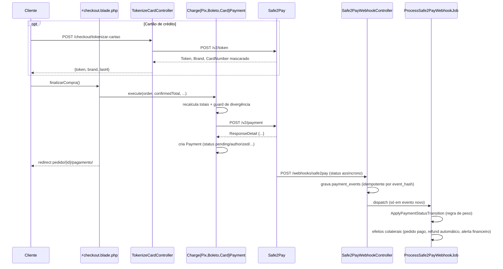

# Integração com a Safe2Pay

> Documento técnico baseado exclusivamente no código-fonte deste repositório
> (estado em que a integração está implementada hoje, não no que a
> documentação oficial da Safe2Pay descreve). Trechos referenciam arquivo e,
> quando útil, linha. Ao longo do texto há links 🔗 para a
> [documentação oficial da Safe2Pay](https://developers.safe2pay.com.br/docs)
> — eles servem só de apoio para quem for mexer na integração; quando a
> página oficial descreve algo diferente do que o código faz, isso é dito
> explicitamente (ver seção 14).

## 1. Visão geral

A Safe2Pay é o único gateway de pagamento do checkout. As três formas de
pagamento oferecidas (Pix, Boleto e Cartão de crédito) cobram através dela,
e o status de cada pagamento é atualizado por webhook — com uma rotina de
reconciliação periódica como rede de segurança.

Toda a saída HTTP para a Safe2Pay passa por uma única classe,
`App\Support\Safe2Pay\Safe2PayClient` (`app/Support/Safe2Pay/Safe2PayClient.php`).
Nenhuma outra classe do projeto chama `Http::` diretamente contra a Safe2Pay.

## 2. Métodos de pagamento suportados

| Forma | Slug interno (`payment_methods.slug`) | `PaymentMethod` na Safe2Pay |
| --- | --- | --- |
| Pix | `pix` | `6` |
| Cartão de crédito | `cartao` | `2` |
| Boleto | `boleto` | `1` |

O mapeamento é feito por `App\Support\Safe2Pay\PaymentMethodCode::fromSlug()`
(`app/Support/Safe2Pay/PaymentMethodCode.php`), o único ponto do código que
converte o slug interno no código numérico da Safe2Pay. Um slug desconhecido
lança `InvalidArgumentException`.

Cada forma tem uma Action de cobrança dedicada em `app/Actions/Payments/`:

- `ChargePixPayment`
- `ChargeBoletoPayment`
- `ChargeCardPayment`

Não existe cobrança recorrente/assinatura implementada.

## 3. Endpoints da Safe2Pay utilizados

Todos encapsulados em `Safe2PayClient`:

| Método do client | Verbo + endpoint | Finalidade | Referência oficial 🔗 |
| --- | --- | --- | --- |
| `charge()` | `POST /v2/payment` | Cria uma cobrança (Pix, Boleto ou Cartão), sempre incluindo `IsSandbox` a partir da config | [Criar cobrança](https://developers.safe2pay.com.br/reference/cobranca-criar) |
| `tokenize()` | `POST /v2/token` | Troca os dados brutos do cartão por um token do "Cofre de Chaves" | [Criar Token](https://developers.safe2pay.com.br/reference/cobranca-cartao-credito-cofre-criar-token) |
| `query()` | `GET /v2/payment/{transactionId}` | Consulta o status atual de uma transação (usada na reconciliação) | [Buscar cobrança](https://developers.safe2pay.com.br/reference/cobranca-buscar) ⚠️ ver nota |
| `installmentValue()` | `GET /v2/creditCard/installmentValue` | Consulta os valores de parcelamento disponíveis para um total | [Consultar valores de parcelamento](https://developers.safe2pay.com.br/reference/cobranca-cartao-credito-consultar-valores-de-parcelamento) |
| `refundPix()` | `DELETE /v2/payment/{transactionId}/cobranca_pix-estornar` | Solicita estorno de uma cobrança Pix | [Estornar cobrança Pix](https://developers.safe2pay.com.br/reference/cobranca_pix-estornar) ⚠️ ver nota |
| `refundCard()` | `DELETE /v2/payment/{transactionId}/estornar` | Solicita estorno de uma cobrança de Cartão | [Estornar cobrança Cartão](https://developers.safe2pay.com.br/reference/cobranca-cartao-credito-estornar) ⚠️ ver nota |

`charge()`, `tokenize()` e `query()` usam o host de `services.safe2pay.base_url`
(`payment.safe2pay.com.br`); `installmentValue()` usa um host dedicado,
`services.safe2pay.installment_base_url` (`api.safe2pay.com.br`) — comentário
no próprio código (`Safe2PayClient.php:47-53`) registra que o host de cobrança
responde 404 para esse endpoint.

Não há endpoint de cancelamento de boleto nem de estorno de boleto
implementado (`RequestCardRefundTest` confirma explicitamente que não existe
uma classe `RequestBoletoRefund` no código-fonte).

> ⚠️ **Nota sobre drift entre código e documentação pública atual**: a
> referência pública de hoje descreve `query()`, `refundPix()` e
> `refundCard()` com paths diferentes dos usados neste código-fonte —
> `GET /v2/transaction/get?id=` para busca, `DELETE /v2/pix/refund/{id}` para
> estorno de Pix e `DELETE /v2/creditCard/cancel/{id}/{amount}` para estorno
> de cartão, contra os paths com sufixo `/v2/payment/{id}/...` implementados
> aqui. Os links acima são os mais próximos disponíveis na doc oficial para
> cada operação, úteis para entender o **conceito** (o que cada chamada faz,
> quais campos ela espera de volta), mas **os paths e nomes de campos que
> valem são os que constam no código** (`Safe2PayClient.php`) e nos testes
> deste repositório — nunca a doc pública isoladamente. Ver também seção 14.

## 4. Criação, consulta e processamento de transações

### Pix — `ChargePixPayment::execute()`

`app/Actions/Payments/ChargePixPayment.php`. Sempre via Pix Dinâmico
(`POST /v2/payment`, `PaymentMethod = "6"` — [payload de exemplo Pix na doc
oficial](https://developers.safe2pay.com.br/reference/cobranca-criar)), nunca
`/v2/staticPix`. Fluxo:

1. Recalcula os totais no servidor (`RecalculateOrderTotals`) e compara com
   `$frontTotal` recebido do checkout — diverge → `PaymentTotalMismatchException`
   antes de qualquer chamada HTTP.
2. Lê `settings.pix_expiration_seconds` para definir `PaymentObject.Expiration`.
3. Chama `Safe2PayClient::charge()`. `HasError: true` no corpo (mesmo com
   HTTP 200) → `Safe2PayChargeFailedException`.
4. Cria uma linha em `payments` com `status = pending`, `qr_code_payload`
   (`ResponseDetail.Key`), `qr_code_image_url` (`ResponseDetail.QrCode`) e
   `expires_at`. `pix_id` fica sempre `null` — o endpoint de criação não
   retorna esse campo.
5. Cada clique em "Finalizar compra" cria uma **nova** linha em `payments`
   com novo `gateway_transaction_id`; o QR de uma tentativa anterior nunca é
   reaproveitado.

### Boleto — `ChargeBoletoPayment::execute()`

`app/Actions/Payments/ChargeBoletoPayment.php`. `PaymentMethod = "1"`
(via `PaymentMethodCode`). Mesmo guard de divergência
de total. `PaymentObject` inclui vencimento fixo de `DUE_DAYS = 3` dias
corridos (constante no código, não configurável pelo painel), instrução de
não recebimento após o vencimento, multa de 2% e juros de 1%. Em resposta,
grava `boleto_digitable_line` (`ResponseDetail.DigitableLine`) e `receipt_url`
(`ResponseDetail.BankSlipUrl`).

### Cartão de crédito — `ChargeCardPayment::execute()`

`app/Actions/Payments/ChargeCardPayment.php`. `PaymentMethod = "2"`. Recebe
`$token` (do endpoint de tokenização — ver seção 5), `$installments` e
`$visitorId`. Antes de qualquer chamada HTTP:

- Rejeita parcelas acima de `payment_methods.max_installments` →
  `InstallmentLimitExceededException`.
- Rejeita `$visitorId` vazio → `MissingVisitorIdException`.
- Recalcula o total esperado (ver seção 6) e o compara com `$frontTotal` →
  `PaymentTotalMismatchException` em caso de divergência.

O payload enviado a `POST /v2/payment` inclui `PaymentObject.Token`,
`PaymentObject.InstallmentQuantity`, `VisitorID` e
`ShouldUseAntiFraud: true`. Nunca inclui `CardNumber`, `SecurityCode` ou
`ExpirationDate` — apenas o token.

O status inicial da cobrança de cartão vem de `ResponseDetail.Status`
(diferente de Pix/Boleto, que usam `TransactionStatus.Id` no webhook),
mapeado por `TransactionStatus::fromCode()->toInternalStatusSlug()`. A linha
criada em `payments` grava `installments`, `card_brand` (via `CardBrand` —
ver [bandeiras suportadas pela Safe2Pay](https://developers.safe2pay.com.br/docs/bandeiras-suportadas)),
`card_last_digits` (últimos 4 dígitos de `ResponseDetail.CreditCard.CardNumber`)
e `authorization_nsu` (`ResponseDetail.Tid`). `gateway_fee`, `net_amount` e
`expected_settlement_date` nunca são preenchidos por esta Action.

### Consulta de status — `Safe2PayClient::query()`

Usada pelo comando de reconciliação (seção 11), não pelo fluxo síncrono de
checkout. Ver a nota sobre o path desse endpoint na seção 3.

## 5. Tokenização e utilização de cartões

Fluxo de tokenização (`TokenizeCardController`, `app/Http/Controllers/Checkout/TokenizeCardController.php`):

1. `resources/js/card-tokenization.js` faz validação client-side (Luhn,
   bandeira por prefixo BIN, validade, CVV) antes de qualquer envio.
2. No submit, o JS chama `POST /checkout/tokenizar-cartao` diretamente
   (fora do ciclo de vida Livewire) com `holder`, `cardNumber`,
   `expirationDate`, `securityCode`.
3. `TokenizeCardRequest` (`app/Http/Requests/TokenizeCardRequest.php`) valida
   o payload: `holder` obrigatório, `cardNumber` 12–19 dígitos,
   `expirationDate` no formato `MM/AAAA`, `securityCode` 3–4 dígitos. Rota
   pública, sem gate de posse.
4. `TokenizeCardController::__invoke()` chama `Safe2PayClient::tokenize()`
   ([`POST /v2/token`](https://developers.safe2pay.com.br/reference/cobranca-cartao-credito-cofre-criar-token) —
   "Cofre de Chaves" na nomenclatura oficial da Safe2Pay). Falha de rede ou
   `HasError: true` →
   `Safe2PayTokenizationFailedException`, que responde `422` com uma mensagem
   genérica ao cliente (`render()` da própria exceção).
5. Em sucesso, o controller devolve apenas `{ token, brand, last4 }` — nunca
   o payload bruto de requisição/resposta.
6. O JS grava o token recebido no campo Livewire `cardToken`
   (`$wire.set('cardToken', token)`) e então chama `finalizarCompra()`.

`ChargeCardPayment` usa exclusivamente esse `Token` (Cofre de Chaves) na
cobrança — dados brutos de cartão nunca trafegam pelos componentes Livewire
nem chegam à Action de cobrança.

## 6. Parcelamento e cálculo de juros

`FetchInstallmentValues::execute()` (`app/Actions/Checkout/FetchInstallmentValues.php`)
consulta [`Safe2PayClient::installmentValue($amount)`](https://developers.safe2pay.com.br/reference/cobranca-cartao-credito-consultar-valores-de-parcelamento)
para um valor em decimal
(ex.: `"180.00"`) e mapeia `ResponseDetail.Installments[]` em uma lista de
`{installments, installment_value, total_value, applied_tax}`. Nenhuma
fórmula de juro é aplicada pela aplicação — os valores vêm prontos da
Safe2Pay. A resposta é cacheada por valor (`safe2pay.installment_value.{amount}`,
TTL de 1h); falhas nunca são cacheadas.

No checkout (`resources/views/pages/⚡checkout.blade.php`), o computed
`installmentQuote` chama essa Action a cada renderização em que "Cartão de
crédito" aparece na lista — mesmo que não seja a forma selecionada, porque a
badge "Até Nx sem juros" (`installmentBadgeText`) precisa estar correta.

Em `ChargeCardPayment::resolveExpectedTotal()`: se a parcela escolhida tiver
`applied_tax > 0` na consulta, o total que `$frontTotal` precisa bater passa
a ser o `total_value` dessa parcela (não o total base); se a consulta falhar,
cai de volta ao total base — a cobrança nunca é bloqueada por causa da
consulta de parcelamento. `gross_amount` gravado em `payments` é sempre o
total base, nunca inclui o juro da parcela.

## 7. Estornos

Duas Actions, uma por forma de pagamento — não existe estorno de Boleto:

- `App\Actions\Refunds\RequestPixRefund` (`app/Actions/Refunds/RequestPixRefund.php`)
- `App\Actions\Refunds\RequestCardRefund` (`app/Actions/Refunds/RequestCardRefund.php`)

Ambas seguem o mesmo desenho:

1. Exigem `$payment->status->slug === 'authorized'` — sem isso, lançam
   `RefundNotAllowedException` sem criar nada.
2. Criam a linha em `refunds` via `App\Actions\Refunds\CreateRefund`
   **antes** da chamada síncrona à Safe2Pay.
3. Chamam [`Safe2PayClient::refundPix()`](https://developers.safe2pay.com.br/reference/cobranca_pix-estornar)
   ou [`Safe2PayClient::refundCard()`](https://developers.safe2pay.com.br/reference/cobranca-cartao-credito-estornar)
   (paths conforme implementados no código — ver nota da seção 3).
   Se a chamada falhar (resposta não-2xx ou `ConnectionException`), gravam
   uma linha adicional em `audit_logs` (`pix_refund_sync_call_failed` /
   `card_refund_sync_call_failed`) referenciando o refund já criado — o
   refund nunca fica órfão e silencioso.
4. A confirmação definitiva de `payments.status_id = reversed` só ocorre
   depois, via webhook (status `6`/Estornado ou `13`/Chargeback) —
   nenhuma dessas Actions atualiza o status do pagamento diretamente.

Também existe um caminho de estorno **automático**, disparado por
`App\Actions\Payments\ApplyPaymentStatusTransition::applyReversedSideEffects()`
quando um webhook chega com status `reversed`/`chargeback` e ainda não existe
um refund associado ao pagamento — cria o refund (motivo `chargeback` ou
`other`) e notifica o time financeiro (`PaymentRefundedNotification`), sem
nova chamada à Safe2Pay (o dinheiro já retornou, segundo o próprio evento).

Um segundo caso automático: quando um pedido já `paid` recebe uma nova
autorização (duplicata), `ApplyPaymentStatusTransition::applyAuthorizedSideEffects()`
abre um refund automático com motivo `duplicate` — também sem chamar a
Safe2Pay diretamente aqui.

## 8. Webhooks

> Doc oficial: [Webhook transacional](https://developers.safe2pay.com.br/reference/callback-transacional)
> (descreve o formato do POST enviado pela Safe2Pay a cada mudança de status)
> e [Reenviar webhook](https://developers.safe2pay.com.br/reference/reenviar-webhook-transacional)
> (reenvio manual pelo painel da Safe2Pay em caso de perda — não implementado
> neste projeto; a rede de segurança local é a reconciliação, seção 11).

### Recepção — `Safe2PayWebhookController`

`app/Http/Controllers/Webhooks/Safe2PayWebhookController.php`, rota
`POST /webhooks/safe2pay` (`routes/web.php`). Responsabilidades:

1. Decodifica o corpo bruto (`JSON_THROW_ON_ERROR`); JSON inválido → `422`.
2. Grava o payload bruto em `payment_events` **antes de qualquer
   interpretação**, mesmo quando `IdTransaction` não corresponde a nenhum
   `Payment` conhecido.
3. Idempotência via `event_hash` (SHA-256 do corpo bruto): um `firstOrCreate`
   por hash garante que reenvios do mesmo corpo nunca despacham um novo job.
4. Se o evento é novo (`wasRecentlyCreated`), despacha
   `App\Jobs\ProcessSafe2PayWebhookJob`.
5. Responde `200 { "received": true }` imediatamente, sem esperar o
   processamento assíncrono.

### Processamento — `ProcessSafe2PayWebhookJob`

`app/Jobs/ProcessSafe2PayWebhookJob.php`, fila `database`. Lê
`payload.TransactionStatus.Id`:

- Código desconhecido (não mapeado em `TransactionStatus`) → grava
  `payment_events.error` e `processed_at`, sem lançar exceção.
- Nenhum `Payment` com o `gateway_transaction_id` do evento → mesmo
  tratamento (evento órfão registrado, sem exceção).
- Caso contrário, associa `payment_events.payment_id` e delega a
  `App\Actions\Payments\ApplyPaymentStatusTransition::execute()`.

### Interpretação do status — `TransactionStatus` + `ApplyPaymentStatusTransition`

`App\Support\Safe2Pay\TransactionStatus` (`app/Support/Safe2Pay/TransactionStatus.php`)
é o único ponto do código que mapeia os 13 códigos numéricos da Safe2Pay
(tabela completa na doc oficial —
[Status transacional](https://developers.safe2pay.com.br/reference/status-transacional))
para um slug interno de `payment_statuses`:

| Código | Rótulo Safe2Pay | Slug interno |
| --- | --- | --- |
| 1 | Pendente | `pending` |
| 11 | Liberado | `pending` |
| 12 | Em cancelamento | `pending` |
| 2 | Processamento | `under_review` |
| 5 | Em disputa | `under_review` |
| 14 | Pré-autorizado | `under_review` |
| 19 | Em devolução | `under_review` |
| 3 | Autorizado | `authorized` |
| 15 | Devolução de contestação | `authorized` |
| 8 | Recusado | `denied` |
| 6 | Estornado | `reversed` |
| 13 | Chargeback | `reversed` |
| 7 | Baixado | `expired` |

Um código fora dessa lista faz `TransactionStatus::fromCode()` lançar
`\ValueError`.

`App\Actions\Payments\ApplyPaymentStatusTransition::execute()`
(`app/Actions/Payments/ApplyPaymentStatusTransition.php`), compartilhada
entre o webhook e a reconciliação periódica:

- Sempre grava o código bruto recebido em `payments.gateway_status_code`
  (sem tradução, para auditoria).
- Só efetiva a transição de `status_id` se o `weight` do status alvo for
  **estritamente maior** que o `weight` atual — nunca retrocede o status de
  um pagamento.
- Ao aplicar `authorized` pela primeira vez, marca `paid_at`, move o pedido
  para `paid`, enfileira o envio para a GFSIS (`send_to_gfsis`), dispara
  `RegisterOrderItemWithGfsisJob`, gera o token de emissão e envia o e-mail
  `IssuanceAccessLinkMail`. Uma autorização subsequente do mesmo pedido já
  `paid` não repete esses efeitos — abre um refund automático de duplicata.
- Ao aplicar `reversed`, cria um refund automático (se ainda não existir um)
  e notifica o financeiro.
- Independentemente do peso, um código `5` (Em disputa) sempre dispara
  `PaymentRefundedNotification::sendToFinanceTeam()`.

## 9. Classes, Services, Actions, Jobs e Controllers envolvidos

| Componente | Caminho | Responsabilidade |
| --- | --- | --- |
| `Safe2PayClient` | `app/Support/Safe2Pay/Safe2PayClient.php` | Único ponto de saída HTTP para a Safe2Pay |
| `PaymentPayloadBuilder` | `app/Support/Safe2Pay/PaymentPayloadBuilder.php` | Monta o envelope comum de `POST /v2/payment` a partir do `Order` |
| `PaymentMethodCode` | `app/Support/Safe2Pay/PaymentMethodCode.php` | Slug interno → código `PaymentMethod` da Safe2Pay |
| `CardBrand` | `app/Support/Safe2Pay/CardBrand.php` | Código de bandeira da Safe2Pay → rótulo exibido |
| `TransactionStatus` | `app/Support/Safe2Pay/TransactionStatus.php` | Código de status da Safe2Pay → slug interno de `payment_statuses` |
| `ChargePixPayment` | `app/Actions/Payments/ChargePixPayment.php` | Cobrança via Pix |
| `ChargeBoletoPayment` | `app/Actions/Payments/ChargeBoletoPayment.php` | Cobrança via Boleto |
| `ChargeCardPayment` | `app/Actions/Payments/ChargeCardPayment.php` | Cobrança via Cartão de crédito |
| `FetchInstallmentValues` | `app/Actions/Checkout/FetchInstallmentValues.php` | Consulta e cacheia parcelamento |
| `ApplyPaymentStatusTransition` | `app/Actions/Payments/ApplyPaymentStatusTransition.php` | Interpreta o status recebido e aplica efeitos colaterais |
| `UpdatePaymentStatusManually` | `app/Actions/Payments/UpdatePaymentStatusManually.php` | Alteração manual de status (fora do fluxo Safe2Pay), com auditoria |
| `RequestPixRefund` / `RequestCardRefund` | `app/Actions/Refunds/` | Abrem estorno ativo junto à Safe2Pay |
| `CreateRefund` | `app/Actions/Refunds/CreateRefund.php` | Cria a linha de `refunds` + auditoria |
| `TokenizeCardController` | `app/Http/Controllers/Checkout/TokenizeCardController.php` | Endpoint de tokenização de cartão |
| `TokenizeCardRequest` | `app/Http/Requests/TokenizeCardRequest.php` | Validação do payload de tokenização |
| `Safe2PayWebhookController` | `app/Http/Controllers/Webhooks/Safe2PayWebhookController.php` | Recepção do webhook |
| `ProcessSafe2PayWebhookJob` | `app/Jobs/ProcessSafe2PayWebhookJob.php` | Processamento assíncrono do webhook |
| `ReconcilePendingPayments` | `app/Console/Commands/ReconcilePendingPayments.php` | Comando agendado de reconciliação |
| `⚡checkout.blade.php` | `resources/views/pages/⚡checkout.blade.php` | Componente Livewire que orquestra o checkout |
| `card-tokenization.js` | `resources/js/card-tokenization.js` | Validação client-side e chamada de tokenização |
| Exceções dedicadas | `app/Exceptions/Payments/`, `app/Exceptions/Refunds/` | `Safe2PayChargeFailedException`, `Safe2PayTokenizationFailedException`, `Safe2PayInstallmentQueryFailedException`, `PaymentTotalMismatchException`, `InstallmentLimitExceededException`, `MissingVisitorIdException`, `RefundNotAllowedException` |

## 10. Autenticação e configuração da API

> Doc oficial: [Autenticação](https://developers.safe2pay.com.br/reference/autenticação)
> (header `X-API-KEY`) e [Dados para geração em Sandbox](https://developers.safe2pay.com.br/docs/dados-para-geração-em-sandbox)
> (credenciais e cartões de teste do ambiente de homologação).

Credenciais e URLs são lidas exclusivamente de `config('services.safe2pay.*')`
(`config/services.php`), nunca hardcoded:

```php
'safe2pay' => [
    'api_key_sandbox' => env('SAFE2PAY_API_KEY_SANDBOX'),
    'api_key_production' => env('SAFE2PAY_API_KEY_PRODUCTION'),
    'is_sandbox' => env('SAFE2PAY_IS_SANDBOX', true),
    'base_url' => 'https://payment.safe2pay.com.br',
    'installment_base_url' => 'https://api.safe2pay.com.br',
],
```

`Safe2PayClient` escolhe entre `api_key_sandbox` e `api_key_production` a
partir de `is_sandbox` e envia a chave escolhida no header `X-API-KEY` em
toda requisição. O flag `IsSandbox` também é incluído no corpo de `charge()`
a partir dessa mesma configuração — nunca fixo no código.

> **Pix não possui sandbox na Safe2Pay** — mesmo com `SAFE2PAY_IS_SANDBOX=true`,
> toda cobrança Pix é real (comentário em `.env.example`).

Nenhuma chave, token ou credencial é logada: `TokenizeCardController` nunca
loga o payload bruto de requisição/resposta; a exceção de falha de cobrança
(`Safe2PayChargeFailedException`) carrega o corpo bruto apenas para quem a
captura investigar internamente, nunca exposto ao cliente.

## 11. Fluxo geral da integração



Rede de segurança: `ReconcilePendingPayments` (comando `payments:reconcile`,
`app/Console/Commands/ReconcilePendingPayments.php`) consulta
`Safe2PayClient::query()` para pagamentos pendentes além do prazo — Pix com
`expires_at` vencido, ou Cartão/Boleto sem `expires_at` criados há mais tempo
que `settings.reconciliation_pending_threshold_minutes` — e aplica a mesma
`ApplyPaymentStatusTransition`, fechando a lacuna de um webhook perdido. Pix
não confirmado até o vencimento é marcado `expired` diretamente, mesmo que a
consulta não retorne um status conclusivo.

## 12. Tratamento de erros e respostas da API

| Situação | Onde é tratada | Comportamento |
| --- | --- | --- |
| HTTP não-2xx em `charge()` | Actions de cobrança (`$response->throw()`) | Exceção HTTP padrão do Laravel, propaga sem criar `Payment` |
| `HasError: true` com HTTP 200 em `charge()` | Actions de cobrança | `Safe2PayChargeFailedException` — a Safe2Pay recusa sem sinalizar erro via status HTTP, então `throw()` sozinho não capturaria o caso |
| Total divergente do front | Actions de cobrança, antes de qualquer chamada HTTP | `PaymentTotalMismatchException` |
| Parcelas acima do limite / `VisitorID` vazio | `ChargeCardPayment`, antes de qualquer chamada HTTP | `InstallmentLimitExceededException` / `MissingVisitorIdException` |
| Falha (rede ou `HasError`) em `tokenize()` | `TokenizeCardController` | `Safe2PayTokenizationFailedException`, responde `422` com mensagem genérica ao cliente |
| Falha em `installmentValue()` (rede, `HasError`, ou resposta sem `Installments[]`) | `FetchInstallmentValues` | `Safe2PayInstallmentQueryFailedException`, tratada inteiramente server-side — nunca cacheada |
| Falha síncrona em `refundPix()`/`refundCard()` | `RequestPixRefund` / `RequestCardRefund` | Grava `audit_logs` com o corpo do erro, sem deixar o refund já criado órfão |
| Código de status desconhecido no webhook | `ProcessSafe2PayWebhookJob` | Grava `payment_events.error`, sem lançar exceção não tratada |
| Evento sem `Payment` correspondente | `ProcessSafe2PayWebhookJob` | Idem — evento órfão registrado com erro |
| Corpo do webhook não é JSON válido | `Safe2PayWebhookController` | Responde `422` |

No checkout Livewire, `PaymentTotalMismatchException`,
`InstallmentLimitExceededException`, `MissingVisitorIdException` e
`Safe2PayChargeFailedException` são capturadas em `finalizarCompra()` e
convertidas em mensagens de erro amigáveis; a falha de cobrança também é
logada (`Log::error('safe2pay.charge_failed', ...)`) com `order_id`,
`order_number` e a resposta bruta da Safe2Pay.

## 13. Testes relacionados à integração

| Arquivo | Cobre |
| --- | --- |
| `tests/Unit/Support/Safe2Pay/Safe2PayClientTest.php` | Cada método do client chama o verbo/endpoint/host correto, com a API key de sandbox ou produção conforme a config |
| `tests/Unit/Support/Safe2Pay/PaymentMethodCodeTest.php` | Mapeamento slug → código, e exceção para slug desconhecido |
| `tests/Unit/Support/Safe2Pay/CardBrandTest.php` | Mapeamento código → rótulo de bandeira, `null` para código desconhecido |
| `tests/Unit/Support/Safe2Pay/TransactionStatusTest.php` | Mapeamento dos 13 códigos para o slug interno, incluindo o caso especial `7`→`expired`, e `ValueError` para código desconhecido |
| `tests/Unit/Support/Safe2Pay/PaymentPayloadBuilderTest.php` | Montagem de `Products`/`Customer`/`Address` a partir do pedido, sem hardcode de código de forma de pagamento |
| `tests/Unit/Support/Safe2Pay/ServicesConfigTest.php` | Config reflete as variáveis de ambiente; nenhum asset de frontend expõe a API key |
| `tests/Unit/Actions/Checkout/FetchInstallmentValuesTest.php` | Mapeamento da resposta, cache por valor, falha nunca cacheada, exceção em `HasError`/resposta sem parcelas/erro HTTP |
| `tests/Feature/Actions/Payments/ChargePixPaymentTest.php` | Persistência dos campos em sucesso, nunca usa endpoint estático, expiração configurável, guard de total divergente, `HasError` bloqueia, duas cobranças geram duas linhas distintas |
| `tests/Feature/Actions/Payments/ChargeBoletoPaymentTest.php` | Persistência de linha digitável/URL do comprovante, guard de total, `HasError` bloqueia |
| `tests/Feature/Actions/Payments/ChargeCardPaymentTest.php` | Payload nunca contém dados brutos de cartão, limite de parcelas, `VisitorID` obrigatório, `ShouldUseAntiFraud` sempre `true`, persistência dos campos de cartão, bandeira desconhecida não quebra, guard de total (incluindo o caso com juro/`applied_tax`), fallback quando a consulta de parcelamento falha |
| `tests/Feature/Http/Checkout/TokenizeCardControllerTest.php` | Resposta contém só `token`/`brand`/`last4`, `HasError` bloqueia, falha HTTP não gera token, validação de campos obrigatórios, credenciais vêm da config, payload/resposta nunca logados |
| `tests/Unit/Http/Requests/TokenizeCardRequestTest.php` | Regras de validação de `holder`, `cardNumber`, `expirationDate`, `securityCode` |
| `tests/Feature/Http/Webhooks/Safe2PayWebhookControllerTest.php` | Evento órfão ainda é registrado, reenvio do mesmo corpo nunca duplica o job, resposta `200` imediata |
| `tests/Feature/Jobs/ProcessSafe2PayWebhookJobTest.php` | Regra de peso (nunca retrocede status), evento órfão/código desconhecido não lança exceção, efeitos colaterais da primeira autorização (pedido pago, emissão, GFSIS, e-mail), duplicata não reprocessa e abre refund automático, transição para `reversed` cria/reaproveita refund e notifica financeiro, ciclo completo de status de cartão |
| `tests/Feature/Actions/Refunds/RequestPixRefundTest.php` | Bloqueio fora de `authorized`, refund criado antes da chamada síncrona, status só muda via webhook, falha síncrona gera auditoria adicional |
| `tests/Feature/Actions/Refunds/RequestCardRefundTest.php` | Mesmo conjunto do Pix, e confirma que não existe `RequestBoletoRefund` no código |
| `tests/Feature/Console/ReconcilePendingPaymentsTest.php` | Pix vencido é consultado e expira quando não autorizado, Pix não vencido nunca é consultado, Cartão/Boleto além do limiar configurável é consultado, limiar é lido da config sem exigir deploy |
| `tests/Feature/CrossCutting/PaymentSecurityTest.php` | `payments` nunca tem colunas de dado bruto de cartão, `Payment::$fillable` nunca inclui dado bruto, cobrança bem-sucedida persiste só bandeira/últimos dígitos/NSU, nenhum asset de frontend (fonte ou build) expõe a API key de produção, `IsSandbox` nunca é hardcoded fora do ponto de configuração |

## 14. Referências oficiais da Safe2Pay

Links para a [documentação oficial da Safe2Pay](https://developers.safe2pay.com.br/docs),
organizados por assunto — úteis para consultar campos de payload, exemplos de
resposta e cenários de erro que este documento não reproduz na íntegra.
**Onde a doc oficial e o código deste repositório divergem, o código é a
fonte da verdade** (ele já foi lido e citado nas seções acima); os links
abaixo são material de apoio, não substituem os arquivos referenciados.

| Assunto | Link |
| --- | --- |
| Introdução / primeiros passos | [Comece aqui](https://developers.safe2pay.com.br/docs/comece-aqui) |
| Arquitetura geral da API | [Arquitetura da API](https://developers.safe2pay.com.br/reference/arquitetura-da-api) |
| Autenticação (`X-API-KEY`) | [Autenticação](https://developers.safe2pay.com.br/reference/autenticação) |
| Credenciais e cartões de teste (sandbox) | [Dados para geração em Sandbox](https://developers.safe2pay.com.br/docs/dados-para-geração-em-sandbox) · [Cartões de teste 3DS](https://developers.safe2pay.com.br/docs/cartões-de-teste) |
| Visão geral de cobrança | [Cobrança — overview](https://developers.safe2pay.com.br/docs/cobranca-overview) |
| Criar cobrança (Pix/Boleto/Cartão) | [Criar cobrança](https://developers.safe2pay.com.br/reference/cobranca-criar) |
| Buscar cobrança por id | [Buscar cobrança](https://developers.safe2pay.com.br/reference/cobranca-buscar) ⚠️ path diferente do usado em `query()` — ver seção 3 |
| Tokenização de cartão (Cofre de Chaves) | [Criar Token](https://developers.safe2pay.com.br/reference/cobranca-cartao-credito-cofre-criar-token) · [Excluir token](https://developers.safe2pay.com.br/reference/cobranca-cartao-credito-cofre-excluir-token) |
| Consulta de parcelamento | [Consultar valores de parcelamento](https://developers.safe2pay.com.br/reference/cobranca-cartao-credito-consultar-valores-de-parcelamento) |
| Estorno de Pix | [Estornar cobrança Pix](https://developers.safe2pay.com.br/reference/cobranca_pix-estornar) ⚠️ path diferente do usado em `refundPix()` — ver seção 3 |
| Estorno de Cartão | [Estornar cobrança Cartão](https://developers.safe2pay.com.br/reference/cobranca-cartao-credito-estornar) ⚠️ path diferente do usado em `refundCard()` — ver seção 3 |
| Webhook de status transacional | [Webhook transacional](https://developers.safe2pay.com.br/reference/callback-transacional) |
| Reenvio manual de webhook (painel Safe2Pay) | [Reenviar webhook transacional](https://developers.safe2pay.com.br/reference/reenviar-webhook-transacional) |
| Tabela de códigos de status transacional | [Status transacional](https://developers.safe2pay.com.br/reference/status-transacional) |
| Bandeiras de cartão suportadas | [Produtos e bandeiras suportadas](https://developers.safe2pay.com.br/docs/bandeiras-suportadas) |

Índice completo (todas as páginas da doc oficial, para busca livre):
[developers.safe2pay.com.br/llms.txt](https://developers.safe2pay.com.br/llms.txt).
